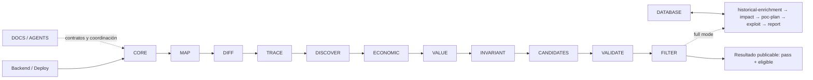

# Veredicto

Solguard es recuperable y ya no está rota como pipeline, pero todavía no es una herramienta automática de detección ciega de bugs económicos profundos.

La evaluación estricta es:

| Dimensión | Resultado |
|---|---|
| Ejecución end-to-end | Aprobada en un canario anterior |
| Integridad de artefactos | Bastante sólida |
| Verdad de los veredictos | Fallo crítico |
| Cierre de prueba económica | Fallido |
| Admisión final FILTER | 0 hallazgos |
| Aislamiento `generic_blind` | Fallido |
| Reproducibilidad de la versión actual | No demostrada |
| Experiencia en 8 lenguajes | No demostrada |
| Preparación para bounty automático | **NO-GO** |
| Release experimental ahora | **NO-GO** |

La frase más exacta sería:

> Solguard es actualmente un generador rule-assisted de candidatos y pistas con una infraestructura de integridad fuerte. Todavía no es un detector autónomo de vulnerabilidades económicas nuevas.

No está rota en el sentido de “no ejecuta”. Sí está rota la semántica de qué cuenta como “detectado”: VALIDATE puede declarar `Supported` sin demostrar la ruptura, y esa decisión acaba contabilizada como un bug detectado aunque FILTER la rechace.

## Cómo funciona realmente

Este es el orden fijo de las quince fases de CORE; las flechas representan orden de ejecución, no necesariamente dependencia directa de datos:

En `audit_only`, el pipeline termina después de FILTER. Esto importa porque el actual `findings.md` se genera en VALIDATE, antes de FILTER; no es un informe final de detecciones admitidas.

El orden está definido en [pipeline.rs](<C:/Users/Roger Gómez Martínez/Documents/GitHub/solguard-core/src/services/pipeline.rs:11>).

# Qué demuestra realmente el canario

El canario Compound terminó correctamente, sin degradación, en unos 61 minutos. Eso demuestra que la instantánea ejecutada pudo recorrer el pipeline completo hasta FILTER.

Los artefactos principales son [analysis_funnel.json](<D:/SolguardCanaries/phase1-core-20260725-compound-r1-incomplete/compound/v1/Compound-Finance/analysis_funnel.json>), [validation_results.json](<D:/SolguardCanaries/phase1-core-20260725-compound-r1-incomplete/compound/v1/Compound-Finance/tool-outputs/validate/validation_results.json>), [filter_results.json](<D:/SolguardCanaries/phase1-core-20260725-compound-r1-incomplete/compound/v1/Compound-Finance/tool-outputs/filter/filter_results.json>) y [pre-release-check.json](<D:/SolguardCanaries/phase1-core-20260725-compound-r1-incomplete/compound/_full-run/pre-release-check.json>).

| Etapa | Resultado observado | Lectura estricta |
|---|---:|---|
| Fuentes | 452 archivos; 213 parseados | Adquisición funcional |
| MAP | 2.618 símbolos; 37.316 edges; 58% resueltos | 42% del grafo sigue parcial/no resuelto |
| TRACE | 669 targets; 110.459 deep paths | Sólo 192 targets recibieron enriquecimiento profundo; 477 quedaron fuera |
| DISCOVER | 11 propuestas; 7 aceptadas; 0 grounded | Genera hipótesis, no bugs demostrados |
| ECONOMIC | 1.775 flows; 148 resueltos | 91,66% parcial; 0 transiciones concretas o `flow_bound` |
| VALUE | 1.159 pruebas/pistas | 0 completas, 0 consumibles por VALIDATE |
| Candidatos | 696 raw; 559 canónicos | Volumen alto y ruido semántico |
| VALIDATE | 230 evaluados; 5 supported | Los cinco proceden de patrones deterministas |
| FILTER | 5 entradas; 0 pass; 5 review | **0 findings finales** |
| Exploit eligible | 0 | Ningún bug publicable o explotable |

El hallazgo Compound emparejado con el oracle —“splitting one legacy reward rate…”— procede de una regla codificada en [real_protocol_families.rs](<C:/Users/Roger Gómez Martínez/Documents/GitHub/solguard-core/src/services/analyzer/seeds/solidity/real_protocol_families.rs:48>).

No es un selector tramposo basado literalmente en el nombre `Compound`: es una regla genérica de una familia conocida y tiene control negativo. Eso es legítimo como detector de clases conocidas. Pero la cadena resultante es:

`regla conocida → candidato → invariante derivado del candidato → coincidencia de familia en VALIDATE`

Por tanto, prueba reconocimiento de una clase conocida, no inferencia autónoma de un bug nuevo.

Además, ese candidato termina como `Supported` aunque tenga:

- `invariant_break.demonstrated=false`
- `economic_delta_confirmed=false`
- `economic_delta_demonstrated=false`
- impacto y explotabilidad `not_assessed`
- evidencia económica TRACE ausente

FILTER actuó correctamente y lo dejó en `review`. Sin embargo, [findings.md](<D:/SolguardCanaries/phase1-core-20260725-compound-r1-incomplete/compound/v1/Compound-Finance/findings.md:87>) lo publica bajo “Supported Findings”.

Consecuencia: el `detected_bugs=1` de la base significa “un patrón conocido recibió `Supported` y coincidió con el oracle”, no “Solguard produjo un finding económico admitido”.

También hay una limitación de reproducibilidad seria: los fingerprints del canario abarcan catorce repos de runtime y **ninguno de los HEAD actuales coincide**. Cuatro repos estaban dirty durante la ejecución. Los hashes permiten identificar los binarios ejecutados, pero los commits no reconstruyen esos cambios dirty. El canario no demuestra que los HEAD limpios actuales funcionen end-to-end.

## Base de datos

La fila `r1-incomplete` de [benckmarks.sqlite](<C:/Users/Roger Gómez Martínez/Documents/GitHub/solguard-database/data/benckmarks.sqlite>) contiene al menos dos métricas probadamente incorrectas:

| Campo persistido | Base | Valor real |
|---|---:|---:|
| `canonical_candidates` | 230 | **559** |
| `trace_deep_paths` | 192 | **110.459** |

SQLite no los corrompió: los hashes del CSV y de los resultados coinciden. El exportador produjo ya los valores equivocados: 230 era la cohorte enviada a VALIDATE y 192 era el número de targets enriquecidos.

Además:

- `benckmarks.sqlite` sigue siendo el default del código y de parte de la documentación.
- Backend `.env.development` apunta a `benchmarks.sqlite`.
- La nueva base todavía no existe.
- No hay migración ni autoridad única que impida dos historiales separados.

Mi recomendación es no inicializar todavía `benchmarks.sqlite`. Primero hay que corregir el exportador, hacer validaciones cruzadas entre funnel/CSV/resultados y definir la migración. La fila actual debe considerarse diagnóstica, no baseline fiable.

# Bloqueantes principales

## P0 de release

1. **VALIDATE concede `Supported` sin ruptura demostrada.**

   La rama de [candidate_resolution.rs](<C:/Users/Roger Gómez Martínez/Documents/GitHub/solguard-validate/src/engine/candidate_resolution.rs:520>) comprueba superficies, cadena causal y familia compatible, pero no exige `invariant_break.demonstrated`. Después describe `Supported` como evidencia terminal.

   FILTER vuelve a comprobar ruptura y delta correctamente en [engine.rs](<C:/Users/Roger Gómez Martínez/Documents/GitHub/solguard-filter/src/engine.rs:452>), pero para entonces ya se han contaminado findings, ranking, matching y métricas.

2. **`generic_blind` filtra patrones conocidos de forma incompleta.**

   TRACE elimina algunos canales conocidos, pero extractores exactos de Go/Node siguen generando guardas, almacenamiento, llamadas y `evidence_items` sin procedencia. DISCOVER los acepta como evidencia TRACE normal.

   El test negativo actual no inspecciona esos canales. Esto bloquea cualquier afirmación blind en Go, JS y TS. No explica el canario Solidity de Compound, pero sí invalida la frontera multilenguaje.

## P1

- El gate dirigido marca `product_health=passed` y `release_eligible=true` con cero pruebas VALUE completas y cero FILTER `pass`. La ceremonia blind superior, en cambio, continúa sin poder otorgar elegibilidad por falta de aislamiento real. Hay dos significados incompatibles de “release eligible”.

- CORE escribe sobre un `project/tool-outputs` compartido y elimina artefactos de la ejecución anterior antes de completar la siguiente. Hay lock y escrituras atómicas, pero no roots aislados por `run_id`, reanudación ni historial reproducible.

- El journal sólo guarda orden, estado, ruta y duración; no guarda intentos, dependencias, presupuestos ni hashes. Además, calcula incorrectamente `started_at_unix_ms`, produciendo cronologías imposibles.

- La síntesis de candidatos tiene contaminación entre dominios: 201 de 559 candidatos del canario terminaron ligados al flow `GovernorAlpha.votingPeriod`; 128 tenían su root fuera de Governance. VALIDATE elimina parte de este ruido, pero el ranking y los informes lo conservan.

- ECONOMIC genera `candidate_economic_checks` desde la prosa del propio candidato. Correctamente no reciben autoridad MAP/TRACE, pero por ello tampoco pueden cerrar el delta. Hoy son una hipótesis sin consumidor capaz de convertirla en prueba independiente.

- El bucle iterativo diseñado existe sólo como scaffolding. En el canario hubo **0 EvidenceRequest y 0 respuestas**. VALUE no volvió a pedir evidencia dirigida para resolver ninguno de sus 1.159 proofs parciales.

- VALIDATE convierte duplicados previamente `Supported` en `Inconclusive`. Dedupe está modificando la verdad técnica; debería conservar el veredicto y cambiar únicamente admisión/presentación.

- El CI de backend fija una revisión antigua de `solguard-database` que no contiene `export_csv_by_test`, aunque el backend actual lo importa. Las pruebas locales pasan por usar el sibling HEAD actual; el checkout limpio de CI es incompatible.

- No existe todavía una ceremonia blind defendible: custodia separada del holdout, aislamiento OCI/VM/CAS verificado, ranking congelado, disyunción por familia/fork/tiempo y revelación posterior.

## P2

- MAP autoasigna tiers por presencia de AST/edges/estado, no por precisión o ratio de resolución medido.

- Backend es síncrono, sin `run_id`, progreso ni cancelación, y comparte el pool global durante análisis de una hora. `/health` no prueba Node, Ollama o SQLite.

- El default de backend sigue siendo `audit_only + compatibility`, no `generic_blind`.

- Database carece de procedimiento operativo probado de backup, restore e integrity check.

- DOCS pasa la comprobación de enlaces, pero omite endpoints benchmark, variables, tablas y contratos actuales.

- AGENTS mantiene afirmaciones sobre aislamiento `generic_blind` que el código contradice.

# Evaluación repo por repo

| Repo / HEAD | Responsabilidad real | Estado |
|---|---|---|
| `solguard-map` `3180cc37` | Autoridad estructural, símbolos, edges, estado y evidencia física | Amplio, pero sus tiers no certifican exactitud |
| `solguard-diff` `b9e5c2aa` | Priorizar cambios Git/PR | Útil; C/C++ acaban como `Other`; no es detector |
| `solguard-trace` `3da0b882` | Rutas, guardas, efectos, llamadas y evidencia estática | Profundo en Solidity; heurístico fuera; fuga blind Go/Node |
| `solguard-discover` `f105d060` | Modelo, reglas implícitas, gaps y `candidate_lead` | Generador de hipótesis; mucha lógica léxica; no escanea C/C++ directamente |
| `solguard-economic` `b0edda44` | Flows, valores, estados e hipótesis económicas | Contrato fuerte; canario con 91,66% parcial y 0 transiciones concretas |
| `solguard-value` `f05afd5e` | Cierre de secuencia, activo, delta y ProofObligation | Diseño bueno; 0 pruebas completas en el canario |
| `solguard-invariant` `dc63b9ba` | Normalizar propiedades tipadas y bindings | Sólido como contrato; no es solver ni detector |
| `solguard-core` `a70f0509` | Orquestación, reglas, canonización y artefactos | Funcional; rule-heavy, sin aislamiento por ejecución y con ruido de bindings |
| `solguard-validate` `6d42c838` | Única autoridad `supported/refuted/inconclusive` | Bloqueante P0: bypass de ruptura económica |
| `solguard-filter` `92a5a4fc` | Admisión final hacia EXPLOIT | Se comportó bien y bloqueó los cinco; no aumenta recall |
| `solguard-database` `15656a1d` | Historial y resultados benchmark | Transaccional y hash-bound; puente CSV incorrecto y nombre dividido |
| `solguard-backend` `fb1911bf` | API y control de análisis | Seguridad local razonable; ejecución síncrona, pin CI roto |
| `solguard-deploy` `5548f0db` | Runner, canarios, gates y release | Integridad fuerte; gate de producto insuficiente y blind no operativo |
| `solguard-docs` `10b39a25` | Documentación pública/técnica | Conceptualmente prudente, pero incompleta y desactualizada |
| `solguard-agents` `8a6fc03c` | Routing, coordinación y contratos interrepo | Contratos compartidos coherentes; topología no validable completa |

INVARIANT y FILTER son los dos componentes que mejor respetan su frontera conceptual. El mayor problema se concentra en la transición `ECONOMIC/VALUE → VALIDATE`: la infraestructura conserva artefactos muy estrictamente, pero no consigue producir la prueba que sus contratos exigen y VALIDATE introduce un atajo rule-based.

# Realidad de los ocho lenguajes

Ningún lenguaje puede llamarse hoy “experto” end-to-end. Solidity es el único camino próximo a profundidad real.

| Lenguaje | Situación actual |
|---|---|
| Solidity | El más fuerte: AST, economía y TRACE profundo; todavía falla el cierre económico |
| Vyper | Parsing y scanner acotados; tier 2, poca validación dedicada |
| Rust | MAP con `syn`; TRACE genérico; macros y semántica económica limitadas |
| Go | Estructura razonable; TRACE genérico y afectado por la fuga blind |
| C | MAP parser; TRACE heurístico; DISCOVER no escanea fuentes propias; DIFF lo trata como `Other` |
| C++ | Similar a C; templates/preprocesador y métodos no están resueltos con profundidad |
| JavaScript | Gramática/regex más heurísticas Node; afectado por la fuga blind |
| TypeScript | Mapping estructural parcial; semántica Node genérica y fuga blind |

FILTER contiene quince checkers semánticos estrechos, todos orientados a EVM/Solidity. Sus nueve fixtures por lenguaje son todos `.sol`. La amplitud de parsers no equivale a experiencia económica multilenguaje.

# Los planes anteriores

La conclusión del [INFORME.md](<C:/Users/Roger Gómez Martínez/Documents/GitHub/solguard-core/tasks/INFORME.md>) sigue vigente: la infraestructura es mucho más fuerte que la capacidad demostrada de detección/generalización.

[LIMITES_RIESGOS_RESIDUALES.md](<C:/Users/Roger Gómez Martínez/Documents/GitHub/solguard-core/tasks/LIMITES_RIESGOS_RESIDUALES.md>) es el documento más alineado con la realidad actual. El canario no retira sus principales riesgos sobre blind, novedad o prueba económica.

El viejo plan todavía contiene piezas esenciales sin cerrar:

- [M1: roots por ejecución y ArtifactStore](<C:/Users/Roger Gómez Martínez/Documents/GitHub/solguard-core/tasks/PLAN_DE_MEJORA.MD:579>)
- [M3: world model, multi-transacción y ablations](<C:/Users/Roger Gómez Martínez/Documents/GitHub/solguard-core/tasks/PLAN_DE_MEJORA.MD:634>)
- [M4: EvidenceRequest, PROBE y cola iterativa](<C:/Users/Roger Gómez Martínez/Documents/GitHub/solguard-core/tasks/PLAN_DE_MEJORA.MD:667>)
- ceremonia de release/holdout

El [plan adjunto](<C:/Users/Roger Gómez Martínez/.codex/attachments/918d0161-42ba-49b9-a68c-f5bc9a461448/pasted-text.txt>) tiene la arquitectura correcta:

`world model → hipótesis → obligación de prueba → evidencia dirigida → VALIDATE → FILTER`

El problema no es la dirección. Es que actualmente el bucle se ejecuta una sola vez y se detiene con proofs parciales.

Como referencia histórica no revalidada hoy, la ejecución anterior de 90 labs dio 7/71 strict-supported operativos y 16/90 reconstruidos, con una brecha fuerte fuera de Solidity. Puede estar desactualizada, pero es coherente con los límites que sigue mostrando el código actual.

# Corrección de tu estrategia

Tu intuición general es buena, pero el orden propuesto no lo es.

## Lo que no haría

- No intentaría “terminar MAP”, luego “terminar TRACE” y así sucesivamente.
- No intentaría conseguir paridad experta en ocho lenguajes antes del primer bounty.
- No cerraría ramas como prueba de release. Una rama mutable no demuestra reproducibilidad.
- No usaría v1-v8 y los 90 labs como demostración blind: son regresión conocida.
- No inicializaría aún la nueva base.

## La vía más corta y defendible

1. **Reparar la verdad del producto.**

   - Prohibir `Supported` sin ruptura demostrada.
   - Cerrar la fuga `generic_blind`.
   - Contabilizar como detección únicamente `FILTER pass + eligible`.
   - Separar `detections.md` de `review_queue.md`.
   - Corregir CSV, gate, pin CI y autoridad de SQLite.
   - Crear roots inmutables por `run_id`.

2. **Cerrar un slice vertical Solidity.**

   Elegir una familia económica —por ejemplo rewards, vault accounting u oracle freshness— y llevarla completa:

   `MAP → TRACE → ECONOMIC → VALUE → VALIDATE → FILTER`

   Cada familia debe tener:

   - vulnerables reales;
   - versiones corregidas;
   - near-miss;
   - renombrados/metamórficos;
   - forks no vistos;
   - evidencia de delta;
   - ranking congelado.

3. **Activar el bucle dirigido.**

   Cuando VALUE no pueda cerrar una obligación, debe emitir EvidenceRequest; CORE debe pedir TRACE/MAP adicional, rederivar ECONOMIC y repetir. Si no puede progresar, debe cerrar con deuda explícita, nunca con `Supported`.

4. **Repetir un canario desde los HEAD limpios actuales.**

   Con manifiesto de release que incluya:

   - SHA exacto;
   - `dirty=false`;
   - hash de binarios;
   - versiones de esquema;
   - parámetros y presupuestos;
   - hashes de todos los artefactos.

5. **Ejecutar la regresión conocida.**

   El catálogo local actual no son aproximadamente 220 ejecuciones:

   - v1: 24
   - v2-v8: 20 cada uno
   - total benchmarks: 164 ejecuciones
   - labs: 90
   - total: **254 ejecuciones**
   - 245 protocolos/nombres únicos

   El canario Compound produjo unos 1,95 GiB. Si todas las ejecuciones costaran lo mismo —sólo como escenario de dimensionamiento— serían unas 259 horas seriales y 495 GiB; ocho workers ideales reducirían tiempo a unas 32 horas antes de contención.

6. **Después, holdout blind sellado.**

   Debe ser disjunto por protocolo, fork, familia, fecha y lenguaje. El código/worker que escanee no puede acceder al oracle. Primero se congelan resultados y ranking; después se revela ground truth.

7. **Etiquetar la release coordinada.**

   Sólo entonces usaría `v0.1.0-experimental`, con un BOM que enlace las quince versiones. Tags inmutables son más importantes que “cerrar” ramas.

8. **Expandir lenguajes según evidencia.**

   Primero Solidity. Después Vyper o Rust. Go/JS/TS sólo tras cerrar la fuga blind. C/C++ requieren trabajo semántico sustancial, no unas pocas reglas adicionales.

# Decisión final

- **¿Solguard va por buen camino?** Sí, en infraestructura y disciplina de artefactos.
- **¿Está ya cerca de ser una herramienta peligrosa para bounty?** No según la evidencia actual.
- **¿Puede obtener un bounty antes como asistente rule-based con analista humano?** Sí, es plausible.
- **¿Puede afirmar detección automática ciega de bugs nuevos?** No.
- **¿Debes lanzar ahora la release experimental?** No.
- **¿Debes abandonar el proyecto?** Tampoco. El cuello de botella está localizado: cerrar evidencia económica real y eliminar atajos de autoridad.

La prioridad no es añadir más familias conocidas ni más parsers. Es conseguir que una sola hipótesis desconocida atraviese honestamente todo el funnel y termine en `FILTER pass` con ruptura y delta demostrados.

Verificación realizada: suites completas de CORE, ECONOMIC, VALUE, VALIDATE, FILTER, DEPLOY, DATABASE, BACKEND y AGENTS; pruebas contractuales dirigidas de MAP, TRACE, DISCOVER, DIFF e INVARIANT; comprobación documental y de enlaces. Todos los repos permanecen limpios y no modifiqué ningún archivo.

Una precisión de alcance: `registry/repos.json` también referencia `solguard-exploit` y `solguard-cli`, que no estaban entre los quince repos solicitados y no están disponibles como topología completa. Por eso la auditoría cubre toda la infraestructura de detección proporcionada, no literalmente los diecisiete componentes registrados.