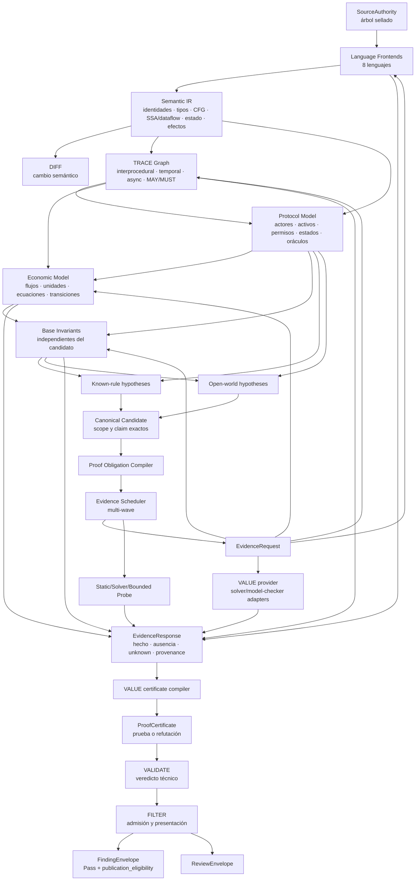
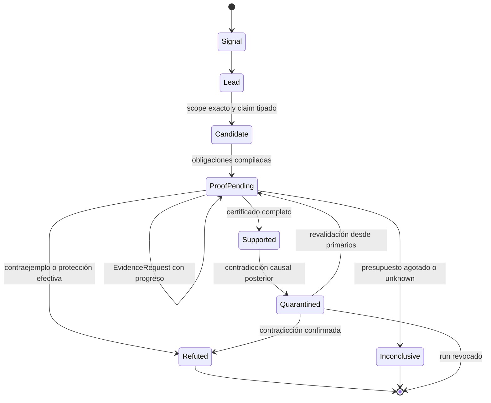
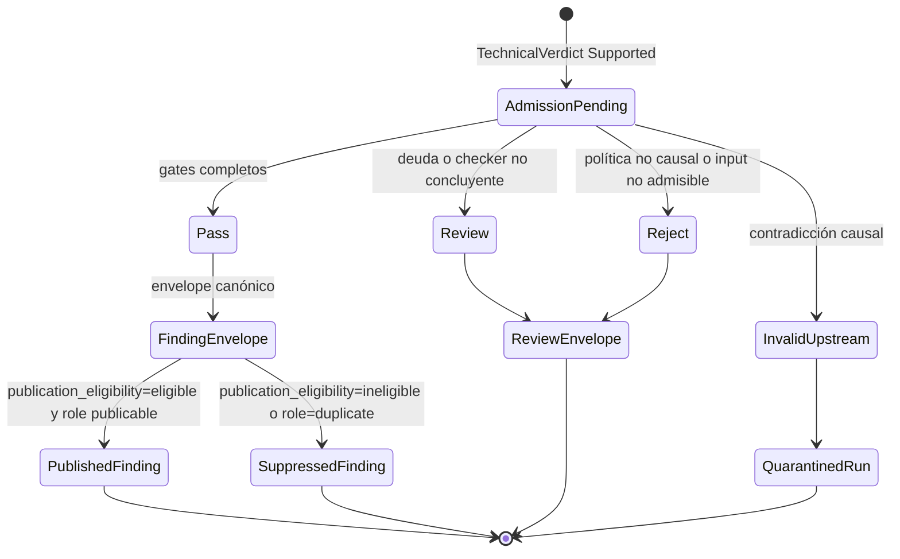

# Contrato de madurez y arquitectura objetivo

## 1. Decisión arquitectónica

Solguard no madurará «terminando repositorios» de forma horizontal. Madurará
cerrando slices verticales que empiezan en código fuente y terminan en un
finding admitido.

La unidad de progreso no será:

> MAP tiene más detectores.

Será:

> Una clase de fallo, en un lenguaje y framework declarados, atraviesa
> adquisición, semántica, modelado, hipótesis, prueba, validación, admisión,
> negativos y holdout sin atajos de autoridad.

La arquitectura objetivo separa tres capas:

1. **IR semántica de lenguaje:** describe fielmente programas, estado, control,
   tipos, llamadas, efectos y procedencia.
2. **IR de protocolo y economía:** describe actores, activos, cuentas,
   permisos, estados, transiciones, flujos, ecuaciones y propiedades.
3. **IR de prueba:** describe la afirmación, obligaciones, evidencia,
   contraevidencia, restricciones, delta, resultado y cobertura.

ECONOMIC, VALUE, INVARIANT, VALIDATE y FILTER no deben implementar ocho
analizadores de sintaxis. Cada uno consume únicamente los contratos que le
asigna el registry canónico de `09_CONTRATOS_LEDGER_Y_DEPENDENCIAS.md`; los
consumidores posteriores reciben candidate, proof, verdict o admission en vez
de abrir IR upstream mediante un bypass no registrado. Las extensiones de
framework son explícitas y versionadas.

## 2. Arquitectura objetivo



El bucle `ProofObligation → EvidenceRequest → EvidenceResponse → nueva
evidencia` es acotado, observable y convergente. MAP, TRACE, ECONOMIC,
INVARIANT y los probes son proveedores de evidencia: ninguno puede fabricar
un certificado. VALUE/prover es el único compilador de `ProofCertificate` y
debe conservar cada respuesta, ausencia, `unknown`, error y procedencia que
sustenta o limita el resultado. No se vuelve a ejecutar el pipeline entero sin
criterio. Cada wave declara qué obligación intenta resolver y qué evidencia
nueva produjo.

## 3. Máquinas de estado ortogonales

El veredicto técnico y la admisión no comparten una única máquina. El primero
responde si la ruptura está demostrada; la segunda decide publicación, review
y presentación sin reescribir esa verdad.

### 3.1 Verdad técnica



### 3.2 Admisión y publicación



Reglas cruzadas:

- `Lead` no entra en VALIDATE.
- `Candidate` no implica vulnerabilidad.
- `Supported` conserva verdad técnica aunque sea duplicado.
- Dedupe cambia `presentation_role`, no el veredicto.
- `Review` y `Reject` son decisiones de `AdmissionResult`; nunca estados de
  `TechnicalVerdict`.
- FILTER puede rechazar publicación, pero no reescribir verdad técnica.
- Si FILTER descubre una protección o contradicción causal, emite
  `invalid_upstream`, revoca la elegibilidad, pone el run en cuarentena y
  obliga a VALIDATE a reabrir primarios.
- `Pass` requiere prueba completa y cero deuda material.
- Sólo `PublishedFinding` se contabiliza como detección de producto.

## 4. Contrato de un finding válido

### 4.1 Condiciones universales

Todo finding debe demostrar:

1. **Scope:** componente, callable, estado, activo y contexto exactos.
2. **Reachability:** ruta raíz → trigger → impacto físicamente alcanzable.
3. **State transition:** estado antes, mutación y estado después.
4. **Invariant:** propiedad tipada independiente del candidato.
5. **Contradiction:** predicado del invariante contradicho.
6. **Effect:** efecto de seguridad o económico concreto.
7. **Economic delta:** cuando el claim es económico, unidad, activo, cuenta,
   signo, expresión y condiciones del delta.
8. **Same-flow binding:** operaciones unidas por una identidad de ruta exacta.
9. **Same-asset binding:** no se comparan cantidades incompatibles.
10. **Protection analysis:** protecciones aplicables resueltas en el mismo scope.
11. **Evidence lineage:** cada evidencia remite a una autoridad física.
12. **Coverage:** ninguna deuda material invalida una afirmación MUST, exacta o
    de ausencia.
13. **Counterevidence:** se buscaron y evaluaron protecciones, rutas seguras y
    estados que refutan la hipótesis.
14. **Run binding:** repos, binarios, modelo, source tree, configuración y
    artefactos están sellados.

### 4.2 Requisitos adicionales para findings económicos

Un finding económico `Supported` exige simultáneamente:

```text
reachable_route
AND confirmed_state_transition
AND typed_invariant_contradicted
AND same_flow
AND compatible_units
AND concrete_nonzero_adverse_delta
AND token_or_asset_semantics_resolved
AND impact_reached
AND no_effective_protection
AND no_material_coverage_debt
```

Una regla determinista puede proponer la hipótesis, pero no sustituye ninguna
de estas condiciones.

Un intervalo sólo prueba delta si todos los valores de su dominio son no cero,
tienen el mismo signo adverso y conservan actor, activo y unidad. Un intervalo
que contiene cero, cambia de signo o depende de un supuesto no cerrado produce
`Inconclusive`.

#### 4.2.1 Materialidad y severidad precongeladas

Un delta adverso distinto de cero prueba que existe un efecto; **no** prueba por
sí solo que el efecto sea material, `high`, `critical` ni apto para bounty. El
scanner usa un `materiality_profile` genérico, no identificante, incluido y
sellado dentro de `solguard-run-spec.v1` antes de ver el target. Como mínimo,
ese perfil contiene:

- `materiality_profile_id`, versión y root canónico;
- taxonomía de clases de impacto y algoritmo de lower bound en unidades
  nativas;
- reglas genéricas de unidad/conversión, freshness, incertidumbre y valoración
  conservadora, sin snapshots ni mappings target-specific;
- horizonte temporal, privilegio del actor, capital, timing, repeticiones,
  estado previo y demás prerrequisitos que deben declararse;
- tratamiento de activos sin precio, valores intervalares y dependencias
  externas.

Las clases mínimas son pérdida directa, mint/deuda no autorizados,
insolvencia/backing deficit, freeze económico cuantificado, control/gobernanza
no autorizado, extracción por fees/rewards/accounting y disponibilidad sólo
cuando tenga una consecuencia económica demostrada. El implementador puede
añadir clases; no puede fusionarlas post-scan ni mapear «impacto genérico» a una
severidad alta.

El scanner demuestra el **límite inferior conservador** en la ruta alcanzable,
no un máximo teórico, TVL total, precio futuro, repetición ilimitada ni supuesto
favorable. Conserva cantidad, activo, unidad nativa, intervalo de incertidumbre,
horizonte, actor y prerrequisitos. Emite `impact_class` y lower bound, pero no
conoce ni decide la categoría o severidad del programa bounty.

La política target-specific, sus snapshots, fechas, mappings y thresholds vive
exclusivamente en el governance/evaluator BOM, fuera de la imagen y del host de
scan. Cada cohort compromete antes del scan un
`policy_set_commitment_root` hiding, salted y timestamped; la vista del
scanner recibe sólo ese root opaco común a la cohort, nunca hojas, salts, IDs,
URLs, categorías ni membership proofs. Tras sellar outputs y hacer reveal, el
evaluator abre la hoja del target, verifica
`target_program_policy_root + membership_proof` y deriva
`program_severity=not_applicable|unclassified|low|medium|high|critical` sin modificar el
FindingEnvelope.

El único esquema válido es
`policy_commitment_scheme=solguard-policy-set-commitment.v1`:

```text
target_program_policy_root =
  SHA256(UTF8("solguard/target-program-policy/v1") || 0x00 ||
    UTF8(RFC8785_JCS({
      campaign_id, cohort, target_ref, target_revision,
      program_id, program_revision,
      policy_snapshot_time, policy_effective_from, policy_effective_to,
      policy_snapshot_content_digest,
      policy_snapshot_signature_content_digest,
      mapping_table_root, mapping_table_content_digest,
      policy_signer_key_id
    })))

target_key = UTF8(RFC8785_JCS([target_ref, target_revision]))
leaf_payload = RFC8785_JCS({
  campaign_id, cohort, target_ref, target_revision,
  target_program_policy_root,
  policy_snapshot_content_digest,
  mapping_table_root, mapping_table_content_digest,
  policy_snapshot_time,
  leaf_salt_b64url
})
leaf_hash =
  SHA256(UTF8("solguard/policy-leaf/v1") || 0x00 || UTF8(leaf_payload))

pad_hash(index) =
  SHA256(UTF8("solguard/policy-pad/v1") || 0x00 ||
    UTF8(RFC8785_JCS({campaign_id, cohort, committed_target_count, index})))

node_hash(level, left, right) =
  SHA256(UTF8("solguard/policy-node/v1") || 0x00 ||
    UINT32BE(level) || left || right)

policy_set_commitment_root =
  SHA256(UTF8("solguard/policy-set/v1") || 0x00 ||
    UTF8(RFC8785_JCS({
      campaign_id, cohort, committed_target_count, tree_height,
      tree_root_hex
    })))
```

Cada `leaf_salt_b64url` decodifica a **exactamente 32 bytes** generados por
CSPRNG, es único por leaf y no se reutiliza entre campaign/cohort; permanece
secreto hasta reveal y se incluye entonces en el policy-leaf artifact. Se
rechazan duplicados de `target_key` y conjuntos vacíos. Las leaves se ordenan
por comparación bytewise ascendente de `target_key`.
`m = 2^ceil(log2(n))`, con `m=1` cuando `n=1`, y
`tree_height=log2(m)`. Se rellena con `pad_hash(index)` para índices `n..m-1`.
El nivel 0 son las leaves/pads; `node_hash(level=0,...)` crea los nodos del
primer nivel y se incrementa `level` en uno en cada subida. Para `n=1`,
`tree_height=0` y `tree_root` son directamente los 32 bytes de la única
`leaf_hash`: no se aplica node hash ni padding. En los demás casos cada nivel
usa pares izquierda/derecha sin duplicar, promover ni ordenar nodos por hash.

`membership_proof` contiene scheme, campaign/cohort, count, target index,
tree height y exactamente un sibling de 32 bytes por nivel, bottom-up; el lado
se deriva del bit del índice. El verifier rederiva leaf, pads, nodes y root. El
manifest privado conserva un entropy-generation receipt y el reveal publica
salts/bytes sólo después del output seal. Salt corto/reutilizado, sort
alternativo, padding/level/side ambiguo, proof truncado, leaf/root swap,
dictionary preimage o reutilización cross-cohort/campaign falla cerrado.

Para una campaign multi-target, policy y severidad se materializan en dos sets
cerrados con cardinalidades distintas:

```text
TargetPolicyOpeningSet
  campaign_id
  cohort
  policy_commitment_scheme
  policy_set_commitment_root
  committed_target_set_root
  committed_target_count
  entries[]

TargetPolicyOpening
  target_ref
  target_revision
  program_id
  program_revision
  leaf_salt_b64url
  target_index
  policy_leaf_hash
  target_program_policy_root
  policy_leaf_artifact_ref
  policy_leaf_content_digest
  membership_proof
  policy_snapshot_time
  policy_effective_from
  policy_effective_to
  policy_snapshot_artifact_ref
  policy_snapshot_content_digest
  policy_snapshot_signature_ref
  policy_snapshot_signature_content_digest
  policy_signer_key_id
  mapping_table_root
  mapping_table_artifact_ref
  mapping_table_content_digest

target_policy_openings_root =
  SHA256(UTF8("solguard/target-policy-openings/v1") || 0x00 ||
    UTF8(RFC8785_JCS({
      header: {
        campaign_id, cohort, policy_commitment_scheme,
        policy_set_commitment_root, committed_target_set_root,
        committed_target_count
      },
      entries: entries_ordered_by_target_index
    })))

FindingMaterialityAssessmentSet
  campaign_id
  cohort
  target_policy_openings_root
  adjudicated_subject_set_root
  adjudicated_subject_count
  claim_profile_id
  claim_materiality_threshold
  entries[]

FindingMaterialityAssessment
  subject_kind
  subject_ref
  subject_digest
  target_ref
  target_revision
  target_policy_opening_ref
  target_policy_opening_digest
  impact_status
  impact_class?
  lower_bound_status
  lower_bound_artifact_ref?
  lower_bound_content_digest?
  lower_bound_evidence_refs[]
  lower_bound_evidence_digests[]
  absence_reason_codes[]
  absence_evidence_refs[]
  absence_evidence_digests[]
  price_status
  price_snapshot_root?
  price_snapshot_artifact_ref?
  price_snapshot_content_digest?
  mapping_status
  mapping_table_artifact_ref?
  mapping_table_content_digest?
  threshold_rule_id?
  threshold_rule_artifact_ref?
  threshold_rule_content_digest?
  program_severity
  materiality_outcome

finding_materiality_assessments_root =
  SHA256(UTF8("solguard/finding-materiality-assessments/v1") || 0x00 ||
    UTF8(RFC8785_JCS({
      header: {
        campaign_id, cohort, target_policy_openings_root,
        adjudicated_subject_set_root, adjudicated_subject_count,
        claim_profile_id, claim_materiality_threshold
      },
      entries: entries_ordered_by_subject_kind_ref_digest
    })))
```

Los roots de población que alimentan esos headers se calculan así:

```text
committed_target_set_root =
  SHA256(UTF8("solguard/committed-target-set/v1") || 0x00 ||
    UTF8(RFC8785_JCS({
      campaign_id, cohort, committed_target_count,
      entries: [
        {target_index, policy_leaf_hash},
        ... ordered by target_index
      ]
    })))

adjudicated_subject_set_root =
  SHA256(UTF8("solguard/adjudicated-subject-set/v1") || 0x00 ||
    UTF8(RFC8785_JCS({
      campaign_id, cohort, adjudicated_subject_count,
      entries: [
        {subject_kind, subject_ref, subject_digest},
        ... ordered bytewise by [subject_kind, subject_ref, subject_digest]
      ]
    })))
```

Cada digest/root serializado usa `sha256:` seguido de 64 hex minúsculas. El
`tree_root_hex` interno del policy commitment son exactamente 64 hex
minúsculas, sin `0x`; al hashear nodes se usan los 32 bytes decodificados.
Target count es mayor que cero y sus índices cubren exactamente `[0,n)` sin
gap/duplicado; `policy_leaf_hash` es el leaf hash salted ya comprometido y la
secuencia de target keys revelada debe ser estrictamente creciente. El subject
set permite count cero, representado por `entries:[]`, y para count positivo
exige la unión cerrada completa sin duplicados. Arrays, objetos header y campos
opcionales ausentes —nunca null— forman parte exacta de JCS.

Ambos sets y sus entries son wire types embebidos, no top-level contracts
nuevos: `solguard-metric-provenance.v1` los contiene junto a ambos roots. El
primer set tiene exactamente una opening por target/revision comprometido,
incluidos no-result/no-response; cero extras, ausentes o duplicadas. Cada
membership proof abre contra el policy-set commitment del header. Los bytes
sellados de la policy leaf, su snapshot completo y la mapping table se resuelven
por sus `artifact_ref` content-addressed; role schema y `content_digest` deben
coincidir con su entry tipada del evidence store/dossier, y sus roots se
recomputan desde esos bytes, no desde una URL, path o ID sin contenido.
`target_program_policy_root` se rederiva con la fórmula anterior y la firma del
snapshot se verifica contra el key/trust map precongelado; root arbitrario,
program/revision/effective-time drift, snapshot/signature/mapping digest
mismatch o signer no autorizado falla.

El segundo set tiene exactamente una assessment por cada subject de la unión
adjudicada de Pass + ReviewEnvelope + top-10, incluidos no económico,
policy-unmapped, no-result materiality, `unclassified`, false positive,
unverifiable y needs-context. Un target con varios subjects tiene varias
assessments, todas referenciando la única policy opening del target. Cero
subjects extra, omitidos o duplicados.

`impact_status`, `lower_bound_status` y `price_status` usan
`proven | not_proven | not_applicable`. Los refs/value fields de cada rama son
obligatorios si y sólo si `proven`; las demás ramas los omiten y exigen reason
codes más evidence refs **y digests** de ausencia/irrelevancia. Para
`mapping_status=mapped`, la assessment repite exactamente el mapping artifact
ref/digest de su opening y liga un threshold-rule artifact ref/digest/ID; para
`unmapped` referencia la misma tabla que demuestra la ausencia y omite rule;
`not_applicable` omite ambos. No se usan nulls ambiguos.
`materiality_outcome` es
`material | non_material | unclassified | not_applicable`. `material` sólo es
válido si la program severity cruza el `claim_materiality_threshold`
pre-registrado y la mapping/policy proof es válida; para
`bounty_detection_ready` el threshold es `high`, por lo que `medium` nunca
entra en el numerador accionable. Cambiar threshold tras scan/reveal invalida
campaign y métricas.

Un adjudication review referencia sólo los artifact+JSON Pointer y digests de
su assessment y su opening exactas; no embebe un set root global. La assessment
no contiene review digest, evitando un ciclo. Cada revisión de metric provenance
agrega las heads vigentes de reviews con esas mismas entries y calcula ambos
set roots; una corrección de un subject crea review+assessment nuevas y nueva
provenance/report, sin re-firmar las reviews no modificadas. Measurement report
y dossier referencian los dos roots de la provenance vigente. Reusar sets en
otra campaign/cohort, subseleccionar targets/subjects o cambiar counts/set roots
falla.

La cadena por `campaign_id + cohort + subject_kind + subject_ref` es lineal:
una corrección debe declarar el review ID/digest de la **head actual**,
conservar campaign/cohort/subject y aumentar `review_revision` y el predecessor
event sequence. Existe como máximo un hijo válido por head. Dos hijos del mismo
predecessor, stale-head update, ciclo, salto de revisión o cross-subject
supersede invalidan provenance/report y dejan el subject sin head contable
hasta un `adjudication_arbitration_event` firmado por la autoridad separada,
que referencia todas las ramas y selecciona una nueva head sin borrar ninguna.
El evaluator no puede escoger silenciosamente la rama favorable.

Truth/adjudication/metric provenance/report/dossier post-reveal referencian los
sets o sus entries exactas. Campaign/run/proof/finding nunca contienen target
policy root, membership proof ni program severity.

Todo artifact ref anterior identifica `artifact_id + JSON Pointer` dentro del
evidence store sellado. Antes de `FINAL-001`, policy leaves/snapshots, mapping
tables, lower-bound/evidence, price snapshots, threshold rules y pruebas de
ausencia referenciadas deben figurar como entries del dossier con el mismo
digest. `FINAL-003` rederiva openings, memberships, conversions, mappings,
thresholds y outcomes exclusivamente desde esos bytes. Ref ausente,
irresoluble o ambiguo, digest/root mismatch, swap entre target/revision/cohort o
reutilización cross-campaign falla cerrado; no puede producir `material`.

H-GEN-A/B, H-NOVEL-A/B y LIVE-AUTH comparten exactamente el
`materiality_profile_root` genérico. Cada cohort/campaign tiene su propio
`policy_set_commitment_root` porque targets y políticas son disjuntos. Una
nueva política, precio autoritativo, mapping o threshold invalida la evaluación
afectada y exige otro commitment/campaign, no reescribir el run. Quedan como
negativos obligatorios: delta mínimo rotulado critical, upper-bound-only, stale
price, cross-asset incompatible, privilege/repetition drift, policy/root swap,
reclasificación posterior al reveal y ataques de diccionario/fingerprint/leak
contra el commitment.

### 4.2.1 `CandidateEpochBinding`

Todo objeto operacional posterior al evento de apertura repite byte-exact un
único binding cerrado; no combina campos sueltos ni consulta el estado live.
Es una discriminated union por fase para evitar que una validación prefreeze
dependa circularmente de un evento futuro:

```text
CandidateEpochBinding
  schema_version = "solguard-candidate-epoch-binding.v1"
  candidate_epoch_id
  candidate_epoch_definition_id
  candidate_epoch_root
  candidate_epoch_open_event_id
  candidate_epoch_open_event_root
  binding_phase = "open_validation" | "post_freeze"
  if binding_phase == "post_freeze"
    candidate_epoch_freeze_event_id
    candidate_epoch_freeze_event_root
  candidate_accepted_input_membership_root
  candidate_accepted_input_membership_count
  accepted_tooling_membership_root
  accepted_tooling_membership_count
  resource_profile_id
  resource_profile_version
  resource_profile_root
  resource_profile_policy_id
  resource_profile_policy_version
  resource_profile_policy_root
  resource_profile_policy_compliance_root
```

`candidate_epoch_root` es el self-hash/content digest de la definición
inmutable; el `candidate_root` interno de esa definición identifica el material
buildado. La rama `open_validation` prohíbe freeze ID/root; la rama
`post_freeze` los exige y sólo puede emitirse después del freeze aceptado. El
open event, el freeze cuando aplique, memberships y resource profile deben
resolver al mismo epoch/root. El propio evento open no se autoincluye: liga la
definición y produce el ID/root que usarán objetos posteriores. Aparte, cada run declara
`run_input_membership_root/count`: inputs concretos de ese run, nunca alias del
tooling ni del input membership aceptado al abrir el epoch. Missing/count
mismatch, binding parcial, root transplant, recurso distinto o mezcla de
candidate/run membership invalida el run completo.

### 4.3 `FindingEnvelope`

El output final debe tener un contrato versionado con, como mínimo:

```text
FindingEnvelope
  schema_version
  finding_id
  run_id
  candidate_epoch_binding
    CandidateEpochBinding
  run_input_membership_root
  run_input_membership_count
  producer
    repo
    tool_version
    contract_version
  candidate_id
  candidate_digest
  verdict_ref
  admission_ref
  origin
    classes[]
    primary_class
    knowledge_taints[]
    effective_knowledge_taint
    taint_join_rule_id
    taint_join_rule_version
    taint_join_rule_root
    taint_ancestor_set_root
    taint_causal_paths_root
    artifacts[]
      origin_class
      knowledge_taint
      artifact_id
      content_digest
      rule_pack_id?
      rule_pack_root?
      model_id?
      model_root?
      tool_id?
      tool_root?
      retrieval_index_root?
  claim
    title
    vulnerability_class
    economic_family
    materiality
      materiality_profile_id
      materiality_profile_version
      materiality_profile_root
      policy_set_commitment_root
      impact_class
      proven_lower_bound
        amount
        asset
        native_unit
        uncertainty_interval?
      time_horizon
      actor_prerequisites
        privilege
        capital
        timing
        repetitions
        protocol_state
      product_materiality_status
  scope
    language
    framework
    components
    entrypoints
    actors
    assets
    states
  route
    flow_id
    route_digest
    ordered_operations
  invariant
    invariant_id
    predicate
    quantifier
    independent_derivation
  proof
    certificate_id
    certificate_digest
    status
    obligations
    state_before
    state_after
    delta
    constraints
    solver_or_probe_receipts
    evidence_refs
    counterevidence_refs
  verdict
    validate_decision
    validate_reason
    filter_decision
    publication_eligibility
    ineligibility?
      kind
      reason_code
      policy_id
      policy_version
      policy_root
      rule_id
      scope_root
      decision_event_id
      actor_id
      actor_key_id
      justification_refs[]
      created_at
      expires_at?
  presentation
    dedupe_group
    presentation_role
    canonical_parent_id?
    rank
    evidence_completeness_score
      value
      rubric_id
      rubric_version
      rubric_root
      component_scores
    calibrated_actionability_probability?
      value
      interval
      calibration_model_id
      calibration_model_root
      calibration_population_root
  coverage
    status
    debts
  bindings
    source_tree_sha256
    runtime_manifest_sha256
    candidate_epoch_binding_digest
    run_input_membership_root
    run_input_membership_count
    parent_artifact_ids[]
    parent_roots[]
```

El Markdown o UI se genera desde este objeto. No existe una segunda lógica de
verdad en `findings.md`.

El ID canónico del contrato es `solguard-finding-envelope.v1`; no se admiten
los aliases `FindingEnvelope.v1` ni `finding-envelope.v1`.

`product_materiality_status` es el enum genérico
`native_lower_bound_proven | non_economic | unclassified`; nunca representa
`low|medium|high|critical`, prioridad bounty ni resultado de un mapping
target-specific.

`publication_eligibility` pertenece exclusivamente a FILTER y sólo expresa si
el finding puede publicarse. Su dominio wire es el enum
`eligible | ineligible`, nunca boolean. Todo `Pass` conserva un
`FindingEnvelope`; sólo `eligible` con `presentation_role` publicable se cuenta
o publica. No depende de readiness de explotación, PoC o reporte.

Si es `eligible`, `ineligibility` está ausente. Si es `ineligible`, la rama es
obligatoria y su `kind` es
`duplicate|policy_suppression|temporary_safety_hold`. Duplicate exige el
`canonical_parent_id` causal y una policy/rule auditables; las otras dos exigen
policy versionada, scope, evento, actor/clave, justificación y expiry. Una
supresión expirada reabre la decisión de presentación; no vuelve el finding
elegible por sí sola. Una policy sin root, actor self-asserted, expiry alterado,
scope distinto o decisión sin evento falla cerrado.

La equivalencia de duplicate es bicondicional:
`presentation_role=duplicate` **si y sólo si**
`publication_eligibility=ineligible`, `ineligibility.kind=duplicate` y existe
`canonical_parent_id` válido. `eligible+duplicate`, duplicate sin parent/policy
o ineligibility duplicate con role representative/unique son inválidos. La
expiry nunca muta el envelope histórico: produce una nueva revisión
`solguard-presentation-decision.v1`; las métricas usan exclusivamente la
revisión y cutoff congelados por campaign.

La supresión sólo afecta la proyección pública. Nunca elimina
FindingEnvelope, TechnicalVerdict, AdmissionResult, attempt, denominador, TP,
review burden ni métricas; el evaluator calcula resultados antes y después de
supresión y exige igualdad en truth/matching. Así FILTER no puede mejorar
precision/recall ocultando aciertos o errores.

`evidence_completeness_score` es una puntuación determinista de completitud de
evidencia para ordenar, no una probabilidad y nunca sustituye un hard gate. Una
probabilidad sólo existe en la rama opcional
`calibrated_actionability_probability`, con población, modelo/root e intervalo
aceptados para el mismo scope/origen. El alias ambiguo `confidence` está
prohibido.

`candidate_id/digest`, `verdict_ref`, `admission_ref` y
`certificate_id/digest` son obligatorios y deben resolver, en el mismo run y
source root, a `TechnicalVerdict Supported`, `AdmissionResult Pass` y
`ProofCertificate complete`. `canonical_parent_id` es el único nombre wire del
parent de dedupe: es obligatorio si `presentation_role=duplicate`, está
ausente para `unique|representative`, apunta a un envelope representativo de
la misma causa, target y revisión y no puede formar ciclos ni cruzar roots.

El payload repite provenance mínima y se envuelve además en
`solguard-artifact-envelope.v1`; repo/version, parents y roots deben coincidir
con el wrapper. El payload no incluye `self_hash`: el
`content_digest` del ArtifactEnvelope se calcula sobre sus bytes canónicos y
los goldens/tamper tests fijan esa canonicalización. El
`solguard-product-artifact-manifest.v1` referencia después el digest del
envelope. El payload no contiene el hash de ese manifest porque crearía una
referencia circular.

Los campos materializados de `claim`, `scope`, `route`, `invariant`, `proof`,
`verdict`, `coverage` y `bindings` son una **proyección canónica determinista**
de los objetos referenciados; no constituyen otra autoridad. Cada valor debe
ser byte-exact tras canonicalización, o rederivable mediante una función
versionada cuyo ID y digest forman parte del schema. Un ref ausente, un campo
proyectado distinto, un campo material obligatorio omitido o un campo adicional
que pretenda aportar autoridad hace fallar la construcción y el consumo. Los
goldens y mutation tests alteran uno por uno delta, materialidad, una inyección
prohibida de `program_severity`, candidate epoch/freeze/membership, scope,
proof status, decisión, `publication_eligibility`, cada campo de
`ineligibility`, `origin.classes[]`, `origin.primary_class`,
`origin.knowledge_taints[]`, `origin.effective_knowledge_taint`, cada
`origin.artifacts[].knowledge_taint`, la regla/root/path causal del join,
origin artifact refs/digests, evidence-completeness/calibrated probability,
roots y lineage para demostrar fallo cerrado. Reordenar origins, borrar una
taint, rebajar el effective taint, expirar o cambiar de scope una suppression,
reclasificar un TP como duplicate o introducir el alias `confidence` también
debe fallar.

### 4.4 `ReviewEnvelope`

Los objetos no admitidos se publican por separado:

```text
ReviewEnvelope
  schema_version
  review_id
  run_id
  candidate_epoch_binding
    CandidateEpochBinding
  run_input_membership_root
  run_input_membership_count
  producer
    repo
    tool_version
    contract_version
  candidate_id
  candidate_digest
  technical_verdict
  verdict_ref
  admission_status
  admission_ref
  review_class
  admission_unresolved_checks
  requested_admission_context
  admission_debt
  proof_certificate_ref
  proof_certificate_digest
  source_tree_sha256
  runtime_manifest_sha256
  parent_artifact_ids[]
  parent_roots[]
  canonical_parent_id?
  next_action
```

No se mezclan con findings y no incrementan detecciones.
El ID canónico de este contrato es `solguard-review-envelope.v1`; sus
referencias son inmutables y no pueden cruzar runs.

Un `ReviewEnvelope` sólo se crea desde un `AdmissionResult Review|Reject`
auténtico. Por ello `technical_verdict` debe ser `Supported` y
`proof_certificate_ref` es obligatorio: apunta a un certificado `complete`
del mismo candidate, run, source root y artifact lineage. Una proof obligation
abierta produce `TechnicalVerdict Inconclusive` y nunca llega a FILTER. Los
campos de deuda del envelope son exclusivamente checks/contexto de admisión;
no pueden encubrir proof incompleta. Certificate ausente, parcial, stale,
cross-run o con roots distintos hace fallar la construcción del envelope.
Todo campo duplicado frente a candidate, verdict, admission o certificate
cumple la misma regla de proyección canónica determinista de §4.3; un projector
no puede combinar refs auténticos con contenido alterado.
`canonical_parent_id` sigue las mismas reglas y el mismo nombre que en
`FindingEnvelope`; no existe el alias `duplicate_of`. El ArtifactEnvelope y el
product manifest aportan el binding externo sin introducir self-reference; el
payload tampoco contiene `self_hash`.

Los goldens/tamper tests de ReviewEnvelope alteran candidate epoch, membership,
candidate/verdict/admission/certificate refs y digests, debt, next action,
canonical parent, source/runtime roots y producer version. Cada mutación debe
ser rechazada por todos los consumidores y no puede convertirse en finding,
Pass ni evidencia de recall.

## 5. Modelo de autoridades

### 5.1 Jerarquía

| Autoridad | Productor | Puede autorizar |
|---|---|---|
| Source authority | CORE/adquisición | bytes, rutas y árbol auditado |
| Structural authority | MAP | símbolos, tipos, estado, operaciones, CFG y edges |
| Trace authority | TRACE | rutas, guardas, efectos y ocurrencias nativas |
| Protocol authority | DISCOVER, rederivada | entidades y relaciones del protocolo |
| Economic authority | ECONOMIC, rederivada | flows, unidades, ecuaciones y transiciones |
| Invariant authority | INVARIANT | propiedades tipadas independientes |
| Proof authority | VALUE/prover | cierre de obligaciones, no veredicto |
| Verdict authority | VALIDATE | supported/refuted/inconclusive |
| Admission authority | FILTER | pass/review/reject y presentación |
| Measurement authority | DEPLOY/evaluator | métricas post-scan |

Ninguna capa puede otorgarse a sí misma autoridad de una capa posterior.

### 5.2 Procedencia cerrada

Todo objeto autoritativo se materializa como
`ArtifactEnvelope + payload canónico`. El par incluye:

- `producer`;
- `producer_version`;
- `schema_version`;
- `run_id`;
- `candidate_epoch_binding` byte-exact;
- `run_input_membership_root/count`;
- `source_tree_sha256`;
- `artifact_sha256`;
- `parent_artifact_digests`;
- `origin_class`;
- `knowledge_taint`;
- `authority_class`;
- `independence_group`;
- `coverage_status`;
- `evidence_refs`.

`artifact_sha256`/`content_digest` pertenece al wrapper y hashea el payload
canónico; no se copia dentro del payload que hashea. Los campos repetidos en
ambos lados deben coincidir y cualquier divergencia invalida el objeto.

El binding completo y el run input membership son obligatorios para todo
artifact de un run operacional y están ausentes sólo en
bootstrap/implementación tipados sin candidate. Un epoch ID sin root, binding
indirecto por `run_id`, cross-epoch parent, resource profile distinto o consulta
al state live falla cerrado.

`origin_class` es un enum cerrado:
`semantic_generic|rule_pack|model_grounded|historical_retrieval|
direct_tool_finding`. El taint local `knowledge_taint` usa exclusivamente
`open_world|known_pattern|train_derived|unknown`. Cada
`origin.artifacts[]` declara su propio `knowledge_taint`, que debe ser byte-exact
al `ArtifactEnvelope.knowledge_taint` del artifact referenciado. El array
`origin.knowledge_taints[]` es la proyección ordenada, única y completa de esos
taints locales; no admite extras, omisiones, duplicados ni el antiguo campo
singular en la raíz de `origin`. Un artefacto con
`knowledge_taint=known_pattern|train_derived` conserva ese taint en todos los
consumidores aunque cambie su `origin_class`; ninguna serialización intermedia
puede eliminarlo.

Todo consumidor calcula `effective_knowledge_taint` como el join determinista
del DAG transitivo completo, incluyendo los taints locales del payload y de
todos sus ancestros. El lattice cerrado es el orden total
`open_world < unknown < train_derived < known_pattern`; el join es el máximo y
por tanto es asociativo, conmutativo, idempotente y monótono. Basta un ancestor
known/rule/retrieval para `known_pattern`; en ausencia de éste, cualquier
TRAIN/DEV produce `train_derived`; después cualquier procedencia no demostrada
produce `unknown`; sólo un DAG íntegramente abierto produce `open_world`.
`taint_join_rule_id/version/root` identifica la función exacta;
`taint_ancestor_set_root` compromete el conjunto cerrado de artifacts visitados
y `taint_causal_paths_root` compromete todos los paths mínimos que alcanzan el
taint efectivo. Los tres roots se calculan con RFC 8785 JCS y separación de
dominio versionada. Missing ancestor, ciclo, duplicado lógico, path incompleto,
root distinto o effective taint diferente del join recomputado falla cerrado.
Reordenar, deduplicar, resumir, cachear o cambiar `primary_origin_class` no
puede rebajarlo.

Un candidato compuesto lleva `origin_classes[]` único/no vacío,
`primary_origin_class` y refs/digests de cada origin artifact. El origen
primario se deriva mediante una regla congelada, no se elige tras ver el
resultado. Merging, ranking, dedupe o validación no pueden relabelar
`rule_pack|historical_retrieval` como `semantic_generic|model_grounded`.
H-NOVEL sólo concede causal novelty cuando
`effective_knowledge_taint=open_world` y ningún ancestor pertenece a
rule-pack, historical retrieval o TRAIN/DEV. Otro finding puede seguir siendo
técnicamente válido, pero no cuenta como novel ni para CLAIM-005/006/007.
`knowledge_taint=unknown` significa que la procedencia no se demostró y excluye
el numerator novel. Es distinto de `model_pretraining_unknown`, una anotación
de límites del claim aplicada **después** de demostrar open-world respecto al
inventario/cutoff Solguard: permite sólo «nuevo respecto a Solguard» y nunca
strong novelty respecto al pretraining del modelo.

`authority_class` es el enum cerrado
`authoritative|corroborative|advisory`. No se deriva del score, del productor
ni del número de artifacts. `independence_group` es el único nombre wire para
linaje de independencia; `lineage_group` es un alias prohibido.

### 5.3 Independencia

Dos evidencias son independientes sólo si:

- provienen de productores o técnicas diferentes;
- no derivan del mismo candidato o texto;
- conservan `independence_group`;
- sus autoridades físicas son distintas;
- corroboran la misma afirmación mediante bindings exactos.

Dos líneas de un mismo patrón no son corroboración independiente.

La independencia se calcula sobre el DAG completo de ancestros. Compartir
source snapshot o Semantic IR no invalida por sí solo dos técnicas, pero
compartir candidato, hipótesis, rule/model output, solver witness o cualquier
ancestro que ya contenga la afirmación sí las coloca en el mismo
`independence_group`. MAP→TRACE es consistencia cross-layer, no corroboración
independiente, porque TRACE consume facts MAP. Una corroboración adicional debe
rederivar la misma afirmación mediante una técnica/producer cuyo path no derive
del candidate ni del witness que confirma. El evaluator publica los ancestor
set roots y rechaza group falsificado, ancestor oculto o falsa independencia.

### 5.4 Perfiles de assurance y custodia del ledger

El ledger declara exactamente uno de estos pares cerrados:

| `assurance_mode` | `assurance_level` | Role policy |
|---|---|---|
| `production` | `independent-custodians` | cuatro claves Ed25519 y cuatro custodios humanos distintos |
| `development` | `single-custodian` | cuatro claves Ed25519 distintas bajo exactamente un custodio declarado |

En ambos perfiles son distintos `key_id`, material público Ed25519,
`human_identity`, `run_id` y `context_id`; cualquier duplicado falla cerrado.
Development permite compartir sólo `custodian_identity`, lo rotula en ledger y
receipts y prohíbe describir el resultado como independiente. Production no
admite esa coincidencia. No existe fallback automático entre perfiles.

El par de assurance se fija antes de genesis, aparece en cada event, lease,
head, derived evaluation y commit receipt, y es inmutable dentro de la cadena.
Cambiarlo exige una nueva versión de programa y nueva genesis. Ningún artefacto
`single-custodian` satisface por sí solo un gate o claim que requiera
independencia humana, custodia ciega, evaluación externa o adjudicación externa.

## 6. Separación de motores de hipótesis

### 6.1 Camino conocido

Responsabilidad:

- reconocer familias conocidas;
- generalizar por estructura y semántica;
- funcionar bajo renombrado y refactor equivalente;
- producir candidatos útiles;
- mantener negativos específicos.

Debe declarar `origin_class=rule_pack`, `rule_pack_id`, versión/root y
`knowledge_taint`. Retrieval histórico es otro origen
(`historical_retrieval`), no un alias de rule pack.

### 6.2 Camino open-world

Responsabilidad:

- inferir propiedades desde el world model;
- buscar inconsistencias, estados imposibles y transiciones no conservativas;
- comparar intenciones, efectos y contabilidad;
- proponer reglas no presentes en el catálogo;
- generar obligaciones explícitas.

No puede usar texto de ground truth, nombres de protocolo, benchmark IDs ni
retrieval de bugs equivalentes durante un scan blind.

### 6.3 Resultado y métricas

Las métricas se publican separadas por:

- origen;
- lenguaje;
- framework;
- familia económica;
- grado de novedad;
- fase de pérdida;
- severidad;
- posición de ranking.

No se permite sumar un hit conocido a la métrica de novedad.

### 6.4 Ablaciones obligatorias

La capacidad de descubrir no se infiere del total agregado. Sobre los mismos
candidate bytes, input commitments, scopes, seeds, budgets, toolchains,
stopping rules y evaluator se ejecutan perfiles aislados:

- `semantic_core_only`: `semantic_generic|direct_tool_finding`, sin modelo,
  rule packs ni retrieval;
- `generic_with_model`: añade `model_grounded`, todavía sin rule packs ni
  retrieval;
- `rule_pack_only`: sólo rule packs y sus herramientas mínimas declaradas;
- `full_without_retrieval`: motor genérico + modelo + rule packs, con
  `historical_retrieval` físicamente inalcanzable;
- `known_retrieval_control`: sólo sobre KNOWN; está prohibido en H-GEN/H-NOVEL.

Cada perfil usa sandbox/output/cache separados y conserva el mismo denominador,
incluidos crash, timeout, OOM y cero-resultados. El informe publica por perfil y
origen recall, precision, Recall@K, review burden, proof closure, fase de primera
pérdida, recursos e intervalos, además de deltas pareados. Un resultado del full
no prueba capacidad genérica si `semantic_core_only` y `generic_with_model`
fallan; el claim debe decir qué origen lo sostuvo. Para H-NOVEL, un match cuyo
único soporte sea `rule_pack|historical_retrieval` no demuestra descubrimiento
causal nuevo.

### 6.5 Frontera contra prompt/context injection

Código, comentarios, strings, nombres, README y metadata del target son input
hostil, nunca instrucciones. El ModelGateway:

- serializa contexto mediante envelopes estructurados con campos
  `untrusted_source_data` y delimitadores canónicos;
- prioriza IR/facts content-addressed y no concatena texto a mensajes de sistema
  ni tool instructions;
- prohíbe tool calls, red, filesystem, secrets, imports, retrieval oculto y
  ejecución de texto sugerido por el target;
- limita bytes/tokens/items/recursión y valida output contra schema antes de
  conservarlo como proposal advisory;
- conserva prompt/model/context roots, truncation/debt y no loggea secretos ni
  holdout truth;
- trata comentarios como semántica sólo cuando una regla explícita del lenguaje
  lo exige, jamás como autoridad de seguridad.

La matriz adversarial incluye instrucciones en comentarios/strings, Unicode/
homoglyphs, JSON/code fences anidados, «ignore previous», URLs, tool requests,
exfiltration, output bombs, recursive context, poisoned dependency metadata y
prompt echo. Deben producir proposal acotada o fallo/deuda, nunca acceso,
authority, Pass, fuga, DoS ilimitado ni aumento del budget.

## 7. Semantic IR

### 7.1 Núcleo común

`solguard-semantic-ir.v1` debe modelar:

- módulos, paquetes, componentes y archivos;
- tipos, genéricos, traits/interfaces y layouts;
- funciones, métodos, closures, handlers y entrypoints;
- visibilidad, autenticación y autoridad;
- CFG con bloques, branches, loops y excepciones;
- SSA/dataflow o una representación equivalente;
- call graph con dispatch y contexto;
- lecturas, escrituras, aliasing y ownership;
- storage persistente y memoria efímera;
- eventos, mensajes y callbacks;
- operaciones externas;
- fuentes de tiempo, bloque, epoch y orden;
- concurrencia, async, goroutines o reentradas;
- serialización y límites de dominio;
- operaciones económicas tipadas;
- unidades, activos, cuentas y cantidades;
- procedencia, confianza, modalidad y cobertura.

El IR no es un JSON libre. Tiene JSON Schema, modelo Rust, golden canonical,
límites, migración y suite de invalidación.

### 7.2 Extensiones de lenguaje y framework

Las extensiones no duplican el núcleo. Añaden:

- `language_semantics`;
- `runtime_model`;
- `framework_profile`;
- `storage_model`;
- `dispatch_model`;
- `transaction_model`;
- `asset_model`.

Un consumidor neutral debe poder rechazar una extensión desconocida sin
reinterpretarla.

### 7.3 Capacidades medidas

Cada frontend publica un `CapabilityReceipt`, pero no puede autocertificarse
como experto. El recibo contiene mediciones:

- archivos y bytes elegibles;
- parseados exactamente, con fallback o fallidos;
- símbolos esperados y observados en corpus controlado;
- edges resueltos, ambiguos y desconocidos;
- CFG y dataflow comparados con oracle;
- estado y operaciones económicas recuperados;
- negativos y mutaciones;
- versión de parser/compiler;
- deuda.

DEPLOY firma la certificación externa después de ejecutar la matriz del
lenguaje.

## 8. World model de protocolo

El target mínimo es `solguard-protocol-model.v1`:

```text
ProtocolModel
  components
  actors
  trust_boundaries
  roles_and_capabilities
  assets
  accounts_and_ledgers
  state_variables
  state_machines
  entrypoints
  messages_and_callbacks
  oracles_and_external_dependencies
  time_and_order_sources
  upgrade_and_configuration_surfaces
  economic_flows
  cross_component_links
  assumptions
  unknowns
  coverage
```

Las reglas implícitas se derivan desde relaciones del modelo. La ausencia de un
token léxico no basta.

### 8.1 Modelo económico

Debe representar:

- conservación y creación/destrucción autorizada;
- unidades y escalas;
- balances observados y contables;
- supply, shares, debt, collateral y indexes;
- fees, rewards, emissions e interés;
- precios, staleness, decimals y confianza;
- orden de liquidación;
- transferencias fee-on-transfer, rebasing y callbacks;
- rounding y acumulación de residuo;
- límites, caps y rate changes;
- gobernanza y migraciones;
- bridge/message lifecycle;
- secuencias multi-transacción;
- concurrencia y finalización cuando el runtime lo permita.

Las transiciones `partial` nunca se convierten en `concrete` por una hipótesis.

### 8.2 Modelo de adversario económico

`solguard-economic-adversary-model.v1` complementa la contabilidad con capacidad
estratégica y costes. Por actor/route declara:

- capital propio, borrow y flash liquidity disponible bajo límites demostrados;
- market depth, slippage, fees, gas/compute, opportunity cost y repayment;
- precio endógeno frente a oracle, fuentes, TWAP/window, heartbeat y capacidad
  de manipulación;
- elección de orden, mempool/MEV, front/back-run, concurrencia, callbacks y
  bloques/epochs;
- secuencias y repeticiones acotadas, inventario intermedio y restricciones de
  solvencia;
- función objetivo, profit/loss lower bound, feasible region y
  `satisfiable|unsat|unknown`;
- privilegios, competencia, victim state y condiciones externas.

El modelo no presume liquidez infinita, MEV perfecto, precio manipulable ni
repetición gratuita. Cada bound liga source/oracle/market snapshot o queda
unknown/debt. VALUE/PROBE puede optimizar una secuencia acotada, pero VALIDATE
rederiva feasibility, costes, repayment y net adverse delta. Tests incluyen
AMM/oracle/TWAP/flash-loan manipulable y controles con profundidad, fees,
heartbeat o capital que hacen la ruta no rentable/imposible.

## 9. Invariantes independientes

Los invariantes base se generan antes de validar candidatos y desde:

- IR semántica;
- world model;
- flujo económico exacto;
- especificaciones del framework;
- propiedades universales versionadas.

Una hipótesis puede pedir que se materialice o especialice un invariante, pero
su contenido sólo se vuelve autoritativo si INVARIANT lo rederiva sin consumir
el texto o la conclusión del candidato.

Tipos mínimos:

- conservación;
- solvencia;
- monotonicidad;
- límites y caps;
- correspondencia activos/shares;
- consistencia requested/received/credited;
- freshness;
- autorización;
- unicidad y replay;
- orden temporal;
- idempotencia;
- inicialización y migración;
- quorum/finality;
- correspondencia contable cross-component;
- liveness económica acotada;
- atomicidad o rollback.

## 10. Proof obligations y EvidenceRequest

### 10.1 Compilación de obligaciones

El conjunto de obligaciones se deriva del tipo de claim. El candidato no elige
un subconjunto cómodo. Para un claim económico deben aparecer, cuando
apliquen:

- `scope_binding`;
- `candidate_link`;
- `root_to_trigger`;
- `trigger_to_impact`;
- `ordered_sequence`;
- `same_flow`;
- `same_asset`;
- `before_after_state`;
- `economic_delta`;
- `conservative_materiality_lower_bound`;
- `materiality_profile_binding`;
- `policy_set_commitment_binding`;
- `actor_prerequisites`;
- `economic_adversary_binding`;
- `capital_liquidity_feasibility`;
- `market_oracle_manipulation_feasibility`;
- `net_profit_or_adverse_delta_after_costs`;
- `bounded_sequence_optimization`;
- `token_semantics`;
- `invariant_relation`;
- `invariant_contradiction`;
- `missing_or_ineffective_protection`;
- `counterexample_search`;
- `coverage_sufficiency`;
- `file_line_evidence`;
- `map_trace_cross_layer_consistency`;
- `independent_corroboration`, sólo cuando el claim/policy la exige y existe
  una técnica cuyo ancestor DAG satisface §5.3.

Una request puede priorizar obligaciones, pero un certificado `complete` debe
satisfacer el conjunto obligatorio completo.

### 10.2 Scheduler

CORE mantiene por candidato:

- obligaciones abiertas;
- evidencia ya examinada;
- requests emitidas;
- respuesta y ganancia informativa;
- presupuesto por técnica;
- motivo de convergencia;
- resultado final.

Estados de una request:

- `planned`;
- `executed`;
- `resolved`;
- `partial`;
- `no_progress`;
- `invalid`;
- `budget_exhausted`.

El scheduler termina cuando:

- todas las obligaciones están resueltas;
- existe refutación terminal;
- no hay progreso en una wave completa;
- se agota un presupuesto declarado;
- una deuda upstream hace imposible una decisión terminal.

### 10.3 Técnicas de evidencia

Sin entrar en explotación, puede usar:

- reanálisis MAP dirigido;
- TRACE con mayor contexto;
- slicing backward/forward;
- expansión interprocedural;
- abstract interpretation;
- constraint solving/SMT;
- symbolic execution acotada;
- comparación de estados;
- análisis dimensional;
- counterfactual sobre una protección;
- probe offline, determinista, sin red y con source/binary hash;
- comparación metamórfica.

Un probe no es PoC ni explotación. Sólo responde una obligación y nunca concede
admisión por sí solo.

## 11. VALIDATE y FILTER

### 11.1 VALIDATE

VALIDATE recibe un `ProofCertificate` y verifica:

- esquema y hashes;
- bindings;
- completitud de obligaciones;
- autoridad de evidencia;
- resultado de solver/probe;
- contradicción del invariante;
- lower bound conservador, prerrequisitos y binding exacto a
  `materiality_profile_root`/`policy_set_commitment_root`, sin policy leaf,
  membership proof ni severidad target-specific;
- deuda;
- protecciones y contraevidencia.

Decisiones:

- `supported`: prueba terminal positiva;
- `refuted`: prueba terminal negativa;
- `inconclusive`: evidencia insuficiente, ambigua o debt-bound.

No existen ramas especiales que omitan el contrato por ser un patrón
determinista.

### 11.2 FILTER

FILTER:

- no aumenta recall;
- no cambia el veredicto;
- revalida source spans y protecciones;
- comprueba independencia y linaje;
- aplica dedupe de presentación;
- determina `pass/review/reject`;
- genera blockers accionables.

Toda supresión es hash-bound, justificada, scope-bound, expirable cuando no sea
un duplicate causal y auditable mediante evento firmado. FILTER conserva
upstream y las métricas sin supresión; no puede usar una lista de silencios para
ocultar un true positive, reducir el denominador o elevar precision.

Los checkers deben operar sobre primitivas semánticas y extensiones de
framework, no sobre quince casos Solidity aislados.

## 12. Arquitectura de ejecución

### 12.0 Modo canónico `detection_only`

El único `product_mode` nuevo es `detection_only`: termina después de FILTER y
materializa technical verdicts, Pass envelopes, PublishedFinding, Review,
Reject, coverage y telemetría. Exploit, PoC y report submission son
inalcanzables por contrato, proceso, fichero y dependencia.

`audit_only` es un alias legacy admitido únicamente por un reader de migración
para artifacts históricos. Ningún writer nuevo lo emite, no puede ser default y
no autoriza publicación. API/CLI/run spec exigen `product_mode=detection_only`;
ausente, desconocido o legacy en un run nuevo falla antes de ejecutar. Tras un
receipt de cero lecturas legacy se retira el adapter en un commit separado.

### 12.1 Root inmutable por run

```text
projects/<project_id>/
  sources/<source_snapshot_id>/
  runs/<run_id>/
    run-manifest.json
    journal/
    phases/
      map/<attempt_id>/
      diff/<attempt_id>/
      trace/<attempt_id>/
      ...
    product/
      technical-verdicts.jsonl
      inconclusive-candidates.json
      inconclusive-candidates.md
      refuted-candidates.json
      refuted-candidates.md
      finding-envelopes.jsonl
      findings.json
      findings.md
      findings.sarif
      review_queue.json
      review_queue.md
      admission-rejected.json
      admission-rejected.md
      coverage-report.json
      coverage-report.md
    telemetry/
    logs/
    manifests/
```

Reglas:

- `run_id` criptográficamente aleatorio o content-addressed, no sólo timestamp;
- create-only;
- un retry crea `attempt_id`;
- ninguna fase borra outputs anteriores;
- `latest` puede ser un índice reemplazable, nunca autoridad;
- los consumidores abren rutas selladas por manifiesto;
- el resultado final enlaza exactamente un attempt por fase.

`finding-envelopes.jsonl` conserva append-only un
`solguard-finding-envelope.v1` por cada admission `Pass`, incluidos los que
FILTER marca `ineligible` o `presentation_role=duplicate`. `findings.json/md`
es sólo la proyección de `PublishedFinding`; `review_queue.*` contiene
exclusivamente admissions `Review|Reject`. Ninguna de esas rutas define
identidad o schema.

`technical-verdicts.jsonl` es un índice/bundle byte-exact de todos los
`solguard-technical-verdict.v1` producidos por VALIDATE: conserva sus
artifact IDs, digests y producer sin copiarlos como autoridad CORE. Las
proyecciones `inconclusive-*` y
`refuted-*` nunca se convierten en `ReviewEnvelope`. `admission-rejected.*` es
una vista del subconjunto Reject de los ReviewEnvelope.
`coverage-report.*` se rederiva de run telemetry, manifests, capabilities,
budgets y debt; no rellena ausencias. `findings.sarif` exporta exclusivamente
PublishedFinding y cada result resuelve al envelope canónico. Los filenames
`validated_candidates` o `supported_findings` quedan prohibidos si no llevan
un sufijo diagnóstico inequívoco: no pueden sugerir publicación pre-FILTER.

`solguard-product-artifact-manifest.v1` es la autoridad para localizar y
tipar esos artefactos. Contiene, como mínimo:

```text
schema_version
manifest_id
run_id
candidate_epoch_binding
  CandidateEpochBinding
run_input_membership_root
run_input_membership_count
source_snapshot_id
config_digest
entries[]
  artifact_id
  artifact_role
  payload_schema_id
  payload_contract_version
  media_type
  producer_repo
  producer_tool_version
  phase
  wave_id
  attempt_id
  source_root
  candidate_epoch_binding
    CandidateEpochBinding
  run_input_membership_root
  run_input_membership_count
  parent_artifact_ids[]
  parent_roots[]
  content_digest
  byte_size
  sequence
  completion_state
  confidentiality
  cas_locator
self_hash
```

Para todo manifest que declare `self_hash` en este programa:

```text
self_hash_domain =
  "solguard/self-hash/" || canonical_schema_id

self_hash =
  SHA256(UTF8(self_hash_domain) || 0x00 ||
    RFC8785_JCS(object_omitting_exactly_top_level(
      self_hash,
      signatures,
      external_timestamp_receipts
    )))
```

`canonical_schema_id` y el domain son constantes registradas por schema, nunca
input elegible por el productor. Sólo se excluyen esos contenedores
**top-level** del propio manifest cuando existen. `signature_refs` y
`timestamp_refs` dentro de entries, parent receipts y cualquier otro dato sí
pertenecen a la preimage. Las firmas usan otra domain separation y cubren
`schema_version`, `self_hash`, rol y key ID; los receipts externos cubren el
hash y las firmas. RFC 8785/JCS, orden de arrays cuando sean semánticamente set,
números, Unicode y campos omitidos quedan fijados por goldens. Hash recursivo,
canonicalización alternativa, null sentinel ambiguo o firma top-level incluida
en la preimage fallan.

`external_timestamp_receipts` nunca acepta records informales. Cada elemento
resuelve por ID y digest a `solguard-external-timestamp-receipt.v1`, definido en
`05_VALIDACION_CIEGA_Y_RELEASE.md` §7.1, y verifica subject role/digest, trust
policy, vigencia, prueba criptográfica y quorum. Un self-hash correcto sin el
quorum temporal exigido no prueba precedencia ni permite cruzar freeze, reveal,
decisión o promoción.

`artifact_role` es un enum versionado —incluye
`finding_envelopes_all`, `published_findings_projection` y
`product_review_envelopes`, `technical_verdicts_all`,
`technical_inconclusive_projection`, `technical_refuted_projection`,
`admission_rejected_projection`, `coverage_debt_projection` y
`published_findings_sarif_export`— y no se infiere del filename. Las
proyecciones no crean un schema de verdad nuevo: cada fila referencia su
verdict, envelope o telemetry canónicos y se verifica por recomputación.
`cas_locator` sólo es transporte: el consumidor resuelve por `artifact_id`,
valida role, schema, producer, lineage, roots, digest, size y estado
`complete`, y después abre el payload.

RunSpec, ArtifactEnvelope, FindingEnvelope, ReviewEnvelope, cada entry y el
manifest repiten `CandidateEpochBinding` y run input membership byte-exact.
ID/root indirecto, ausencia, estado live sin receipt, resource profile distinto,
cross-epoch parent o mezcla RC-V/RC-FULL invalida todo el manifest; no se
corrige filtrando sólo la entry conflictiva.

### 12.2 ArtifactStore/CAS

Responsabilidades:

- staging y publicación atómica;
- hashes y tamaños;
- inventario exacto;
- identity/link/TOCTOU checks;
- deduplicación física opcional sin cambiar identidad lógica;
- retención y garbage collection por política;
- export/import de bundles;
- verificación read-only.

Publicar exige durability, no sólo atomicidad de namespace: escribir en staging
del mismo volumen, flush/fsync/`FlushFileBuffers` de cada file, verificar
digest/tamaño, hacer el rename/replace atómico permitido, persistir la entrada
de directorio o equivalente documentado por plataforma, reabrir desde un
proceso nuevo y crear el manifest complete **al final**. El
`solguard-artifact-durability-receipt.v1` conserva primitive/plataforma,
file+directory flush results, before/after identity, digest, recovery probe y
reason codes. Plataforma sin garantía equivalente declara
`durability_unknown` y no puede aceptar RUN-203.

GC sólo alcanza objetos no referenciados. Todo artifact reachable desde un
candidate epoch frozen/cerrado, acceptance snapshot, dossier, DSSE, tag,
transparency receipt o release adquiere un retention pin/refcount firmado. No
puede borrarse mientras exista ese root/claim. Archive/restore conserva digest,
locator history y pin set y se verifica desde un entorno limpio; dangling
reference, pin perdido, archive no restaurable o GC de evidence de un claim
reabre el gate/release afectado.

### 12.3 Journal como DAG

Cada nodo declara:

- phase y attempt;
- dependencias y sus hashes;
- configuración;
- presupuesto;
- start/end wall clock y monotonic;
- proceso y exit;
- estado;
- outputs;
- deuda;
- retry/resume lineage.

La reanudación sólo reutiliza un nodo cuando su cache key, inputs, toolchain y
contrato coinciden.

## 13. Backend, database y deploy

### 13.1 Backend

Pasa de request síncrona a jobs:

- `POST /runs`;
- `GET /runs/{run_id}`;
- `GET /runs/{run_id}/events`;
- `POST /runs/{run_id}/cancel`;
- `GET /readiness`;
- descarga de findings/review mediante manifests.

`POST /analyze` puede conservarse como compatibilidad, sin convertirse en el
contrato de ejecución principal.

### 13.2 Database

Separa físicamente:

- conocimiento histórico;
- medición benchmark;
- metadata de runs;
- índice de findings.

Durante `generic_blind`, el scanner utiliza una base nueva, vacía y sellada.
La base de evaluación nunca está montada en su entorno.

La ingesta benchmark acepta únicamente el conjunto recomputable de
`solguard-campaign-manifest.v1`, `solguard-truth-item.v1`,
`solguard-corpus-manifest.v1`, `solguard-contamination-event.v1`,
`solguard-match-decision.v1`, `solguard-adjudication-review.v1`,
`solguard-metric-provenance.v1` y `solguard-measurement-report.v1`, ligado por
roots. `MeasurementBundle` no es un schema wire. El CSV pasa a ser export, no
autoridad primaria.

`solguard-campaign-manifest.v1` no es un selector por versión. Cada instancia
liga de forma inmutable, como mínimo:

```text
schema_version
campaign_id
campaign_kind
pair_id?
cohort
candidate_epoch_id
candidate_epoch_root
candidate_epoch_freeze_event_id
candidate_epoch_freeze_event_root
accepted_input_membership_root
cohort_precommitment_root
paired_campaign_commitment?
release_candidate_root
scanner_runtime_bom_root
build_execution_tcb_bom_root
governance_evidence_bom_root
harness_root
materiality_profile_root
policy_commitment_scheme
policy_set_commitment_root
scope_ids[]
scope_manifest_roots[]
scope_c0_c4_candidate_roots[]
corpus_commitment_root
truth_mode
truth_commitment_root
contamination_root_at_freeze
sampling_frame_root
power_analysis_root
metric_profile_id
matching_policy_root
adjudication_policy_root
ablation_profile_set_root
ablation_profile_count
ablation_run_specs[]
  profile_id
  runtime_allowlist_root
  cache_root
  output_root
  target_slot_set_root
  attempt_policy_root
attempt_policy
budget
stopping_rule
operator_view_root
custodian_view_root
live_authorization?
  artifact_ref
  content_digest
  authorization_root
  issuer_id
  issuer_key_id
  issuer_signature
  issuer_authority_chain_ref
  issuer_authority_chain_content_digest
  issuer_authority_chain_root
  trust_policy_id
  trust_policy_root
  target_ownership_binding_root
  independent_authorization_attestor_id
  independent_authorization_attestor_key_id
  independent_authorization_attestation
  subject_id
  target_revision_program_set_root
  valid_from
  valid_to
  allowed_actions_probes_root
  rate_resource_limits_root
  prohibited_actions_root
  status_snapshot_ref
  status_snapshot_content_digest
  status_snapshot_root
created_at
external_timestamp_receipts[]
signatures[]
self_hash
```

`H-GEN-A/B` y `H-NOVEL-A/B` tienen `pair_id` común, cohorts distintas, roots de
corpus/truth disjuntos y exactamente los mismos candidate, harness, BOM,
scope-manifest, C0-C4 y materiality-profile roots; sus
`policy_set_commitment_root` son distintos porque sus poblaciones/policies son
disjuntas. El commitment es hiding y no expone policies o mappings al scanner.

`truth_mode` es el enum
`precommitted_private | empty_live_oracle`. H-GEN/H-NOVEL/KNOWN exigen un
`truth_commitment_root` privado, no vacío y timestamped antes del scan. LIVE
exige `empty_live_oracle` y el root canónico domain-separated del conjunto
vacío; null, placeholder o truth añadido post-scan fallan. Un candidato LIVE se
adjudica fuera de oracle con `match_decision_ref=null` y `truth_ref=null`, y una
confirmación válida se añade como evento nuevo al novelty/confirmation ledger,
nunca reescribe el truth root de la campaign.

La cardinalidad de ablación es condicional y cerrada. H-GEN/H-NOVEL exigen
exactamente los cuatro perfiles blind de §6.4; KNOWN exige el profile productivo
sin retrieval y el `known_retrieval_control`; LIVE ejecuta únicamente el profile
productivo congelado. Cada spec conserva los mismos target slots/input/seed/
budget/stopping/evaluator que sus comparables y usa cache/output allowlists
disjuntos. Perfil ausente, extra, cross-profile cache o resultados reusados
produce `insufficient_evidence`.

`live_authorization` es obligatorio si y sólo si
`campaign_kind=LIVE_AUTH`; en las demás campañas el campo se omite, nunca es
null. Su artifact content-addressed conserva issuer, sujeto autorizado,
targets/revisiones/programas, ventana, probes/acciones permitidas, límites de
rate/recursos, acciones prohibidas y procedimiento de revocación. El
`authorization_root` se rederiva de los bytes JCS firmados y cada ref resuelve
a una entry tipada del evidence store/dossier con role schema+content digest.
El trust policy prefreeze acepta únicamente una cadena cuya raíz sea el owner
del programa/target o la plataforma bounty autorizada y liga su identidad al
target+revision+program; conserva signed API/snapshot o ownership proof,
validity/revocation source y key status. Un attestor independiente verifica esa
cadena y firma el binding. Una clave válida no se vuelve autoridad por
autofirmarse.
Antes de **cada intento**, un trusted timestamp y un status/revocation snapshot
firmado posterior al manifest prueban vigencia y scope; esos receipts quedan
en attempt ledger, metric provenance, MeasurementReport y dossier.

Issuer/signature/key inválido, cadena/ownership/trust root ausente,
self-issued o no autorizado, attestor no independiente, target/revision/program mismatch,
`now ∉ [valid_from,valid_to]`, revocación, status stale, probe no allowlisted,
rate/resource excess o acción prohibida aborta antes del scan y conserva un
intento terminal `authorization_failed`. Un sampling frame o URL pública no
equivale a permiso. Este programa sólo autoriza análisis/detección no
destructiva; explotación, extracción de fondos, persistencia y publicación no
autorizada permanecen prohibidas.

El pair se construye sin ciclo:

```text
cohort_precommitment_root =
  SHA256(UTF8("solguard/campaign-precommit/v1") || 0x00 ||
    UTF8(RFC8785_JCS({
      schema_version: "solguard-campaign-manifest.v1",
      campaign_core: object_omitting_exactly(
        cohort_precommitment_root,
        paired_campaign_commitment,
        self_hash,
        signatures,
        external_timestamp_receipts
      )
    })))

paired_campaign_commitment =
  SHA256(UTF8("solguard/campaign-pair/v1") || 0x00 ||
    UTF8(RFC8785_JCS({
      pair_id,
      cohort_a_precommitment_root,
      cohort_b_precommitment_root,
      common_binding: {
        release_candidate_root,
        scanner_runtime_bom_root,
        build_execution_tcb_bom_root,
        governance_evidence_bom_root,
        harness_root,
        materiality_profile_root,
        scope_ids,
        scope_manifest_roots,
        scope_c0_c4_candidate_roots,
        metric_profile_id,
        matching_policy_root,
        adjudication_policy_root,
        attempt_policy,
        budget,
        stopping_rule
      }
    })))
```

`A` y `B` se ordenan por el enum de cohort, no por orden de llegada. Después de
insertar el mismo `paired_campaign_commitment` en ambos manifests se calcula el
`self_hash` general de §12.1. LIVE omite `pair_id` y
`paired_campaign_commitment`; conserva su precommitment, policy-set commitment,
sampling frame autorizado y todos los intentos comprometidos. Goldens/negativos
cubren reorder A/B, cross-pair, common-root drift, cambio de precommitment,
field tamper, encoding/length/type alias y reutilización de pair commitment.
Todos los digests usan el encoding canónico `sha256:<64 lowercase hex>` y
cohort A/B se asigna por enum antes de construir el objeto JCS. Un reader rechaza un manifest
que sólo indique versión/lenguaje, omita un scope root, cambie un candidato
entre A/B o no ligue las vistas separadas de custodio y operador.

El evidence store puede persistir
`solguard-acceptance-dossier-manifest.v1`, pero éste indexa el dossier y no se
convierte en fuente de truth ni en input del scanner.

### 13.3 Deploy

DEPLOY posee:

- build y BOM;
- aislamiento;
- canarios;
- corpus conocidos;
- holdout;
- evaluator post-scan;
- gates;
- telemetría;
- rollback;
- publicación de evidencia.

`measurement_integrity` y `product_capability` son decisiones diferentes.
`release_eligible` y `finding_eligibility` están prohibidos incluso con
namespace: mezclan admisión de producto y autorización de claims. La admisión
usa exclusivamente `publication_eligibility`; los claims se derivan de sus
gates `CLAIM-*` en el acceptance ledger.

### 13.4 Candidate epochs y dominios de cierre

Candidate no significa «estado actual de main». Cada candidatura es una
**definición inmutable** `solguard-candidate-epoch.v1`, content-addressed, con
SHAs/trees, scope set, tooling aceptado, tres BOM y closure ID-set. No contiene
IDs o roots futuros de validation, freeze, campaign, measurement o aceptación,
ni un `lifecycle_state` mutable. Open, evaluating, `closed_pass`,
`closed_nonpass` y superseded se derivan exclusivamente de eventos create-only
ordenados en el ledger. La definición ya es inmutable desde `open`; el freeze
inmoviliza los validation/BOM/scope/environment artifacts comprometidos para
ese epoch y los commits posteriores sólo pueden pertenecer a otro.

El seed fija `planned_tooling_subject_set_root/count` sobre IDs/versiones. Al
abrir el epoch se materializa otro
`accepted_tooling_membership_root/count`: por entry liga contribution/node
version, accepted event/evidence root, commit o absence-tree receipt,
repo-candidate SHA/tree y un
`solguard-candidate-tree-containment-receipt.v1`. El verifier prueba que el
commit aceptado está contenido por el candidate repo SHA y que los paths/bytes
relevantes —o su supersession aceptada— forman parte del tree; un acceptance
posterior al open no cuenta retroactivamente.

El accepted member es una union cerrada. `implementation_ref` liga publication
commit/tree y paths/digests implementados. `absence_tree_receipt_ref` también
liga repository commit/tree, receipt de publicación/ausencia y el inventario
acotado de paths/símbolos prohibidos; no puede omitir el tree para aparentar
containment. Swap de repo/commit/tree, receipt sobre otro scope, inventario
truncado o absence cuyo tree no está contenido en el candidate falla.

Los roots planned/accepted se materializan por epoch, no son listas narrativas.
RC-V contiene exactamente todas las contributions de su evaluation closure;
RC-FULL contiene **todas** las contributions de su evaluation/release closure,
incluidas capacidades de lenguaje, medición, evidencia y release. Missing commit,
accepted event sin containment, tree distinto, absence receipt sobre otro tree
o source capability añadida después del open invalida candidate/freeze/release.

Todos los roots de sets del epoch usan
`solguard-canonical-set-commitment.v1` y la misma preimagen normativa:
`SHA256(UTF8("solguard:candidate-set:" + set_kind + ":v1") || 0x00 ||
UTF8(RFC8785_JCS(payload)))`, donde `payload` es un objeto cerrado con
`schema_version`, `program_id`, `program_version`, `candidate_epoch_id`,
`set_kind`, `member_count` y `members[]`. Los members se
ordenan por la clave canónica normativa del kind; se rechazan clave duplicada,
count distinto, objeto no JCS, key desconocida, root de otro `set_kind` o
candidate y cualquier `JSON.stringify(array.sort())` dependiente del orden de
inserción. Los vectores golden cubren cada kind, reordenación de claves/members,
duplicados, domain swap y count tamper.

El membership no apunta al estado mutable de un ID. Por cada primary o
contribution fija el ID, subject/version, content root, evento exacto de
aceptación y operand-state root. El freeze captura una revisión/root del ledger
y la clausura crea un `solguard-candidate-epoch-closure-receipt.v1` firmado y
timestamped. Reabrir o sustituir después una capacidad conserva esa aceptación
histórica y sólo invalida candidatos abiertos posteriores que consuman la
versión; nunca reevalúa ni cambia un claim de un epoch ya cerrado.

El programa usa dos dominios:

- `RC-V-EVM-1`: common stack + `SOL-EVM-DEFI`, destinado a medir utilidad bounty
  antes de completar los otros lenguajes;
- `RC-FULL-1`: candidate posterior con los 30 scopes y tooling de release/tag.

```mermaid
flowchart LR
  A["Common + SOL-EVM-DEFI + tooling vertical"] --> B["Freeze RC-V-EVM-1"]
  B --> C["Canary / known / blind / novel / chaos / LIVE"]
  C --> D["Contamination-close: todo pasa a TRAIN/DEV"]
  D --> E["Otros 7 lenguajes + políglota + tooling full"]
  E --> F["Validation y freeze RC-FULL-1"]
  F --> G["Holdout / novel / LIVE full frescos"]
  G --> H["FINAL-007 sobre closure RC-FULL-1"]
```



Comparten únicamente contracts/capabilities y estados de infraestructura que no
dependen del candidate —por ejemplo DB-902 tras cutover—. Nunca comparten
instancias CORPUS, validation, freeze, canary, known, H-GEN, H-NOVEL, CHAOS,
LIVE, dossier o claim. Todo artefacto operacional liga `candidate_epoch_id/root`.

El único puente es
`VERTICAL-EVM-CONTAMINATION-CLOSE-001`: registra el 100 % de evidencia vertical,
incluidos non-pass, como conocimiento TRAIN/DEV antes de abrir el corpus/holdout
full. Cada epoch congela un `evaluation_closure`: capacidades y observaciones
que deben estar terminales para emitir su receipt closed_pass/nonpass. RC-FULL
se cierra después de CLAIM-001..006 y antes de FINAL-001. Sólo su closed_pass
habilita el `release_train_closure`, que añade RC-FULL-1-CLOSE,
FINAL-001..007, RELEASE-914 y CLAIM-007/008. FINAL-007 evalúa ese release train
inmutable, no todos los nodos históricos del programa. Un fallo vertical permanece auditable y bloquea su
claim, pero no puede ser borrado ni bloquear por accidente una candidatura full
nueva. El contrato wire/lifecycle exacto vive en
`05_VALIDACION_CIEGA_Y_RELEASE.md`.

Cada epoch se abre, congela y cierra mediante eventos create-only con CAS sobre
la revisión/root anterior. Sólo puede existir una cadena autoritativa: dos
cierres firmados divergentes `closed_pass`/`closed_nonpass` para el mismo
predecessor son un fork inválido, no dos opiniones válidas. El receipt terminal
incluye el resultado derivado del claim aunque sea `false`, todos los estados
terminales y el contamination root. `RC-FULL-1` debe pinnear y revalidar sus
propias versiones; compartir bytes de una capability no permite heredar su
evidencia operacional.

El closure receipt demuestra igualdades, no sólo enumera roots:

- `frozen_membership` es exactamente el closure ID/version set comprometido,
  sin missing, extra ni sustitución;
- existe exactamente un binding terminal por miembro y cada binding resuelve
  el evento/content/evidence/operand root de esa versión en el ledger head de
  cierre;
- cada observation comprometida se evalúa exactamente una vez, sin omitir un
  non-pass ni reutilizar una evaluación de otro epoch;
- el evaluation closure se particiona sin solapamiento: todos sus miembros
  excepto los claims pre-close forman `required_pass_member_set`; éstos forman
  el `pass_claim_target_set` exacto (uno en vertical, `CLAIM-001..006` en full);
- `closed_pass` si y sólo si todos los miembros de
  `required_pass_member_set` están accepted/satisfied, ninguno está reopened y
  todos los claims de `pass_claim_target_set` son `true`;
- con todos los miembros terminales, cualquier otro resultado es
  `closed_nonpass`, al menos un requisito/claim es non-pass/false y cada
  descendant primary no ejecutable **dentro del evaluation closure** queda
  `terminal_not_run` mediante receipt `upstream_nonpass`; los nodos post-close
  no se fabrican como terminales;
- un miembro pending, doble binding, evento stale/cross-epoch o desacuerdo de
  counts/roots hace imposible cerrar tanto pass como non-pass.

## 14. Requisitos no funcionales de producto

El programa incluye:

- reproducibilidad;
- determinismo controlado;
- recuperación tras crash;
- cancelación;
- límites de CPU/RAM/disco/IO/modelo;
- ejecución paralela aislada;
- confidencialidad del source y holdout;
- no network por defecto en scans;
- schema migrations;
- backward compatibility declarada;
- logging sin secretos;
- readiness;
- backup/restore;
- SBOM/BOM;
- CI clean-checkout;
- release y rollback;
- documentación contractual;
- threat model;
- soporte operativo Windows y Linux donde el contrato lo requiera.

## 15. Invariantes de arquitectura

Estas afirmaciones deben convertirse en tests:

1. No hay `Supported` económico sin `ProofCertificate.complete`.
2. No hay `ProofCertificate.complete` con una obligación obligatoria abierta.
3. No hay `PublishedFinding` ni detección canónica sin FILTER `Pass`,
   `publication_eligibility=eligible`, evidencia causal y
   `presentation_role` en `{unique, representative}`.
4. Dedupe no modifica `supported/refuted/inconclusive`.
5. Known-pattern no pierde procedencia.
6. Candidate-derived no se convierte en evidencia independiente.
7. Ground truth no está en la closure del scanner.
8. Un límite positivo genera deuda.
9. Deuda material bloquea terminalidad.
10. Un run no borra ni sobrescribe otro run.
11. Un retry no sobrescribe el attempt fallido.
12. La DB benchmark no alimenta el producto blind.
13. Un language tier procede de medición externa.
14. Un frontend parcial no autoriza ausencia.
15. La misma entrada y release producen el mismo conjunto final admitido o una
    variación expresamente acotada y medida.

## 16. Definition of architectural done

La arquitectura se considera implementada cuando:

- los contratos anteriores existen, están versionados y tienen golden tests;
- cada productor y consumidor usa la misma semántica;
- se eliminaron los atajos legacy o están fail-closed;
- el pipeline usa roots por run y DAG reanudable;
- el proof loop produce, consume y cierra EvidenceRequests reales;
- VALIDATE y FILTER respetan sus fronteras;
- findings y review se publican separados;
- Backend expone jobs y readiness;
- Database ingiere bundles coherentes;
- Deploy puede reconstruir la ejecución desde el BOM;
- los tests E2E demuestran positivos, negativos, fallos y recuperación;
- la checklist enlaza los receipts de aceptación.

La arquitectura por sí sola no demuestra capacidad de detección. Esa afirmación
se obtiene únicamente mediante
[05_VALIDACION_CIEGA_Y_RELEASE.md](05_VALIDACION_CIEGA_Y_RELEASE.md).
