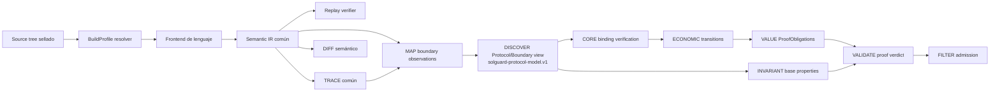

# Programa de madurez para ocho lenguajes

## 1. Definición defendible de soporte

Solguard no soporta un lenguaje porque reconozca su extensión o publique
símbolos. Una claim de soporte siempre tiene este scope:

```text
lenguaje
+ versiones/toolchain
+ perfiles de build
+ runtime/framework
+ familias económicas
+ nivel de capacidad medido
+ límites residuales
```

Ejemplos de forma, no certificados actuales:

```text
SOL-EVM-DEFI / Solidity / EVM DeFi /
solc={versiones exactas y digests del scope} / Foundry+Hardhat fijados /
vault+lending+oracle+rewards / C5

Rust / Solana Anchor / toolchain y features declaradas /
accounts+PDA+CPI+token accounting / C5

Go / Cosmos SDK / modules+build tags declarados /
bank+staking+authz+hooks / C5
```

No se admite `solc 0.x`, `Node Web3`, `native C++` ni una etiqueta equivalente
como scope ejecutable. El certificado enumera versiones, frameworks, perfiles,
targets, adaptadores y digests exactos. La forma abreviada sólo puede mostrarse
acompañada por un enlace al manifest completo.

«Experto en Rust» sin distinguir Solana, CosmWasm, Substrate o cliente nativo
es una afirmación falsa.

Python puede seguir siendo input tolerado donde ya exista, pero queda fuera de
la certificación de ocho lenguajes de este programa y no puede inflar sus
métricas.

## 2. Escala contractual de capacidades

| Nivel | Nombre | Garantía |
|---|---|---|
| C0 | Inventario | Source roots, archivos, toolchain y perfiles enumerados |
| C1 | Sintaxis exacta | AST/compiler IR, símbolos, tipos y spans reproducibles |
| C2 | Semántica local | CFG, guards, reads/writes, calls y efectos locales |
| C3 | Semántica interprocedural | Dispatch, aliases, closures, async/atomicidad y deuda |
| C4 | Semántica económica | Actores, activos, ledgers, flows, transiciones e invariantes |
| C5 | Experto blind certificado | `solguard-language-certification.v1` post-scan; los proof certificates por finding, negativos, metamórficos y ambos holdouts son evidencia interna |

Un run tiene un vector, no una media:

```text
Rust/Solana:
  source_inventory = exact
  parsing = exact
  type_resolution = exact
  dispatch = sound_over_approximation
  persistent_state = exact
  async_happens_before = partial
  account_semantics = exact
  economic_proof = exact
```

Un `partial` no se oculta detrás de `tier_1`. El vector anterior no obtiene C5
si `async_happens_before` participa en el witness: `economic_proof = exact` sólo
sería defendible si esa capacidad estuviera fuera de la ruta económica y de las
familias del scope desde el freeze original.

## 3. Requisitos universales de C5

La onda C6 implementa y cualifica cada scope desde C0 hasta C4. Su resultado es
un **C5 candidate** congelado: no es todavía una certificación. La onda C7
ejecuta `H-GEN-A` y `H-GEN-B`, evalúa ambos reveals y, sólo si todo pasa,
DEPLOY/evaluator post-scan emite C5 y un verifier independiente lo reproduce.

Un scope obtiene C5 únicamente si:

1. El scope exacto, las familias, el corpus, los perfiles, los toolchains y las
   exclusiones se congelan antes del primer holdout.
2. Todo input físico y todo perfil incluido en ese scope está inventariado.
3. No hay fallback regex/heurístico con autoridad terminal.
4. Símbolos, tipos, spans, estado, calls y efectos se reejecutan desde inputs
   limpios mediante un verifier independiente.
5. La semántica del framework se normaliza en la IR común.
6. Las familias declaradas tienen vulnerable, patched, safe, near-miss,
   metamórficos y adversariales.
7. Todos los positivos de conformidad cierran `ProofCertificate`, reciben
   `VALIDATE Supported`, `FILTER Pass` y
   `publication_eligibility=eligible`.
8. Ningún patched, safe o near-miss, incluidas todas sus transformaciones,
   obtiene `FILTER Pass`.
9. `H-GEN-A` supera los gates blind del scope con el candidate congelado.
10. `H-GEN-B`, independiente y sin retuning, vuelve a superarlos con los mismos
    hashes de scanner, reglas, prompts, modelos, materiality profile genérico y
    proof/admission policy. Sus `policy_set_commitment_root` son específicos de
    cada cohort y necesariamente distintos porque A/B comprometen sets
    disjuntos; sólo sus leaves/policies son target-specific y ninguna de ellas
    se abre al scanner.
11. DEPLOY/evaluator post-scan emite el certificado y un verifier independiente
    lo reproduce; el frontend, el runtime scanner, la documentación o un commit
    de harness no pueden autocertificarlo.

Una reducción de scope posterior a ver resultados invalida la campaña. Exige
un scope nuevo, nuevos manifests, nuevas asignaciones de corpus, dos holdouts
nuevos y un certificado distinto. No se rebaja el significado de C5 para hacer
pasar un lenguaje.

### 3.1 Regla bloqueante de deuda

Para cualquier hecho necesario en el witness:

```text
partial | unavailable | heuristic | unresolved crítico
=> ProofCertificate incompleto
=> VALIDATE Inconclusive
=> sin AdmissionResult; FILTER no se ejecuta
```

`sound_over_approximation` puede conservar un conjunto candidato y abrir una
investigación, pero no demuestra ausencia, unicidad, protección ni un witness
exacto. En C/C++, si el resultado depende de undefined behavior, el veredicto
es `Inconclusive` salvo que se pruebe un dominio concreto libre de UB. Puede
aparecer en deuda o en una cola técnica de investigación, pero nunca como
`ReviewEnvelope`, que exige `TechnicalVerdict Supported` y una decisión FILTER
real.

Una capacidad incompleta sólo puede quedar fuera de C5 cuando estaba excluida
en el scope congelado y ninguna familia certificada depende de ella.

`solguard-language-certification.v1` incluye:

- lenguaje y ecosystem pack;
- familias;
- frontend y binary digest;
- toolchain/image digest;
- IR/proof schema;
- `solguard-corpus-manifest.v1`;
- holdout attestation;
- métricas;
- excluded profiles;
- límites residuales;
- release BOM;
- fecha de expiración o invalidation conditions.

Cambiar parser, toolchain, schema, framework adapter, regla, prompt, modelo,
budget que altere cobertura o proof policy invalida la certificación afectada.

Gate E de novedad es una puerta de claim de producto separada. C5 demuestra
transferencia blind dentro de un scope; no demuestra por sí solo detección de
una familia causal excluida ni universalidad del lenguaje.

## 4. Arquitectura común de frontend



### 4.1 Ownership de `LANG-050`

`LANG-050` no tiene un único productor monolítico:

- MAP posee `LANG-050A`, observaciones físicas de boundary:
  ABI/FFI/RPC/event/queue,
  serialización, tipos, recursos y evidencia de source/build;
- DISCOVER posee `LANG-050B`, el perfil interno `Protocol/Boundary IR`:
  actores, activos, lifecycle, mensajes, context identities y relaciones entre
  componentes. No es un wire/schema/archivo adicional: es una vista declarada
  de `solguard-protocol-model.v1`;
- CORE posee `LANG-050C`: verifica envelopes, versiones, digests y bindings
  productor-consumidor;
- TRACE aporta causalidad, orden, estado y discontinuidades de atomicidad;
- ningún consumidor puede reinterpretar una observación parcial como modelo
  completo.

### 4.2 `BuildProfile`

Contiene:

- toolchain y digest;
- target/runtime;
- flags;
- features/tags/macros;
- dependencies/lock;
- workspace/module;
- generated sources;
- entrypoints;
- included/excluded translation units;
- sandbox receipt.

No ejecutar hooks, build scripts, plugins o macros no confiables en el host de
release. Se usa sandbox y el resultado queda ligado al profile.

Cada manifest fija, según aplique:

- compiler/runtime/standard exactos y sus digests;
- framework y adapter versions;
- package manager y lockfile;
- target triple, VM/chain/runtime y ABI;
- flags, features, tags, macros, profiles y module modes;
- generated-code policy y source-map policy;
- translation units o project references incluidos;
- exclusiones preregistradas y su impacto sobre familias.

### 4.3 `solguard-language-frontend-manifest.v1`

Métricas mínimas:

```text
files discovered / authoritative / fallback / excluded
symbols observed / exact / ambiguous
callsites observed / exact / candidate-set / unresolved
state accesses observed / bound / unresolved
CFG blocks and branches
numeric operations classified
effects classified
async/atomicity boundaries
capabilities
coverage debts
artifact digests
```

Estados:

- `exact`;
- `sound_over_approximation`;
- `partial`;
- `unavailable`.

Autoridad:

- `compiler`;
- `trusted_parser`;
- `derived`;
- `heuristic`.

`heuristic` sólo abre leads. `sound_over_approximation` no prueba ausencia.

### 4.4 Operaciones comunes

```text
Require, Branch, ReadState, WriteState,
Credit, Debit, Transfer, Mint, Burn, Lock, Unlock,
PriceRead, ExternalCall, DelegateCall, Callback,
Commit, Verify, Enqueue, Dequeue, Spawn, Await,
Emit, Return, Revert
```

Cada operación conserva semántica numérica, activo, unidad, actor, estado,
orden, evidence y build profile.

### 4.5 Cadena completa obligatoria por scope

Cada scope debe demostrar, con el mismo `run_id` y lineage:

```text
DEPLOY C0 scope/build profile sellado
-> MAP C1-C2 + boundary observations
-> TRACE C3 witness/counterevidence
-> DISCOVER vista Protocol/Boundary de solguard-protocol-model.v1
-> ECONOMIC transición concreta y kernel
-> INVARIANT propiedad independiente
-> DISCOVER hipótesis known/open-world sobre modelo e invariante
-> CORE canonical candidate con scope/claim/bindings
-> VALUE obligaciones, evidence loop, before/after, delta y certificado
-> VALIDATE veredicto técnico
-> FILTER Pass/Review/Reject
```

CORE agenda las `EvidenceRequest` acotadas entre candidate y certificado; cada
provider responde desde primarios y VALUE no elige un subconjunto de
obligaciones. DIFF se valida en paralelo sobre vulnerable→patched,
safe→regression y cambios de profile. Un scope no llega a C4 si ECONOMIC,
INVARIANT, VALUE, CORE o DIFF sólo han pasado tests comunes de Solidity o de
otro lenguaje.

Esos pares DIFF pertenecen exclusivamente al corpus visible de conformance
prefreeze. En H-GEN/H-NOVEL el scanner recibe un único snapshot opaco: ni el
patch, ni un sibling seguro, ni labels, metadata de diff o hashes comparables
se montan o se incluyen en prompts. DIFF no es evidencia de causalidad ni puede
entrar en `solguard-proof-certificate.v1` blind.

## 5. Kernels económicos comunes

| ID | Kernel | Propiedad |
|---|---|---|
| K1 | Conservation | inputs, outputs y accounting cuadran |
| K2 | Backing/solvency | supply, shares o debt tienen respaldo |
| K3 | Boundedness | fees, rates, rewards y caps respetan límites |
| K4 | Single consumption | claim, nonce, message o credit se consume una vez |
| K5 | Context binding | asset, actor, domain, epoch, fork y price son correctos |
| K6 | Ordering/atomicity | checks, writes y effects siguen orden seguro |
| K7 | Authority/lifecycle | sólo actor y fase válidos mutan economía |
| K8 | Precision | units, decimals, casts y rounding preservan valor |
| K9 | Commitment completeness | todos los campos consumidos están comprometidos |
| K10 | Economic liveness | fondos/estado no quedan irrecuperables |

Los packs de lenguaje traducen construcciones a estos kernels. ECONOMIC,
VALUE, INVARIANT y VALIDATE no se duplican ocho veces. Todo scope con ataque
estratégico aplica además `solguard-economic-adversary-model.v1`: capital y
liquidez finitos, repayment, depth/slippage, fees/gas/compute, oracle/window,
orden/MEV, callbacks, repetición acotada y delta neto. Un campo crítico unknown
o un beneficio que sólo existe con recursos infinitos impide Supported/Pass y
high/critical.

## 6. Solidity / EVM

Scope C5 obligatorio:

- `SOL-EVM-DEFI` — contratos EVM DeFi;
- set exacto de versiones/digests `solc` del manifest;
- versiones/configuraciones exactas de Foundry y Hardhat;
- proxies y libraries;
- Solidity y el subconjunto Yul/assembly declarado.

El manifest enumera cada combinación `solc + EVM version + optimizer/viaIR +
framework profile`. Yul/assembly crítico sin frontend/replay exacto bloquea el
scope; no puede ocultarse como deuda y conservar C5.

### LANG-SOL-01 — Frontend compiler-backed

- `solc --standard-json` en sandbox;
- pragmas y versiones;
- imports/remappings;
- AST, source maps, ABI, storage layout e IR;
- C3 linearization;
- overloads/overrides;
- modifiers;
- libraries y `using for`;
- interfaces;
- structs/mappings/arrays/packing;
- immutables y transient storage;
- generated artifacts excluidos o ligados.

### LANG-SOL-02 — Control y estado

- modifiers expandidos semánticamente;
- CFG/def-use;
- calldata/memory/storage;
- revert/rollback;
- external calls;
- `call/staticcall/delegatecall`;
- callbacks/token hooks;
- reentrancy y cross-contract closure;
- proxy/implementation sets;
- assembly/Yul exacto o deuda.

### LANG-SOL-03 — Packs económicos

- vault/share/accounting;
- fee-on-transfer/rebase;
- lending/interest/solvency/liquidation;
- AMM/pricing/slippage/fees;
- oracle freshness/decimals/context;
- rewards/emissions/indexes;
- staking/slashing/withdrawal queues;
- signatures/nonces/domain/replay;
- bridges/commitments;
- governance/upgrades/migration;
- callback/flash-loan/ordering.

Estas familias no son sólo patrones. `SOL-EVM-DEFI` debe probar la estrategia
contra capital/flash liquidity y repayment reales, market depth, slippage,
fees+gas, oracle/TWAP/heartbeat, orden/MEV/callback y una secuencia acotada; el
lower bound económico es neto de costes. Los near-misses cambian una sola de
esas restricciones para eliminar beneficio o materialidad y deben ser
rechazados.

### LANG-SOL-04 — DIFF y verificador

- ABI;
- storage layout;
- guard/modifier;
- call target;
- units;
- economic operation;
- proxy target;
- compiler replay.

### LANG-SOL-05 — Gate E2E

Cada vulnerable:

```text
compiler MAP
-> exact TRACE
-> concrete transition
-> independent invariant
-> complete proof
-> VALIDATE Supported
-> FILTER Pass
```

Cada patch y near-miss produce no pass.

## 7. Vyper / EVM

Scope C5 obligatorio:

- `VYP-EVM-DEFI` — contratos DeFi EVM;
- versiones/digests exactos de Vyper declarados;
- modules/interfaces;
- semántica de decorators y calls;
- framework/build profiles exactos del manifest.

### LANG-VYP-01 — Sustituir regex autoritativa

- AST/IR de compilador Vyper fijado;
- version matrix;
- source maps;
- constructors/default args;
- modules/interfaces;
- decorators/visibility;
- `HashMap`, `DynArray`, structs, immutables;
- storage layout;
- compiler replay.

### LANG-VYP-02 — Calls y seguridad

- `raw_call`;
- `extcall/staticcall`;
- `send`;
- return flags;
- event;
- nonreentrant por versión;
- callbacks;
- revert.

### LANG-VYP-03 — Semántica EVM reutilizada correctamente

Puede reutilizar el mapping EVM → Protocol/Economic IR. No puede reutilizar:

- parser Solidity;
- visibility assumptions;
- source binding;
- fixture equivalente como certificación Vyper.

### LANG-VYP-04 — Packs y gate

Las familias Solidity/EVM se reproducen con código Vyper independiente,
patches, safe y near-miss propios.

## 8. Rust

No existe un único pack Rust. Son obligatorios:

- `RST-SOLANA-ANCHOR`;
- `RST-COSMWASM`;
- `RST-NEAR`;
- `RST-SUBSTRATE-FRAME`;
- `RST-NATIVE-CLIENT`.

Cada scope fija toolchain, target, editions, workspace members, features,
framework crates/macros, adapter versions, lockfile y política de build
scripts/proc macros. CosmWasm y NEAR no comparten certificado.

### LANG-RUST-01 — Frontend

- `cargo metadata`;
- workspace/lock;
- toolchain;
- `cfg/features/target`;
- build profiles;
- macro expansion en sandbox;
- HIR/type resolution;
- MIR/CFG para toda ruta certificada que lo necesite;
- traits/impls/generics/associated types;
- ownership, borrow/alias regions y move/copy effects;
- dispatch;
- async/futures/channels;
- unsafe/FFI exacto o deuda bloqueante cuando afecta el witness;
- serialization/discriminants;
- replay verifier.

### LANG-RUST-02 — Solana/Anchor

- signer/owner/writable;
- PDA seeds/bump;
- init/reinit/close;
- account constraints;
- remaining accounts;
- token accounts/decimals;
- CPI/callback;
- account substitution;
- lifecycle;
- rent/storage effects.

Familias:

- authority/account identity;
- PDA/context;
- CPI ordering;
- token accounting;
- reinitialization;
- arithmetic/casts;
- replay;
- rewards/staking.

### LANG-RUST-03A — CosmWasm

- entrypoints;
- storage keys;
- transferred funds;
- messages/submessages;
- replies/callbacks;
- serialization;
- gas/error/rollback boundaries;
- cross-contract asset flow.

Familias mínimas: K1, K2, K4, K5, K6, K7, K8, K9 y K10.

### LANG-RUST-03B — NEAR

- methods públicos y access keys;
- attached deposit y storage staking;
- promises, callbacks y promise results;
- predecessor/signer/current account identities;
- persistent collections y serialization;
- gas, panic y partial asynchronous completion;
- fungible/non-fungible token accounting;
- cross-contract asset flow.

Familias mínimas: K1, K2, K4, K5, K6, K7, K8, K9 y K10.

### LANG-RUST-04 — Substrate/FRAME

- origins;
- pallets;
- storage;
- hooks;
- extrinsics;
- weights;
- cross-pallet calls;
- balances/assets;
- staking/slashing;
- governance/upgrades.

Familias mínimas: K1, K2, K3, K4, K5, K6, K7, K8, K9 y K10.

### LANG-RUST-05 — Cliente/consenso

- validator/fork/checkpoint;
- persistence;
- serialization/commitment;
- quorum;
- replay;
- concurrency;
- finality;
- reward/slashing accounting.

Familias mínimas: K1, K3, K4, K5, K6, K7, K8, K9 y K10.

### LANG-RUST-06 — Gate

Cada pack tiene certificación separada. No existe checkbox global Rust hasta
que los cinco scopes declarados estén C5 mediante `H-GEN-A` y `H-GEN-B`.

## 9. Go

Packs obligatorios:

- `GO-COSMOS-SDK`;
- `GO-GETH-CLIENT`;
- `GO-RELAYER-ORACLE`.

Cada scope fija versión/digest Go, `go.work`, módulos, replacements, vendor,
framework versions, build tags, GOOS/GOARCH, generated-code policy y adapters.

### LANG-GO-01 — Frontend

- `go.work`, modules, vendor, replace;
- `go/packages`, `go/types`, SSA;
- build tags, GOOS/GOARCH;
- interfaces/generics;
- dispatch sets;
- pointer/escape/alias analysis;
- indirect calls/reflection como deuda bloqueante en rutas certificadas;
- `defer`, panic/recover;
- error propagation;
- goroutines/channels/mutex/happens-before;
- generated protobuf;
- replay verifier.

### LANG-GO-02 — Cosmos SDK

- MsgServer/keepers;
- KVStore keys;
- bank/supply;
- denoms;
- authz;
- hooks;
- begin/end block;
- staking/slashing/rewards;
- module boundaries.

Familias mínimas: K1, K2, K3, K4, K5, K6, K7, K8, K9 y K10.

### LANG-GO-03 — Geth/cliente

- state transition;
- nonce;
- gas/fee;
- mempool;
- replacement;
- fork/reorg;
- chain context;
- persistence;
- consensus/finality boundary.

Familias mínimas: K1, K3, K4, K5, K6, K7, K8, K9 y K10.

### LANG-GO-04 — Relayer/oracle

- RPC trust/finality;
- retry;
- dedupe;
- queue;
- cache;
- idempotency;
- domain/message identity;
- signing;
- asset routing.

Familias mínimas: K1, K4, K5, K6, K7, K8, K9 y K10.

### LANG-GO-05 — Cierre de fuga

Todos los extractores corpus-shaped actuales:

- sólo `rule_assisted`;
- origin visible;
- cero authority en blind;
- negativos por evidence/guard/storage/call/path.

Cada uno de los tres scopes tiene qualification C0-C4 y certificados C5
separados. El agregado Go no puede cerrarse por promedio ni por el éxito de un
único ecosistema.

## 10. C

Scope C5 obligatorio:

- `C-UTXO-CONSENSUS`;
- `C-BRIDGE-FINALITY`;
- `C-WALLET-CUSTODY`;
- translation units declaradas;
- economic-impact memory issues únicamente.

Cada scope fija estándar C, compiler/build image, target triple, ABI, flags,
macros, includes, linker inputs y digest de `compile_commands.json`.

### LANG-C-01 — Build authority

- `compile_commands.json`;
- Clang AST/CFG;
- preprocessor provenance;
- macros/includes/target/flags;
- cross-TU symbols;
- linker visibility;
- toolchain/image;
- excluded units como debt.

### LANG-C-02 — Semántica

- structs/unions;
- global/static/heap;
- pointer alias;
- function pointers;
- integer promotions;
- signedness/widths;
- undefined overflow;
- atomics/threads/locks;
- serialization/endian/layout;
- persistent state.

### LANG-C-03 — Packs económicos

- money range/supply;
- UTXO inputs/outputs/fees;
- signature/sighash/context;
- canonical serialization;
- timelock/height/fork;
- mempool/replacement;
- replay;
- integer/rounding;
- cache/persistence;
- bridge/finality.

### LANG-C-04 — Scope de memory safety

Un fallo de memoria sólo entra en finding económico si:

- hay ruta alcanzable;
- actor control;
- state/effect;
- delta;
- invariant;
- misma proof discipline.

Solguard no se convierte en scanner genérico de C memory safety.

La capability mínima, sin embargo, es real y medible:

- bounds/region y pointer provenance;
- allocation/free ownership, lifetime, UAF y double-free;
- stack/heap/global alias y invalid read/write;
- integer-to-allocation/offset y serialization length;
- thread/atomic/race state cuando afecte contabilidad;
- receipts de Clang/LLVM static analysis, symbolic memory model y
  ASan/UBSan/MSan harness aislado cuando aplique;
- bridge causal actor-controlled bytes → memory effect → persistent/economic
  state → delta/invariant.

Un sanitizer hit aislado, UB sin witness estable o crash sin estado económico
produce lead/debt, no finding. Capability unavailable, build profile no
instrumentable, path no acotado o sanitizer/symbolic disagreement bloquea el C4
del scope afectado; no permite llamarlo experto.

### LANG-C-05 — DIFF y gate

DIFF compara preprocessor profiles, ABI/layout, signedness, width, serialization,
function-pointer targets y atomicity. Cada uno de los tres scopes termina C6
como C5 candidate y sólo recibe C5 en C7.

## 11. C++

Scope C5 obligatorio:

- `CPP-UTXO-CONSENSUS`;
- `CPP-BRIDGE-FINALITY`;
- `CPP-WALLET-CUSTODY`;
- base Clang y build profiles exactos.

Cada scope fija estándar C++, compiler/stdlib/linker, target triple, ABI,
compile database, flags, macros, template instantiations cubiertas y digests.

### LANG-CPP-01 — Semántica adicional

- templates/instantiations;
- overload resolution;
- virtual dispatch/inheritance;
- lambdas/captures;
- RAII/destructors;
- exceptions/partial effects;
- move/copy;
- containers/iterators;
- `constexpr`;
- object lifetime;
- atomics/concurrency.

### LANG-CPP-02 — Packs

Los de C, más:

- class invariant desynchronization;
- exception/rollback parcial;
- object/cache lifetime con valor;
- wallet/custody accounting;
- template/build-profile consensus divergence.

La capa C++ añade bounds/ownership/lifetime de objetos, smart pointers,
move/copy, iterator invalidation, RAII/destructor, exception unwind,
use-after-move/free y virtual-target lifetime. Combina Clang/LLVM static/
symbolic receipts y sanitizers aislados con el mismo bridge causal económico de
C. Un crash, race o UB sin ruta/actor/state/delta sólo es lead o debt.

### LANG-CPP-03 — DIFF

C++ deja de caer en `Other`. Cambios de template instantiation, virtual target,
layout, signedness o exception boundary se modelan.

Cada uno de los tres scopes termina C6 como C5 candidate y se certifica por
separado en C7. El éxito del frontend C no certifica C++.

## 12. JavaScript

Scope C5 obligatorio:

- `JS-NODE-RELAYER`;
- `JS-NODE-KEEPER-ORACLE`;
- `JS-NODE-TX-BUILDER`.

Cada scope fija Node runtime, module mode, package manager/lockfile, framework
packages/adapters, database/queue/cache drivers, transpilers, source-map policy
y exact dependency graph. “Node Web3” por sí solo no es un scope.

### LANG-JS-01 — Frontend separado

- ESM/CommonJS;
- exports/imports;
- AST/CFG propio;
- closures/prototypes/destructuring;
- module state;
- dynamic properties/reflection como sets/debt;
- promises/callbacks/events/timers;
- event-loop order;
- source maps;
- `Number`, `BigInt`, `bn.js`, BigNumber;
- unit tracking.

### LANG-JS-02 — Packs

- tx construction;
- chain/domain/nonce/signature;
- slippage/deadline/value/gas/fee;
- RPC finality/reorg/stale cache;
- relayer dedupe;
- oracle/keeper freshness;
- BigInt/decimal/rounding;
- retry/idempotency/concurrency;
- custody/asset routing;
- configuration/admin.

### LANG-JS-03 — Blind

No comparte certificado con TypeScript. Las heurísticas Node conocidas sólo
pertenecen a `rule_assisted`.

Los tres scopes terminan C6 como candidates separados y requieren sus propios
H-GEN-A/H-GEN-B. Dynamic properties o reflection en una arista crítica bloquean
la proof conforme a la regla de deuda.

## 13. TypeScript

Scope C5 obligatorio:

- `TS-NODE-RELAYER-SDK`;
- `TS-NODE-KEEPER-ORACLE`;
- `TS-NODE-TX-BUILDER`.

Cada scope fija TypeScript compiler, Node runtime, `tsconfig` hierarchy,
compiler options, project references, module mode, package graph, exact
ethers/viem/web3 adapters, generated-client policy y source maps.

### LANG-TS-01 — TypeScript compiler

- Compiler API/type checker;
- tsconfig;
- project references;
- paths;
- package boundaries;
- generics/unions/overloads;
- decorators;
- inferred types;
- runtime erasure;
- transpilation/source maps;
- async/effects;
- generated clients.

### LANG-TS-02 — Packs

Los de JavaScript, más:

- narrowing no válido en runtime;
- deserialización no validada;
- `number`/`bigint`;
- optional fields en commitments;
- branded units perdidas;
- schema/client drift.

### LANG-TS-03 — Gate

Fixture TypeScript no certifica JavaScript y viceversa. Las métricas se separan.

Los tres scopes reciben certificados separados; el agregado TypeScript es su
conjunción y no una media.

## 14. Sistemas cross-language

Una herramienta Web3 experta debe seguir valor a través de boundaries.

Casos obligatorios:

- `X-SOL-TS-RELAYER` — Solidity + TypeScript relayer;
- `X-VYP-JS-KEEPER` — Vyper + JavaScript keeper/oracle;
- `X-SOLANA-TS-CLIENT` — Rust Solana/Anchor + TypeScript client;
- `X-COSMWASM-GO-RELAYER` — Rust CosmWasm + Go relayer;
- `X-NEAR-JS-CLIENT` — Rust NEAR + JavaScript client;
- `X-GO-C-FFI` — Go client + C native boundary;
- `X-GO-CPP-FFI` — Go client + C++ native boundary;
- `X-TS-DATA-SOL-TX` — database/queue/event + TypeScript tx builder +
  Solidity.

### LANG-X-01 — Boundary identities

- ABI/schema/message;
- asset/unit;
- actor/key;
- chain/domain;
- nonce/message ID;
- source/sink;
- commitment fields;
- serialization;
- version.

### LANG-X-02 — TRACE compuesto

- causal edge cross-language;
- async/finality;
- retry/replay;
- queue/cache;
- atomicity discontinuity;
- counterevidence.

### LANG-X-03 — Economic composition

- flow único;
- same asset;
- state handoff;
- external service assumptions;
- before/after;
- delta;
- liveness.

### LANG-X-04 — Gate

Los ocho scopes exactos cubren seis categorías de boundary y terminan E2E con
implementaciones independientes, patched, safe, near-miss, metamórficos y
fallos parciales. Siete de ocho scopes o cinco de seis categorías es fallo.
Cada scope atraviesa MAP, TRACE, DISCOVER, ECONOMIC, INVARIANT, CORE, VALUE,
VALIDATE y FILTER; DIFF valida cambios en ambos lados de la boundary.

## 15. Matriz de corpus

Cada `(lenguaje, ecosystem pack, familia)` contiene:

| Celda | Contenido |
|---|---|
| Vulnerable | mínimo + implementaciones reales independientes |
| Patched | parche upstream del mismo root |
| Safe | diseño seguro alternativo |
| Near-miss | misma forma/vocabulario sin ruptura |
| Metamorphic | transformación equivalente |
| Adversarial | decoys, ambiguity, budget y hostile layout |

Mínimo de admisión por familia:

- tres roots vulnerables independientes;
- patches de los tres;
- tres diseños seguros alternativos;
- cinco near-miss;
- transformaciones obligatorias;
- un caso compuesto con otra familia.

Estos números describen corpus requerido, no resultados actuales.

### Transformaciones obligatorias

- alpha-renaming;
- extracción/inlining;
- split/merge files/modules;
- wrapper/interface/trait/proxy;
- declaration reorder;
- early-return vs branch;
- match/switch equivalente;
- aliases/structs;
- framework idiom alternativo;
- comments/docs/formatting;
- dead code y decoys;
- feature/build tag equivalente;
- boundary cross-component;
- ruido seguro.

### Near-miss obligatorios

- palabras vulnerables sólo en comments/tests/vendor;
- protección en helper/modifier/middleware/trait;
- ruta inalcanzable;
- actor sin control;
- delta cero;
- mismo propietario;
- protección antes de efecto;
- context completo con nombres atípicos;
- bounded intencional;
- family correcta pero asset/flow/profile distintos.

### Case manifest

El oracle vive fuera del scan root:

```text
case_id
language
ecosystem
family
cell
source commit/hash
build profiles
expected structural facts
expected transition/invariant
expected final decision
fixed pair
metamorphic parent
split assignment
oracle digest
```

## 16. Gates de certificación

Estos son floors de aceptación futuros, no métricas actuales.

### Gate A — Integridad

- 100% schemas/consumidores compatibles;
- 100% hashes/IDs/receipts reconciliados;
- 0 evidence sin authority;
- 0 fallback silencioso;
- 0 forged evidence aceptada;
- límites N-1/N/N+1;
- crash/timeout/OOM → deuda.

### Gate B — Frontend de conformidad

- 100% runtime files inventariados;
- 100% fixtures obligatorios sin fallback;
- 100% spans/bindings goldens;
- 100% facts obligatorios;
- 0 facts exactos falsos;
- replay independiente.

Sobre corpus real anotado del scope:

- ≥99% archivos runtime con parsing autoritativo;
- ≥98% callsites exactos o candidate-set sound;
- ≥98% accesses críticos ligados;
- toda diferencia como deuda.

El scope y sus denominadores se congelan antes de cualquier holdout. Si no se
cumplen estos floors, el scope falla. No puede reducirse después de observar
resultados. Una propuesta más estrecha se registra como scope nuevo y reinicia
corpus, asignaciones, H-GEN-A y H-GEN-B.

Los porcentajes se calculan por files y bytes, perfil y clase de hecho. Las
exclusiones sólo salen del denominador cuando estaban preregistradas, tienen
razón tipada y no son necesarias para ninguna familia certificada.

### Gate C — Conformidad económica

- 100% vulnerables obligatorios generan candidato;
- 100% cierran proof y pass;
- 0 patched/safe/near-miss pass, incluidas todas sus transformaciones
  metamórficas y adversariales;
- 100% transformaciones normativas conservan decisión;
- ≥95% de transformaciones **positivas** adversariales conservan top-10 y
  clasificación causal;
- 0 checker_missing en familia certificada;
- 0 proof por patrón sin delta.

El floor del 95% nunca se aplica a controles negativos. Un único `Pass` falso
en un patched/safe/near-miss obligatorio falla Gate C.

### Gate D — Holdout de transferencia y C5

Por scope congelado, tanto `H-GEN-A` como `H-GEN-B` deben pasar:

- `strict_precision` puntual ≥90% y límite inferior ≥80%;
- `raw_pass_support_precision` puntual ≥90% y límite inferior ≥80%, con
  suppression/dedupe y sus razones publicadas;
- `all_committed_strict_recall`,
  `predeclared_scoreable_strict_recall` y `macro_recall` puntuales ≥70%, con
  límites inferiores simultáneos ≥55%;
- `finding_recall_at_10` ≥80% y
  `positive_target_hit_rate_at_10` publicado por separado;
- cero `FILTER Pass` en patched/safe/near-miss obligatorios y sus
  transformaciones;
- `negative_target_false_alert_rate` puntual ≤2% y límite superior ≤5%;
- `adjudication_coverage = 100%` y evidence completion del 100%;
- mediana de review burden ≤10 y P95 ≤25;
- mediana de raw pass burden ≤15 y P95 ≤40;
- mediana/P95 de technical inconclusive ≤10/25, candidate burden ≤50/100 y
  proof-debt burden ≤10/25; `filter_failure_burden=0`;
- todos los ceilings del resource profile congelado pasan, timeout de modelo
  <2 %, schema/model failure <1 % y cero OOM/non-completion en controles;
- non-duplicate suppression puntual ≤10% y límite superior ≤20%;
- cero falsos high/critical en controles;
- metamorphic consistency ≥95%;
- cero leak;
- macro por familia;
- denominadores mínimos e intervalos preregistrados;
- lower confidence bounds compatibles con los floors;
- hashes idénticos de scanner, reglas, prompts, modelos y proof policy entre
  ambas ceremonias.

Los point estimates sin intervalos o con potencia insuficiente no certifican.
`H-GEN-B` es lineage-disjoint de `H-GEN-A`; no es un replay del mismo corpus.
La definición, denominadores y protocolo estadístico normativos son exactamente
los de `05_VALIDACION_CIEGA_Y_RELEASE.md` §12 y §13.5; una implementación no
puede elegir el gate más débil entre documentos.

C6 sólo produce el candidate que ha pasado Gates A-C. C7 ejecuta Gate D y
emite `solguard-language-certification.v1` únicamente si `H-GEN-A` y
`H-GEN-B` pasan.
Un commit no emite por sí solo un agregado C5.

### Gate E — Novedad

Para afirmar bugs nuevos:

- familias excluidas de rules/prompts/corpus visible;
- cada TP que sostiene novedad tiene `effective_knowledge_taint=open_world` y
  cero ancestors rule-pack, historical-retrieval o TRAIN/DEV, demostrado por
  ancestor-set root y join receipt;
- freeze pre-oracle;
- H-NOVEL-A y H-NOVEL-B disjuntos, comprometidos antes de cualquier scan, con
  targets, truth, controles, `N`, `n_eff`, presupuesto y stopping rule;
- mismo BOM en ambas cohortes y ambos outputs sellados antes de revelar uno;
- al menos dos roots independientes de dos familias excluidas con
  `ProofCertificate complete`, `VALIDATE Supported`, `FILTER Pass`,
  `publication_eligibility=eligible` y adjudicación post-freeze;
- confirmación posterior;
- segunda ceremonia sin retuning;
- misses, falsos avisos, review y denominadores publicados;
- endpoints e intervalos de H-NOVEL superados según
  `05_VALIDACION_CIEGA_Y_RELEASE.md`.

Gate E autoriza un claim de novedad sólo dentro del alcance y diseño de esas
ceremonias. No convierte todos los scopes C5 en detectores universales de
familias nuevas.

## 17. Work packages comunes

| ID | Resultado |
|---|---|
| LANG-000 | Claim policy y certificación scoped |
| LANG-010-HARNESS | Implementación del harness de conformidad Semantic IR v1 |
| LANG-010 | Agregado calculado del harness y todos los gates C1 de scope |
| LANG-020-HARNESS | Implementación del harness de BuildProfiles y sandbox |
| LANG-020 | Agregado calculado del harness y todos los gates C0 de scope |
| LANG-030-HARNESS | Implementación del replay verifier desde inputs limpios |
| LANG-030 | Agregado calculado del harness y todos los replays C1 de scope |
| LANG-040-HARNESS | Implementación del harness TRACE semántico común |
| LANG-040 | Agregado calculado del harness y todos los gates C3 de scope |
| LANG-050A | MAP publica boundary observations tipadas |
| LANG-050B | DISCOVER deriva la vista Protocol/Boundary del `solguard-protocol-model.v1` |
| LANG-050C | CORE verifica binding observación-modelo-productor |
| LANG-050 | Agregado calculado de 050A/050B/050C y todos los scopes |
| LANG-060 | Economic kernels |
| LANG-070 | EvidenceRequest/fixpoint |
| LANG-080-VALIDATE | Implementación del contrato de verdict genérico |
| LANG-080-FILTER | Implementación del contrato de admission genérico |
| LANG-080 | Agregado calculado de ambos hijos y todos los scopes |
| LANG-090-HARNESS | Implementación del harness DIFF semántico |
| LANG-090 | Agregado calculado del harness y todos los scopes |
| LANG-100 a 170 | Agregados calculados de certificados de scopes por lenguaje |
| LANG-180 | Agregado calculado de ocho certificados cross-language que cubren seis categorías de boundary |
| LANG-190-HARNESS | Implementación del harness de corpus/metamorfismo |
| LANG-190 | Agregado calculado de matrices C4 completas |
| LANG-200-HARNESS | Implementación del harness de certificación blind |
| LANG-200 | Agregado calculado de todos los certificados C5 obligatorios |

Los IDs agregados `LANG-010`, `LANG-020`, `LANG-030`, `LANG-040`, `LANG-050`,
`LANG-080`, `LANG-090` y `LANG-100..200` no son task IDs cerrables por un
commit. Un commit de docs, harness o frontend sólo aporta evidencia a un
prerequisito. Las fórmulas AND normativas, scopes y evidencias están en
[`10_MATRIZ_CERTIFICACION_SCOPES.md`](10_MATRIZ_CERTIFICACION_SCOPES.md).

Orden:

1. verdad/IR/proof loop;
2. Solidity C0-C4 como reference implementation, tooling C7 necesario y corte
   `RC-V-EVM-1`;
3. validación/medición bounty vertical y contamination-close, sin certificar
   ocho lenguajes;
4. Vyper C0-C4 reutilizando sólo mapping EVM y C5 candidate;
5. Rust y Go;
6. C;
7. C++;
8. TypeScript;
9. JavaScript;
10. composición cross-language;
11. nuevo `RC-FULL-1`, revalidation/refreeze y H-GEN-A/B full para emitir los
    certificados C5.

Este orden no reduce el objetivo final. Evita abrir ocho ramas horizontales
antes de que exista una definición común de evidencia y permite medir utilidad
Solidity antes. Los aggregates `LANG-010/040/...` de todos los scopes no son
dependencias de `SOL-EVM-DEFI-C4`; sólo entran en certificación/full-product.
Freeze, corpus, canary, known, holdout, novelty, chaos y LIVE se repiten por
candidate epoch: no se arrastran resultados verticales al full.

El certificado vertical conserva un snapshot histórico de las versiones y
eventos exactos que consumió. Si una capability común se corrige antes de
`RC-FULL-1`, el full pinnea la aceptación nueva y repite su validación; esa
reapertura no propaga dentro de `RC-V-EVM-1` ya cerrado ni cambia retrospectivamente
su claim. Reutilizar un ID sin subject/version/content root y acceptance event
exactos es cross-epoch leakage y falla cerrado.

Para cada C5A/C5B, la evaluación conserva el desglose por
`semantic_generic|rule_pack|model_grounded|historical_retrieval|
direct_tool_finding` y ejecuta las ablaciones canónicas con inputs, budgets y
evaluator idénticos. `historical_retrieval` es inalcanzable en H-GEN/H-NOVEL.
Un scope puede superar detección full por rule pack y, a la vez, fallar la
capacidad genérica; el certificado y el claim deben mostrar ambas verdades. Un
hit H-NOVEL sostenido sólo por rule pack no certifica causa nueva.

## 18. Checklist de lenguaje

Una certificación individual requiere estas evidencias separadas:

- [ ] C0 — Scope, toolchain, profiles e inventario congelados.
- [ ] C1 — Frontend autoritativo, Semantic IR y replay verifier.
- [ ] C2 — CFG, calls, state, effects y numeric domains locales.
- [ ] C3 — TRACE interprocedural, async/atomicidad y deuda completa.
- [ ] C4 — DISCOVER, ECONOMIC, VALUE, INVARIANT, VALIDATE, FILTER y DIFF E2E;
      matrices vulnerable/patched/safe/near-miss/metamorphic/adversarial.
- [ ] C5A — H-GEN-A sellado supera gates e intervalos.
- [ ] C5B — H-GEN-B independiente, sin retuning, vuelve a superarlos.
- [ ] CERT — DEPLOY/evaluator post-scan emite
      `solguard-language-certification.v1` ligado al release BOM y un verifier
      independiente lo reproduce.

La checklist maestra no marca «8 lenguajes» hasta que cada scope obligatorio y
los sistemas cross-language estén aceptados.

La única claim autorizada por `LANG-200` es: “Solguard dispone de certificación
C5 en los scopes publicados de ocho lenguajes”. Siempre se enumera el manifest
de scopes. No autoriza “experto en todo Rust/C++/JavaScript”, universalidad,
explotación ni bounty garantizado.
