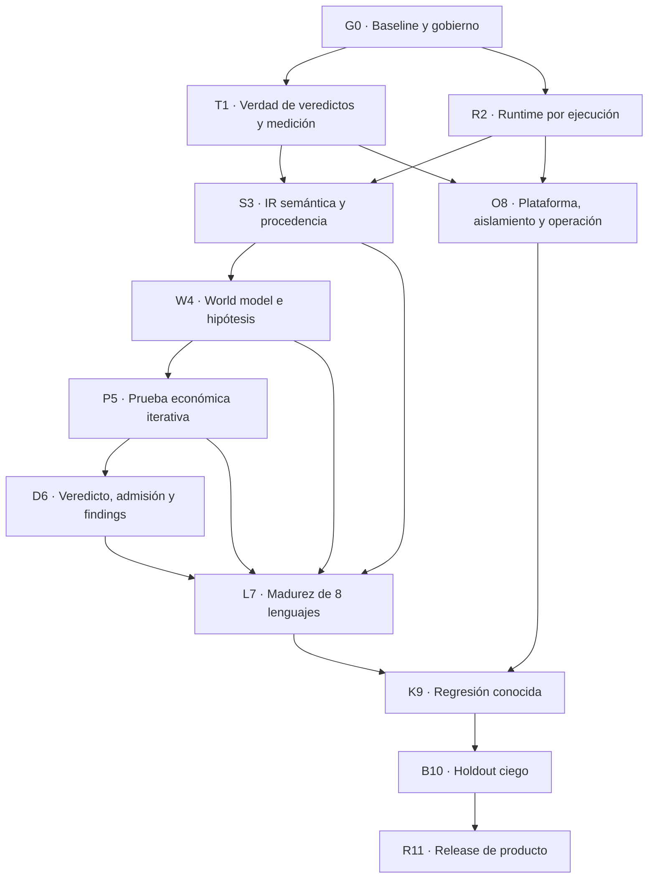

# Programa maestro de madurez de Solguard

Estado editorial del plan: **CERRADO Y CONGELADO** para la versión
`solguard-detection-maturity-2026-07-25.4`. Cualquier cambio posterior exige
una nueva versión, regenerar las vistas y superar de nuevo el validador.

Estado de ejecución: **PENDIENTE**. Cerrar el plan no acepta ningún estado del
ledger, no marca la checklist como implementada y no autoriza claims de
madurez, detección ciega, utilidad, bounty ni release.

Fecha de referencia: 25 de julio de 2026.

Ámbito: infraestructura de detección formada por `solguard-map`,
`solguard-trace`, `solguard-discover`, `solguard-economic`, `solguard-value`,
`solguard-invariant`, `solguard-validate`, `solguard-filter`, `solguard-diff`,
`solguard-database`, `solguard-core`, `solguard-backend`, `solguard-deploy`,
`solguard-docs` y `solguard-agents`.

Fuera de ámbito: explotación, generación o ejecución de PoC, reporte de bounty
final, `solguard-exploit` y `solguard-cli`. El límite funcional de este programa
es publicar findings válidos, reproducibles y económicamente demostrados. El
paso siguiente, deliberadamente no cubierto, será explotación.

<!-- GENERATED:CANONICAL-STATUS:BEGIN -->
Ledger canónico `solguard-detection-maturity-2026-07-25.4`: roots node/contribution/all-counted = `6fab73e53ff6adbb1cdb940e611a83774d0e0d48a85f3a96650b6bd3af374e3b` / `d9b86f98702c0da74b8324b400302ae9f6c437625467dfff2b2c3fd136020885` / `0d323e2fab3955e8ac50fa717c086fa538542ea4f0efd18001f5e03eefe4866d`.
Perfil activo: `development` / `single-custodian`. No declara independencia humana ni de custodia.
<!-- GENERATED:CANONICAL-STATUS:END -->

## 1. Propósito

Este programa transforma la
[auditoría inicial](../AUDITORIA_COMPLETA_INICIAL.md) en un plan de ingeniería
ejecutable. No es una lista de ideas ni una promesa de rendimiento. Define:

- la arquitectura de producto objetivo;
- la responsabilidad final de cada repositorio;
- los contratos y migraciones interrepo;
- el orden obligatorio de implementación;
- los commits pequeños que deben producirse;
- las pruebas unitarias, contractuales, adversariales y end-to-end;
- la validación conocida y la validación ciega;
- los artefactos de evidencia requeridos;
- los criterios que permiten marcar cada trabajo como aceptado;
- la checklist que determina si el programa está realmente completo.

La referencia histórica de lo implementado antes de este programa está
archivada en
[20-25-Jul-2026](../../20-25-Jul-2026/AUDITORIA.md). Ese material es contexto,
no evidencia de que los nuevos objetivos estén satisfechos.

## 2. Resultado exigido

El programa no se considera completo hasta que Solguard pueda demostrar, con
evidencia congelada e independiente, las cinco afirmaciones siguientes:

1. **Verdad:** un finding publicado siempre representa una ruptura de
   invariante y un efecto concreto; una coincidencia de regla, un candidato o un
   `VALIDATE supported` incompleto nunca se contabilizan como detección.
2. **Utilidad:** los findings admitidos tienen precisión suficiente para
   justificar revisión humana y aparecen en posiciones útiles del ranking.
3. **Generalización:** la herramienta detecta fallos estrictos en un holdout que
   estuvo física y lógicamente fuera del alcance del scanner.
4. **Novedad:** H-NOVEL-A y H-NOVEL-B sellados detectan causas excluidas del
   conocimiento operativo y del corpus congelado, con contaminación ausente,
   adjudicación independiente y todos los endpoints cuantitativos de `05`;
   marcar un origin como open-world o no-rule jamás prueba novedad por sí solo.
5. **Profundidad multilenguaje acotada:** Solguard obtiene certificación C5 en
   los **30 scopes publicados** de Solidity, Vyper, Rust, Go, C, C++,
   JavaScript y TypeScript, con versiones, frameworks, familias, perfiles y
   exclusiones congelados. Esto no equivale a ser experto universal en todo
   constructo de los ocho lenguajes.

Completar código, pasar unit tests o ejecutar corpus conocidos no basta para
demostrar esas afirmaciones.

## 3. Qué significa «100%»

La autoridad es [`acceptance-ledger.v1.json`](acceptance-ledger.v1.json), no el Markdown. Esta versión cierra la especificación; el trabajo sigue inicialmente pending.

Universo exacto: **440 primary + 128 derived + 1103 contributions = 1671 ítems contados**.

«100%» exige primary de implementación accepted, primary terminalizables terminales, todas las contributions accepted, derived materializados, `RC-FULL-1-CLOSE=closed_pass`, release train sin pending/reopened, `FINAL-007` accepted y `CLAIM-007=true`.

Cerrar o implementar el plan no garantiza bounty, detección universal ni bugs futuros. Los claims sólo valen dentro de scopes, cohorts, amenazas y recursos congelados cuando los gates medidos pasan.

## 4. Documentos del programa

Leer y aplicar la precedencia en este orden:

1. [01_CONTRATO_DE_MADUREZ_Y_ARQUITECTURA.md](01_CONTRATO_DE_MADUREZ_Y_ARQUITECTURA.md)
   Define el producto, la arquitectura destino, las autoridades y qué es un
   finding válido.
2. [09_CONTRATOS_LEDGER_Y_DEPENDENCIAS.md](09_CONTRATOS_LEDGER_Y_DEPENDENCIAS.md)
   y [acceptance-ledger.v1.json](acceptance-ledger.v1.json) fijan IDs, owners,
   contratos canónicos, DAG, predicates, estados, reapertura y claims.
3. [05_VALIDACION_CIEGA_Y_RELEASE.md](05_VALIDACION_CIEGA_Y_RELEASE.md)
   Define corpus, métricas, aislamiento, holdouts, thresholds y release.
4. [02_PROGRAMA_ESTRUCTURAL.md](02_PROGRAMA_ESTRUCTURAL.md)
   Divide la transformación en fases y work packages ejecutables.
5. [03_PLAN_POR_REPOSITORIO.md](03_PLAN_POR_REPOSITORIO.md)
   Especifica qué debe cambiar y qué debe demostrar cada repositorio.
6. [04_MADUREZ_OCHO_LENGUAJES.md](04_MADUREZ_OCHO_LENGUAJES.md)
   Define el soporte experto, los frontends, frameworks y gates por lenguaje.
7. [10_MATRIZ_CERTIFICACION_SCOPES.md](10_MATRIZ_CERTIFICACION_SCOPES.md)
   Congela los 30 scopes y sus gates C0, C1, C2, C3, C4, C5A, C5B y CERT.
8. [06_PLAN_DE_COMMITS.md](06_PLAN_DE_COMMITS.md)
   Establece waves, orden de publicación y mensajes de commit propuestos.
9. [07_CHECKLIST_MAESTRA.md](07_CHECKLIST_MAESTRA.md)
   Es la vista humana generada del ledger; nunca se edita como autoridad.
10. [08_PLANTILLA_DE_TAREA_GPT.md](08_PLANTILLA_DE_TAREA_GPT.md)
   Plantilla obligatoria para cada worker GPT-5.6-Sol y cada verificador.
11. [`rebuild-final-plan.mjs`](rebuild-final-plan.mjs)
    Regenera de forma determinista el ledger y sus vistas derivadas. Debe
    producir archivos byte-identical en dos ejecuciones consecutivas.
12. [`validate-final-plan.mjs`](validate-final-plan.mjs)
    Verifica de solo lectura conteos, IDs, DAG, contratos, closures, roots JCS,
    scopes, schemas y coherencia Markdown. Su salida `PASS` es obligatoria para
    congelar o versionar el plan.

Si aparece una contradicción:

1. prevalecen los invariantes de producto del documento `01`;
2. después, `09` y el ledger JSON;
3. después, los thresholds y ceremonias del documento `05`;
4. después, el detalle de implementación de `02`, `03`, `04`, `06` y `10`;
5. `07` nunca puede suavizar ni contradecir esas autoridades.

## 5. Mapa de fases



No se permite declarar cerrada una fase porque sus commits existan. Cada flecha
representa una dependencia de aceptación.

## 6. Principios no negociables

### 6.1 Una detección tiene una definición única

La métrica canónica de detección es:

```text
VALIDATE verdict == supported
AND FILTER decision == pass
AND publication_eligibility == eligible
AND dedupe.presentation_role IN {unique, representative}
AND proof_certificate.status == complete
```

Los siguientes objetos nunca son detecciones:

- señal MAP o TRACE;
- gap DISCOVER;
- hipótesis ECONOMIC;
- attack path o proof parcial VALUE;
- invariante sin contradicción;
- candidato canónico;
- `VALIDATE inconclusive`;
- `VALIDATE supported` sin certificado completo;
- `FILTER review` o `reject`;
- `presentation_role=duplicate`;
- coincidencia post-hoc con ground truth;
- score alto sin gates terminales.

### 6.2 No existe autoridad por copia

Cada dato autoritativo conserva:

- productor;
- versión de esquema;
- identidad física;
- hash;
- ubicación o rango;
- procedencia y linaje;
- cobertura y deuda;
- run y configuración que lo produjeron.

Copiar un ID, una ubicación o un texto no transfiere autoridad.

### 6.3 Conocido y open-world son productos medidos por separado

Una regla conocida puede ser útil para bounty, pero no demuestra novedad. Cada
candidato declara uno de estos orígenes:

- `known_rule`;
- `generic_semantic_rule`;
- `open_world_hypothesis`;
- `model_proposal`;
- `historical_hint`;
- `manual_seed`;
- `unknown` — siempre no autoritativo.

No se agregan sus métricas. La release publica resultados separados.

### 6.4 La ausencia sólo es evidencia con cobertura exhaustiva

No encontrar un modificador, una llamada, una palabra o una protección es
desconocido salvo que exista un recibo de cobertura exhaustiva sobre el mismo
scope. La ausencia léxica nunca autoriza por sí sola una vulnerabilidad.

### 6.5 La prueba es independiente de la hipótesis

Un candidato puede decidir qué evidencia pedir, pero no puede fabricar la
evidencia que lo confirma. Los invariantes, transiciones, deltas y protecciones
terminales se rederivan desde MAP, TRACE, fuentes y, cuando corresponda, un
solver o probe aislado.

### 6.6 El ground truth es post-scan

CORE y las herramientas de producto no abren IDs, descripciones, categorías,
parches o labels del corpus. El evaluador sólo accede al oracle después de
congelar y firmar:

- outputs;
- ranking;
- configuración;
- repositorios y binarios;
- modelo;
- base de datos vacía;
- manifiesto del source tree.

### 6.7 Todo límite genera deuda

Timeouts, caps, compactación, rutas omitidas, parse fallbacks, ambigüedad,
solver unknown y materialización parcial aparecen como deuda tipada. No se
reinterpretan como ausencia segura.

### 6.8 El soporte multilenguaje se mide end-to-end

Un parser aceptando una extensión no equivale a soporte. Un lenguaje sólo se
certifica cuando puede:

- construir identidades y tipos;
- resolver control y llamadas;
- modelar estado y activos;
- formar invariantes;
- cerrar una prueba;
- refutar negativos;
- publicar findings en holdout ciego.

### 6.9 Los contratos cambian con migración

Todo cambio de wire contract requiere:

1. esquema versionado;
2. productor;
3. golden válido e inválido;
4. consumidores actualizados;
5. periodo de compatibilidad explícito o rechazo explícito;
6. actualización de `PROJECT_CONTEXT.md`, `registry/repos.json` cuando proceda
   y guías por repo;
7. test interrepo;
8. documentación;
9. eliminación posterior del legacy mediante una tarea distinta.

### 6.10 No hay claim sin evidencia comparable

No se afirma mejora de recall, precision, ruido, velocidad, profundidad o
generalización sin:

- comando;
- dataset;
- baseline;
- resultado nuevo;
- entorno;
- hashes;
- diferencias de configuración;
- denominador;
- intervalo de confianza cuando aplique.

### 6.11 La independencia lógica no sustituye a personas independientes

La ceremonia ciega fuerte no puede ser auto-administrada. Antes de congelar
H-GEN deben existir, como personas distintas, al menos:

- product maintainer/scanner operator;
- custodio externo del holdout;
- adjudicador final independiente del maintainer.

LIVE-AUTH exige además que el selector/attestor del objetivo y el confirmador
externo no sean el maintainer/operator. Separar GPTs, sesiones, worktrees,
cuentas, claves o VMs no borra la memoria ni el conflicto de una misma persona.
Si Roger cubre varios de esos roles, la campaña se etiqueta
`self_administered_isolated_evaluation`. Puede demostrar aislamiento técnico,
regresión conocida y una release piloto, pero no autoriza
`sealed_blind_generalization`, `sealed_novel_detection`, C5 completo,
`bounty_detection_ready` ni `product_release`.

### 6.12 El corpus actual no basta por presunción

Cada uno de los 30 scopes y cada cohort A/B necesita un power analysis firmado
antes de seleccionar o escanear: estimand, efecto mínimo, potencia de al menos
80 %, alpha y multiplicidad, clusters, no-response, `N` y `n_eff`. Si cualquier
endpoint carece de potencia, ese scope no alcanza C5 aunque el point estimate
parezca bueno.

Los aproximadamente 220 protocolos y 90 labs actuales no pueden presentarse
como evidencia suficiente para 30 scopes × dos cohorts. Los ceilings de
controles hacen probable una escala de varios miles de observaciones
independientes; el número normativo será el que produzca el cálculo
preregistrado, no esta orientación. Sólo hay tres salidas honestas si la muestra
no alcanza: ampliar holdouts independientes, preregistrar `partial_scope` con
claim limitado o publicar un piloto. Relajar gates, reciclar known como blind o
reducir scopes después de ver resultados está prohibido.

### 6.13 Un fallo operacional también cuenta contra el detector

Todos los controles comprometidos permanecen en denominador. Además del false
alert y del Review rate se calcula
`conservative_negative_control_failure_rate`: Pass incorrecto, Review que no
sea simultáneamente TP y material, o non-completion por source/preflight,
crash, timeout, OOM, cancel o budget. Su gate es <=2 % con UCB <=5 %. La
herramienta no puede mejorar una métrica fallando selectivamente en los casos
difíciles.

## 7. Protocolo de ejecución por GPT-5.6-Sol

Cada tarea se genera desde
[08_PLANTILLA_DE_TAREA_GPT.md](08_PLANTILLA_DE_TAREA_GPT.md) y debe respetar:

1. un objetivo comprobable;
2. un repo propietario o ownership de archivos disjunto;
3. dependencias aceptadas;
4. contratos afectados declarados;
5. negativos antes de implementar cuando el fallo sea de autoridad;
6. commits pequeños y monotónicos;
7. comandos exactos de verificación;
8. informe final normalizado;
9. verificación independiente;
10. propuesta de transición del ledger y regeneración de la checklist sólo
    después de aceptación independiente.

Un worker no debe:

- ampliar alcance para corregir otro repo;
- modificar dos productores del mismo contrato simultáneamente;
- reescribir artefactos históricos;
- borrar evidencia fallida;
- ajustar un detector viendo el holdout;
- resolver un gate suavizándolo;
- marcar una tarea por tests que no observan el comportamiento E2E.

## 8. Gobierno de branches y commits

- Una tarea de implementación tiene una branch `codex/<task-id>-<slug>` en su
  repo propietario.
- Un commit sólo contiene una responsabilidad.
- Los cambios interrepo se agrupan en una wave, no en un supuesto commit
  atómico inexistente.
- La wave define orden schema/goldens → consumidores dual-read → productor
  nuevo → activación → observación → retirada legacy → docs.
- No se mergea un consumidor si no puede probarse contra el commit inmutable
  del productor.
- Cada merge aprobado se fija por SHA de 40 caracteres.
- La release final usa tags inmutables y un BOM de los quince repos.
- El rollback detiene o revierte primero el productor nuevo; los lectores
  compatibles se retiran al final, después de restaurar el formato anterior.

El detalle se encuentra en
[06_PLAN_DE_COMMITS.md](06_PLAN_DE_COMMITS.md).

## 9. Evidencia mínima por tarea

Cada tarea aceptada conserva:

```text
task_id/
  task-brief.md
  implementation-report.md
  verification-report.md
  changed-files.txt
  commits.json
  commands.json
  contract-diff.md
  test-results/
  artifacts/
  risks.md
```

Los logs voluminosos permanecen en el repo propietario o en el root sellado de
medición. La documentación guarda manifiestos, hashes y resúmenes verificables,
no copias arbitrarias de gigabytes.

## 10. Regla final de decisión

Al finalizar el programa se genera un dossier de aceptación que contesta:

| Pregunta | Condición para responder «sí» |
|---|---|
| ¿Es una herramienta útil de verdad? | `CLAIM-002=reviewer_useful`, con precisión, ranking, controles y carga de revisión dentro de los thresholds preregistrados |
| ¿Detecta automáticamente bugs a ciegas? | `CLAIM-003=sealed_blind_generalization` sobre H-GEN-A/B sellados; cada detección satisface la fórmula canónica completa |
| ¿Detecta bugs nuevos? | `CLAIM-004=sealed_novel_detection`, con H-NOVEL-A/B, causalidad adjudicada y sin regla determinista equivalente |
| ¿Tiene soporte experto en ocho lenguajes? | `CLAIM-005`: C5 en los 30 scopes publicados, sin promediar scopes fallidos ni extender el claim a perfiles no medidos |
| ¿Está cerca de ser peligrosa para bounty? | `CLAIM-006=bounty_detection_ready`: LIVE-AUTH produce una detección nueva, económicamente material e independientemente confirmada; no demuestra exploit ni pago |
| ¿Está lista para release de producto? | `CLAIM-007=product_release` sólo tras `RELEASE-914 AND FINAL-006 AND FINAL-007`, BOM inmutable, DSSE pre-tag, realización 15/15 de tags, canarios, recuperación y rollback aceptados |

Los denominadores salen del manifest firmado. Las cifras históricas de 254
targets y 630 truth items son sólo una expectativa de planificación, nunca el
denominador normativo. Si una respuesta depende de evidencia inexistente, la
respuesta es «no demostrado», nunca «probablemente».
