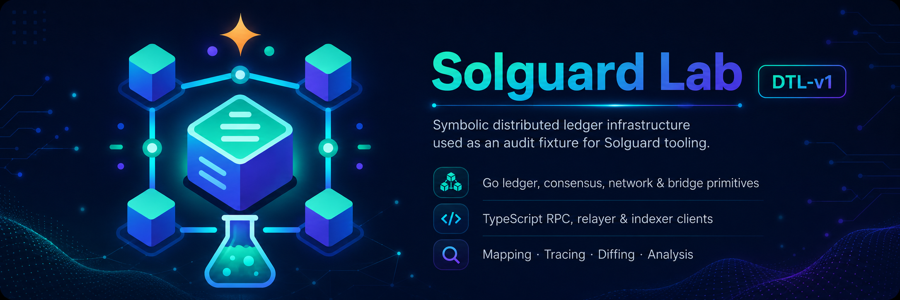
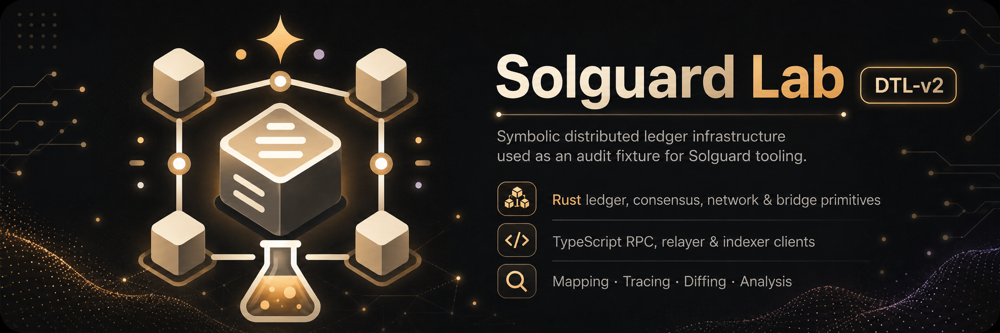

# Solguard Labs

---

## Infrastructure - Blockchain/DTL

### Lab 1 - Golang Infrastructure

- **Dificulty:** Low
- **Vulns:** 2
- **Stack:** Go, TypeScript

**Access:** 

### Lab 2 - Rust Infrastructure

- **Dificulty:** Medium
- **Vulns:** 2
- **Stack:** Rust, TypeScript

**Access:** 

### Lab 3 - C++ Infrastructure

- **Dificulty:** High
- **Vulns:** 2
- **Stack:** C++, TypeScript

**Access:** 

## DeFi - SmartContracts

