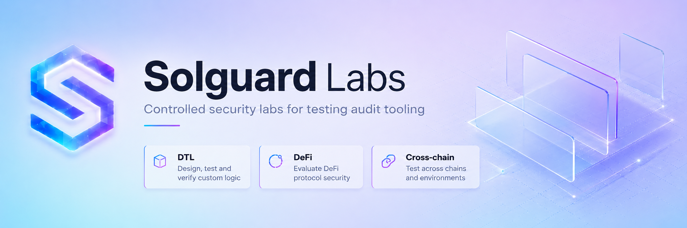
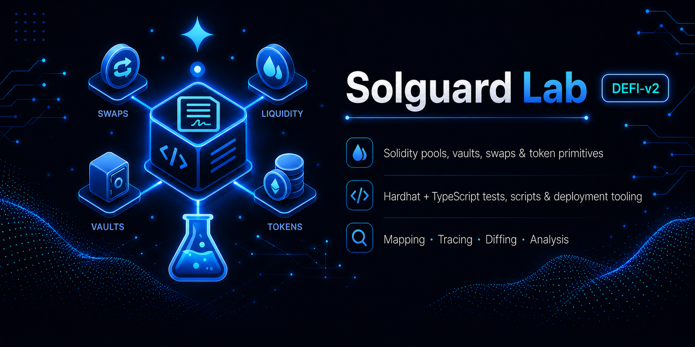
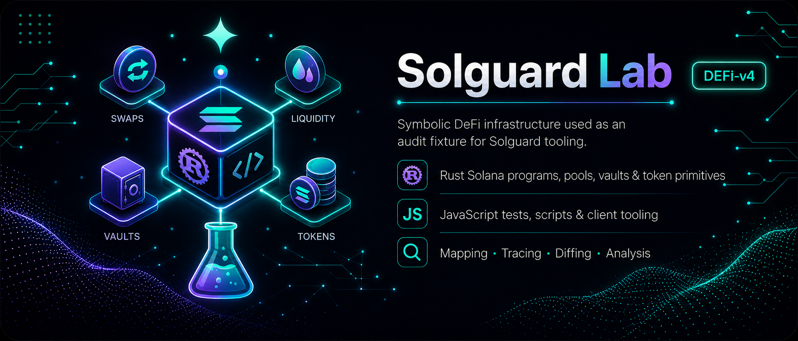

# Solguard Labs

---

## DeFi - SmartContracts

### Lab 1 - Forge SmartContracts

- **Dificulty:** Low
- **Vulns:** 3
- **Stack:** Solidity

**Access:** [DeFi-v1](https://github.com/SolguardSecurity/solguard-lab-defi-v1)

**Article:** [Solguard Lab - DeFi v1](./solguard-lab-defi-v1.md)

### Lab 2 - Hardhat SmartContracts

- **Dificulty:** Medium
- **Vulns:** 3
- **Stack:** Solidity

**Access:** [DeFi-v2](https://github.com/SolguardSecurity/solguard-lab-defi-v2)

**Article:** [Solguard Lab - DeFi v2](./solguard-lab-defi-v2.md)

### Lab 3 - Vyper SmartContracts

- **Dificulty:** High
- **Vulns:** 3
- **Stack:** Vyper

**Access:** [DeFi-v3](https://github.com/SolguardSecurity/solguard-lab-defi-v3)

**Article:** [Solguard Lab - DeFi v3](./solguard-lab-defi-v3.md)

### Lab 4 - Solana SmartContracts

- **Dificulty:** Extra High
- **Vulns:** 2
- **Stack:** Rust

**Access:** [DeFi-v4](https://github.com/SolguardSecurity/solguard-lab-defi-v4)

**Article:** [Solguard Lab - DeFi v4](./solguard-lab-defi-v4.md)

## Infrastructure - Blockchain/DTL

### Lab 1 - Golang Infrastructure

- **Dificulty:** Low
- **Vulns:** 2
- **Stack:** Go, TypeScript

**Access:** [DTL-v1](https://github.com/SolguardSecurity/solguard-lab-dtl-v1)

**Article:** [Solguard Lab - DTL v1](./solguard-lab-dtl-v1.md)

### Lab 2 - Rust Infrastructure

- **Dificulty:** Medium
- **Vulns:** 3
- **Stack:** Rust, TypeScript

**Access:** [DTL-v2](https://github.com/SolguardSecurity/solguard-lab-dtl-v2)

**Article:** [Solguard Lab - DTL v2](./solguard-lab-dtl-v2.md)

### Lab 3 - C++ Infrastructure

- **Dificulty:** High
- **Vulns:** 4
- **Stack:** C++, TypeScript

**Access:** [DTL-v3](https://github.com/SolguardSecurity/solguard-lab-dtl-v3)

**Article:** [Solguard Lab - DTL v3](./solguard-lab-dtl-v3.md)

### Lab 4 - C Infrastructure

- **Dificulty:** Extra High
- **Vulns:** 4
- **Stack:** C, JavaScript

**Access:** [DTL-v4](https://github.com/SolguardSecurity/solguard-lab-dtl-v4)

**Article:** [Solguard Lab - DTL v4](./solguard-lab-dtl-v4.md)
