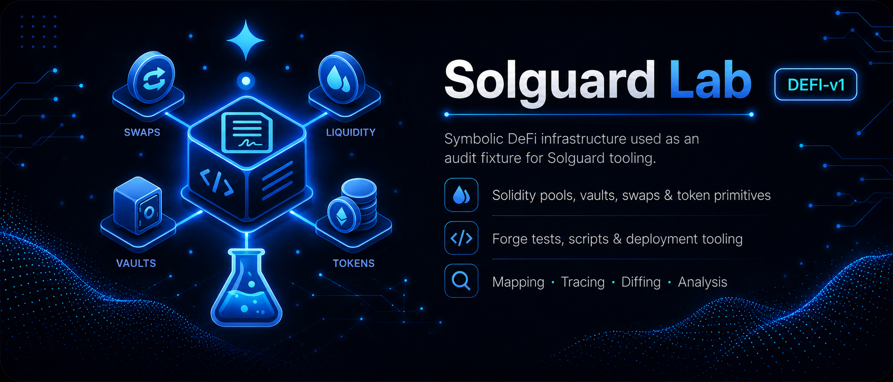

# Solguard Lab - DeFi v1

Solguard Lab DeFi v1 is a Foundry-based vulnerable lending lab built as a compact Ethereum-style protocol. The repository is intentionally small, but its internal model is close enough to a real single-market lending system to expose the accounting, oracle, liquidation and incentive boundaries that matter during an audit.

## Overview

The lab is organized around one isolated lending market. Liquidity providers deposit a base asset into the pool and receive internal shares that represent their position over the pool balance sheet. Borrowers post a separate collateral asset, open debt against the pool and remain subject to health checks driven by the oracle layer. The protocol also maintains a reward stream for liquidity providers, which introduces a second accounting surface on top of the lending state.

This version is deliberately straightforward. It does not depend on external integrations, upgrade frameworks or cross-contract orchestration beyond the core protocol modules, so the main focus stays on state transitions and internal economic accounting.

## System Architecture

The central contract is `HarborLendingPool`. It owns liquidity custody, collateral custody, debt accounting, fee accrual and liquidation logic. That makes it the operational hub of the lab: every meaningful user action eventually changes the state maintained by this contract.

The pricing layer is delegated to `PriceOracle`, a reporter-managed contract that stores the latest snapshot for each tracked asset. The pool consumes these snapshots directly when it needs to measure collateral value, calculate borrowing capacity or evaluate liquidation conditions. This produces a clean architectural separation between asset accounting and price publication while keeping the dependency surface minimal.

Reward distribution lives in `RewardsController`. Instead of modifying pool balances directly, rewards are streamed against pool share ownership over time. This means LP participation is represented by two parallel state models: one inside the pool for liquidity and debt exposure, and another inside the rewards controller for accrued incentives.

Local token fixtures are implemented with mock ERC-20 contracts, which keep the repository deterministic and easy to test under Foundry.

## Execution Model

The normal execution path begins when a liquidity provider deposits the base asset and receives pool shares. Those shares are the protocol's internal representation of ownership over the available liquidity plus outstanding debt. Borrowers then lock collateral and draw liquidity from the same pool, which turns the system into a shared balance sheet where idle cash, open debt and accrued fees all affect the effective asset base.

When debt positions are evaluated, the pool reads the latest oracle snapshot for the base and collateral assets. That price boundary is what determines health checks, borrow limits and liquidation sizing. Liquidations therefore are not a separate subsystem; they are an extension of the same debt-accounting path, triggered when the oracle-implied collateral coverage is no longer sufficient.

Fees are retained inside the pool and moved to treasury only when explicitly skimmed. This is important from an infrastructure point of view because protocol revenue is not externalized continuously. It remains embedded in pool state until an operational action extracts it.

Rewards follow their own cadence. The reward controller is prefunded for a fixed distribution window and checkpoints user accrual against changing share balances. As LP positions move over time, the reward layer needs to remain aligned with the pool's notion of ownership without becoming the source of truth for liquidity itself.

## Tooling And Operations

The repository uses Foundry as both build system and test harness. The layout is conventional: protocol logic under `src/`, shared interfaces in `src/interfaces/`, token fixtures in `src/mocks/` and protocol tests in `test/`. This makes the lab easy to inspect with static tooling because core logic, supporting abstractions and nominal scenarios are cleanly separated.

Operationally, the lab expects a simple workflow: build, run tests, refresh oracle assumptions when simulating price-sensitive paths, then re-run the suite after changing accounting or parameters. That deterministic loop is one of the reasons the lab works well as a documentation and audit fixture.

## Why This Lab Matters

DeFi v1 is the simplest entry point in the Solguard lab family, but it already captures the infrastructure patterns that define many lending protocols: pooled liquidity, collateral-backed debt, external price dependence, treasury fee extraction and secondary reward accounting. Because it is vulnerable by design yet compact in scope, it is well suited for studying how a lending stack is assembled before moving on to more opinionated or more operationally complex environments.
