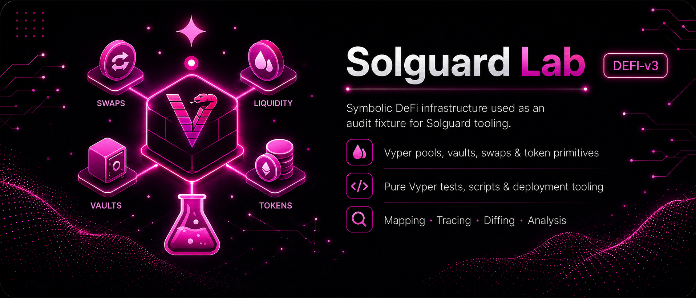

# Solguard Lab - DeFi v3

Solguard Lab DeFi v3 is a Vyper-based vulnerable vault lab focused on managed capital rather than direct lending. Instead of a borrower-versus-liquidity-provider market, this repository models a share vault that allocates assets into strategy debt, locks reported profit over time and processes withdrawals through delayed settlement epochs.

## Overview

The main idea behind this lab is to move from a spot-style lending system to a managed portfolio model. Depositors bring assets into the vault and receive ERC-20 style shares. A manager can then deploy part of the idle liquidity into strategy debt and later report gains or losses back to the vault. The vault therefore has to reconcile liquid assets, off-vault deployed capital and delayed profit recognition inside one accounting surface.

This is an important change in infrastructure terms. The protocol is no longer driven primarily by collateral ratios and immediate debt health, but by asset valuation, reporting cadence and redemption scheduling.

## System Architecture

`MarinaVault` is the central component and the authoritative ledger for the entire system. It mints and burns vault shares, tracks idle balances, records strategy debt, applies gain and loss reports and orchestrates the withdrawal queue. The vault is therefore both the accounting core and the settlement coordinator.

The external pricing boundary is implemented by `HarborOracle`, which stores the latest reporter-submitted price for each asset. Here the oracle is less about liquidation triggers and more about quoting a NAV-sensitive external view for integrations and operational checks. Even so, it remains a critical dependency because it influences how downstream consumers interpret vault value.

Mock assets are provided through a configurable Vyper token fixture. This keeps the testing surface deterministic while still allowing the lab to exercise transfer-sensitive behavior around deposits, redemptions and manager interactions.

## Execution Model

Deposits mint vault shares against the current total asset base. That asset base is not limited to the tokens sitting idle in the vault; it also includes strategy debt that has been allocated externally and not yet reconciled through reporting. For that reason, share pricing depends on a broader notion of managed capital than in a simple pool.

When the manager reports gains, losses or released capital, the vault updates its internal accounting. Reported profit does not immediately become fully liquid NAV. Instead, it is time-locked and decays into availability over time, which introduces a temporal dimension to solvency and withdrawal expectations.

Withdrawals are handled through an epoch request-and-claim pattern. Users do not exit instantly. They first queue their redemption request, then wait for the manager to finalize the epoch, and only after that can claim their settlement. This means redemption infrastructure is explicitly asynchronous, with a state handoff between user intent, manager finalization and later asset release.

Fee handling also fits this accounting model. Treasury compensation can be realized through fee-share minting tied to strategy performance rather than only through simple fee buckets extracted from live balances.

## Tooling And Operations

The repository uses Vyper with a Python-based test environment. Contracts live under `contracts/`, nominal scenarios under `tests/` and lightweight helpers under `scripts/`. The layout is intentionally compact, but it still reflects a realistic separation between protocol code, local fixtures and operator workflows.

From an operational standpoint, the most sensitive paths are manager configuration, profit reporting and withdrawal finalization. Those actions define the vault's capital picture, so local validation depends on keeping oracle assumptions fresh and rerunning the test suite whenever accounting parameters or manager behaviors change.

## Why This Lab Matters

DeFi v3 is useful because it captures a different class of protocol complexity. Instead of focusing on lending math, it focuses on managed assets, delayed liquidity and accounting state that evolves over time. The lab is vulnerable by design, but its real instructional value is showing how a vault architecture combines share issuance, strategy exposure, locked profit and epoch-based settlement into one coherent infrastructure model.
