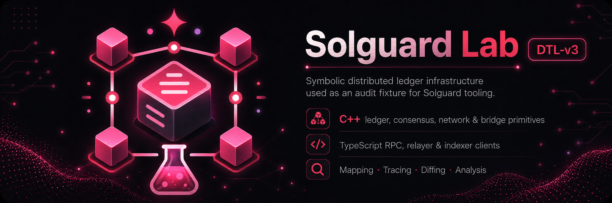

# Solguard Lab - DTL v3

Solguard Lab DTL v3 is a C++20 and TypeScript vulnerable distributed-ledger lab that models the most complete blockchain-style architecture in the Solguard DTL series. It extends the ideas from DTL v2 with a broader native surface that includes fork choice, append-only storage, receipt indexes, peer gossip and proof-oriented bridge execution.

## Overview

This lab is designed to feel like a serious systems repository. The native side is split into public headers, implementation modules, a symbolic node application and C++ protocol tests. The off-chain side mirrors a production-like support stack with an RPC client, fork-aware indexing, proof relaying and deterministic scenario tooling.

What makes DTL v3 technically interesting is not just the number of modules, but the fact that those modules form a layered execution pipeline: pending transactions are ordered, executed into blocks, committed into storage, finalized by checkpoint logic and then consumed by external services that care about forks, proofs and finalized views.

## System Architecture

The C++ core begins with `primitives` and `crypto`, which define the symbolic building blocks used across the rest of the system. `ledger` handles accounts, nonces, transaction execution, receipts and state roots. `mempool` introduces nonce lanes, bundles, fee ordering and replacement policy, making transaction admission and ordering a first-class subsystem.

`consensus` manages validator registries, fork choice and checkpoint finality. `storage` adds append-only journals, snapshots and indexes for blocks and receipts, which means finalized state is not only computed but also materialized for later reconstruction. `bridge` models route validation, receipt proofs, message batches and an execution registry. `p2p` adds signed gossip envelopes and anti-replay windows, while `rpc` defines the typed node facade exposed to outside consumers.

The TypeScript side under `ts/` sits on top of those native boundaries. It provides a client for protocol access, a fork indexer that interprets canonical and finalized views, a proof relayer for cross-domain execution and a scenario runner for deterministic end-to-end flows.

## Execution Model

Transactions move through mempool lanes and bundles before they are selected for execution. The ledger applies them into blocks, debits balances, emits receipts and computes a new state root. Consensus then uses validator power to evaluate checkpoints and decide which chain state is finalized, with fork choice influencing how competing views are resolved before downstream consumers rely on them.

Storage turns those decisions into durable internal views by maintaining journals, snapshots and indexes. That makes DTL v3 more than a transient execution engine; it is also a repository for reconstructing what happened and why a given finalized state should be considered canonical.

The bridge layer consumes that finalized context through route-bound receipt proofs and message batches. The TypeScript relayer and indexer then project the same state into operational workflows, one oriented around cross-domain execution and the other around queryable chain views.

## Tooling And Operations

The repository uses CMake and Ninja for the C++ side and Bun-based tooling for the TypeScript side. Public interfaces live under `include/`, implementations under `src/`, the symbolic node entrypoint under `apps/` and nominal tests under `tests/`. This is the most explicit native/off-chain split in the DTL series, and it makes the infrastructure boundaries easy to document.

Operationally, the lab expects native compilation and test execution first, then TypeScript type checks and tests, followed by deterministic analysis passes. Since the system is offline-friendly, repeated runs should produce stable outputs even when exploring complex paths such as fork indexing or bridge proof handling.

## Why This Lab Matters

DTL v3 is the best reference in the series for documenting a layered ledger architecture. It is vulnerable by design, but its real value is structural: it shows how execution, ordering, finality, storage, networking, bridging and off-chain consumers interlock inside a C++-centric codebase. For anyone studying how infrastructure complexity grows as a protocol matures, this lab is the clearest example.
