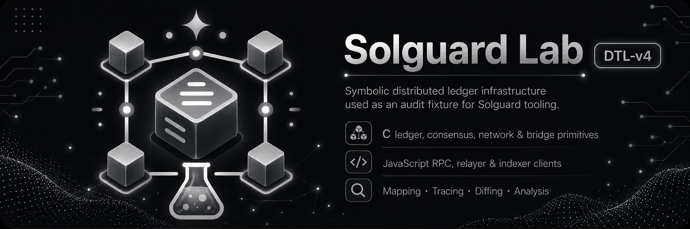

# Solguard Lab - DTL v4

Solguard Lab DTL v4 is a C11 and JavaScript vulnerable distributed-ledger lab built around a mixed native and off-chain architecture. It retains the multi-layer ledger model of DTL v3, but expresses the protocol core in low-level C and the operational infrastructure in JavaScript, creating a sharper boundary between deterministic native state transitions and the services that consume them.

## Overview

The repository models a blockchain-style stack with ledger execution, fee-prioritized mempool lanes, validator checkpoints, bridge route families, receipt indexing, storage snapshots and watcher-driven finalized-state consumption. Despite that breadth, it remains intentionally dependency-light and deterministic, which makes it suitable for repeatable documentation and security analysis.

DTL v4 is especially instructive because it shows how a native protocol core can be kept compact and in-process while still supporting a realistic ecosystem of relayers, indexers, watchers and scenario tooling.

## System Architecture

The C core owns the authoritative protocol state. `ledger` tracks accounts, receipts, blocks and state roots. `mempool` orders pending transactions using lane metadata and replacement rules. `finality` models validator sets, checkpoint signatures and finalized-state advancement. `bridge` manages route-family metadata, batch proof roots and execution registries. `storage` maintains snapshots and receipt lookup paths, while `rpc` exposes the native facade through a symbolic in-process interface. Supporting protocol types are defined through headers under `include/solguard/dtl/`.

This native layer is complemented by a JavaScript operational layer under `js/`. The JavaScript side includes client wrappers for transaction submission and finalized views, a proof relayer for bridge batch execution, a receipt indexer for finalized bridge state, a finality watcher for checkpoint feeds and a scenario runner for deterministic end-to-end flows.

A route configuration example under `config/` reinforces that the bridge is not only a native subsystem. It is also an operational surface that requires coordination between registry state, relayer configuration and indexer expectations.

## Execution Model

The execution flow begins with transaction submission into the native mempool. Transactions are ordered by local scoring rules and drained into deterministic blocks, which update account state, emit receipts and produce a new state root. Checkpoints are then imported into the light-client finality path, where validator power determines whether the new state can be treated as finalized.

Bridge execution builds on top of that finalized context. Messages are grouped by route family, validated against active route metadata and bound to aggregated proof roots before execution is recorded. The native executor keeps track of executed identifiers so that the path remains idempotent.

The JavaScript layer mirrors these native assumptions rather than replacing them. The relayer validates and executes batches, the indexer builds finalized views, and the watcher monitors checkpoint progression. This means the same protocol state is reflected through multiple consumers, each with a different operational responsibility.

## Tooling And Operations

DTL v4 uses CMake for the native build and Bun-based JavaScript tooling for the off-chain services. The repository also includes a runbook that documents route updates, validator rotations and mempool-pressure workflows. That material is important because it frames the lab as an operational system, not just a code artifact.

The RPC layer is intentionally in-process. Instead of depending on an HTTP server or external signer, the lab models the API boundary through native functions and matching JavaScript clients. This keeps the system portable while still documenting the state handoff that external tooling would depend on in a fuller deployment.

## Why This Lab Matters

DTL v4 is the most operations-oriented infrastructure lab in the collection. It is vulnerable by design, but its deeper value is showing how a deterministic C core can anchor a broader service layer without losing architectural clarity. Native execution, finality handoff, route-family bridge coordination, finalized-state indexing and watcher-based observability all live in one repository, which makes this lab a strong reference for documenting end-to-end ledger infrastructure.
