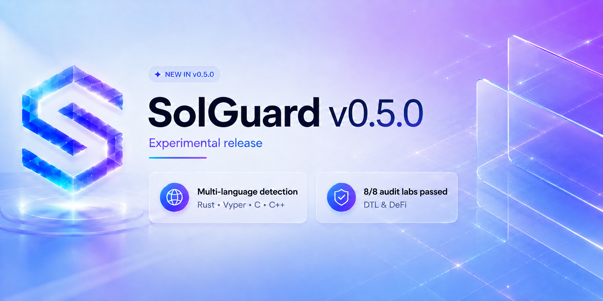

# Solguard v0.5.0 (Experimental)

`v0.5.0` es la primera versión de Solguard que ya puede recorrer de forma consistente el flujo completo de análisis local: preparar un proyecto, ejecutar `solguard-map`, `solguard-trace` y `solguard-diff`, recuperar contexto desde `solguard-database`, consultar un modelo local y producir artefactos de auditoría persistidos en el workspace del proyecto.

Sigue siendo una versión experimental. Las conclusiones de esta release están basadas en laboratorios controlados de Solguard y no en auditorías contra protocolos de producción. La intención de esta nota no es vender capacidades hipotéticas, sino dejar claro qué hace hoy la herramienta y qué resultados medidos está consiguiendo.

## Qué hace realmente esta versión

En `v0.5.0`, Solguard ya es capaz de analizar un objetivo local, un repositorio Git o un `.zip`, resolverlo dentro de un proyecto de auditoría y ejecutar una cadena determinista de tooling sobre ese código fuente. Esa cadena genera un mapa estructural del repositorio, una capa de trazado sobre superficies priorizadas, un análisis de cambios recientes y una fase posterior de recuperación de conocimiento desde la base local de reportes.

La herramienta también puede ingerir documentación técnica y reportes de auditoría en `PDF`, `Markdown` y `TXT` hacia `solguard-database`, y reutilizar ese conocimiento durante `search` y `analyze`. Esto significa que la IA no trabaja en vacío: recibe contexto taxonómico, findings similares, invariantes y agregados exactos procedentes de una base estructurada.

En esta versión, el modelo local ya no es la fuente de verdad del finding final. El modelo se usa para generar hipótesis, rechazos y apoyo de razonamiento, pero los findings finales del flujo actual se promueven desde reglas deterministas del backend. Esa distinción es importante porque reduce el riesgo de que una respuesta libre del LLM reescriba el resultado técnico del análisis.

## Capacidades técnicas relevantes

### `solguard-map`

La mejora principal de esta release en `solguard-map` es que el mapeo multi-lenguaje ya no se queda solo en funciones sueltas o librerías aisladas. La herramienta ahora prioriza mejor entrypoints reales y conserva más contexto útil para el resto del pipeline.

En Node.js y TypeScript, el mapeo detecta con más precisión métodos públicos de clases exportadas y conserva helpers con menos peso cuando existe un sink más claro. En Rust, mejora la cualificación de métodos dentro de bloques `impl`, lo que ayuda a que el nombre cualificado sea más útil durante `trace` y durante `analyze`. En C y C++, el output conserva mejor los métodos cualificados y mantiene un contrato de nombre más uniforme para las etapas posteriores.

En términos prácticos, `map` en `v0.5.0` sirve mejor como capa de orientación multi-lenguaje para auditoría, especialmente en repositorios de infraestructura donde conviven componentes nativos y off-chain.

### `solguard-trace`

`solguard-trace` incorpora una mejora importante en su modo batch con la flag `--top`. En esta versión, `--top` funciona como presupuesto de trazado diverso por lenguaje y componente, no como un simple top global ciego. Eso evita que un bloque fuerte de targets de un mismo stack expulse superficies relevantes de otros stacks del mismo repositorio.

Además, la herramienta añade un mismatch nuevo, `partial_dedupe_key`, orientado a detectar rutas donde la deduplicación puede no estar enlazando toda la identidad contextual del mensaje o de la operación. No significa que la herramienta pruebe automáticamente el bug, pero sí que ahora puede elevar esa familia de riesgo como pista de revisión explícita dentro del trazado.

### `solguard-diff`

`solguard-diff` ya forma parte del flujo de análisis del backend y aporta la dimensión temporal del sistema: qué ha cambiado recientemente y qué superficies auditables toca ese cambio. Su función sigue siendo determinista y de priorización manual. No declara vulnerabilidades; clasifica cambios, los cruza con el contexto de `audit_map.json` y los convierte en señales de revisión.

### `solguard-backend`

En `v0.5.0`, el backend ya puede:

- crear y gestionar proyectos locales de auditoría,
- ingerir documentación hacia `solguard-database`,
- responder búsquedas generales, de conocimiento o híbridas,
- y ejecutar `analyze` sobre un objetivo de código.

La parte más importante de esta release es que el backend ya integra de forma estable la secuencia `map -> trace -> diff -> retrieval -> hipótesis -> findings -> validation plan`. También endurece la separación entre evidencia determinista y razonamiento del modelo local. La capa de IA ayuda a expandir y contrastar hipótesis, pero no debería inventar conteos de base de datos ni sustituir el cierre técnico del análisis.

### `solguard-database`

La base de conocimiento ya cumple una función operativa real dentro del análisis. Puede procesar documentos, estructurar findings, indexar taxonomía, guardar chunks, snippets y embeddings locales, y devolver contexto útil para `search` y `analyze`.

Esto es relevante porque el sistema ya no depende solo del estado del repositorio actual. También puede recuperar patrones históricos de findings y utilizarlos como memoria de apoyo durante el análisis de un laboratorio o de un objetivo nuevo.

## Qué no afirma esta release

`v0.5.0` no demuestra todavía comportamiento equivalente a una auditoría de producción. No está validada contra repositorios oficiales reales ni contra protocolos desplegados en entornos abiertos. Tampoco significa que todos los findings generados sean reportables sin revisión humana. La herramienta sigue necesitando validación manual para confirmar alcance, comportamiento incorrecto, explotabilidad realista, impacto y exclusiones.

Esta versión tampoco debe leerse como “el LLM audita solo”. Lo que existe hoy es una orquestación local donde las herramientas deterministas y la base de conocimiento preparan el contexto, y el modelo local ayuda a razonar sobre él.

## Resultados medidos en los laboratorios

Sobre los 8 laboratorios actuales de Solguard, la versión `v0.5.0` alcanza cobertura completa sobre los bugs documentados del benchmark. El recall medido es `100%` en todos los laboratorios.

La contrapartida es que aparecen tres findings adicionales no incluidos en el ground truth del benchmark: uno en `DeFi-v2`, uno en `DeFi-v3` y uno en `DTL-v1`. Eso mejora recall, pero reduce precisión. En agregado, la herramienta genera `27` findings, de los cuales `24` son verdaderos positivos estrictos y `3` quedan como extras no validados. El resultado agregado de esta release sobre el benchmark es `100%` de recall y `88,9%` de precisión.

| Lab | Vulns reales | Findings generados | TP estrictos | Extras no validados | Recall | Precisión |
| --- | ---: | ---: | ---: | ---: | ---: | ---: |
| DeFi-v1 | 3 | 3 | 3 | 0 | 100% | 100% |
| DeFi-v2 | 3 | 4 | 3 | 1 | 100% | 75% |
| DeFi-v3 | 3 | 4 | 3 | 1 | 100% | 75% |
| DeFi-v4 | 2 | 2 | 2 | 0 | 100% | 100% |
| DTL-v1 | 2 | 3 | 2 | 1 | 100% | 66,7% |
| DTL-v2 | 3 | 3 | 3 | 0 | 100% | 100% |
| DTL-v3 | 4 | 4 | 4 | 0 | 100% | 100% |
| DTL-v4 | 4 | 4 | 4 | 0 | 100% | 100% |

La lectura correcta de esta tabla es clara: la herramienta ya no se está quedando corta sobre el benchmark actual, pero todavía tiene margen de mejora en precisión antes de poder tratar todos los findings extra como señal limpia.

## Señales internas del pipeline

Para complementar el benchmark de cobertura, también conviene mirar qué produjo internamente cada corrida. La tabla siguiente no mide vulnerabilidades confirmadas, sino señales operativas del pipeline: volumen de hipótesis sembradas, invariantes seleccionadas desde `solguard-database`, superficie realmente trazada y densidad de promoción de findings. La última columna, `findings/hipótesis`, es una métrica derivada que sirve solo como proxy de eficiencia del filtrado.

| Lab | Hipótesis | Invariantes | Targets trazados | Flujos semánticos | Guards mutables | Metric mismatches | Review alta | Findings/hipótesis |
| --- | ---: | ---: | ---: | ---: | ---: | ---: | ---: | ---: |
| DeFi-v1 | 5 | 2 | 12 | 13 | 2 | 2 | 9 | 0,60 |
| DeFi-v2 | 5 | 5 | 12 | 3 | 2 | 3 | 9 | 0,80 |
| DeFi-v3 | 16 | 2 | 12 | 0 | 0 | 10 | 11 | 0,25 |
| DeFi-v4 | 15 | 3 | 12 | 0 | 0 | 12 | 12 | 0,13 |
| DTL-v1 | 30 | 5 | 12 | 0 | 0 | 9 | 12 | 0,10 |
| DTL-v2 | 30 | 6 | 12 | 0 | 0 | 12 | 12 | 0,10 |
| DTL-v3 | 31 | 5 | 12 | 0 | 0 | 12 | 12 | 0,13 |
| DTL-v4 | 29 | 6 | 12 | 0 | 0 | 13 | 12 | 0,14 |

Estas cifras enseñan varias cosas útiles sobre `v0.5.0`. Primero, el pipeline ya mantiene una superficie de trazado estable de `12` targets por laboratorio y una recuperación constante desde base de conocimiento de `10` findings y `6` chunks por corrida. Segundo, la presión de hipótesis crece con fuerza en los laboratorios DTL, donde el sistema necesita abrir más ramas de razonamiento antes de cerrar findings. Tercero, los `metric mismatches` se han convertido en una de las señales más frecuentes de priorización en esta release, especialmente en los laboratorios más infraestructurales.

## Tiempos de resolución

Los tiempos medidos por laboratorio en esta release son los siguientes:

| Lab | Tiempo |
| --- | --- |
| DeFi-v1 | 2 min 11 s |
| DeFi-v2 | 1 min 58 s |
| DeFi-v3 | 5 min 47 s |
| DeFi-v4 | 5 min 27 s |
| DTL-v1 | 10 min 20 s |
| DTL-v2 | 10 min 50 s |
| DTL-v3 | 12 min 02 s |
| DTL-v4 | 9 min 24 s |

El tiempo total acumulado sobre los ocho laboratorios es `57 min 59 s`, con una media aproximada de `7 min 15 s` por laboratorio. La diferencia entre DeFi y DTL es consistente con la complejidad de superficie: los laboratorios de infraestructura reparten el análisis entre más capas, más componentes y más contexto operacional.

## Veredicto de la release

`v0.5.0` marca un cambio importante porque Solguard ya no es solo una colección de herramientas sueltas. En esta versión ya existe un flujo local relativamente coherente entre mapeo, trazado, diff, base de conocimiento y modelo local, con resultados medidos que cubren completamente el benchmark actual de laboratorios.

El estado real de la herramienta en esta release es el de un sistema experimental que ya tiene recall pleno en su banco de pruebas y que empieza a comportarse como una plataforma de análisis reproducible. La siguiente frontera técnica no es inflar capacidades, sino mejorar precisión, endurecer validación de findings extra y seguir contrastando el sistema fuera de laboratorios controlados.
