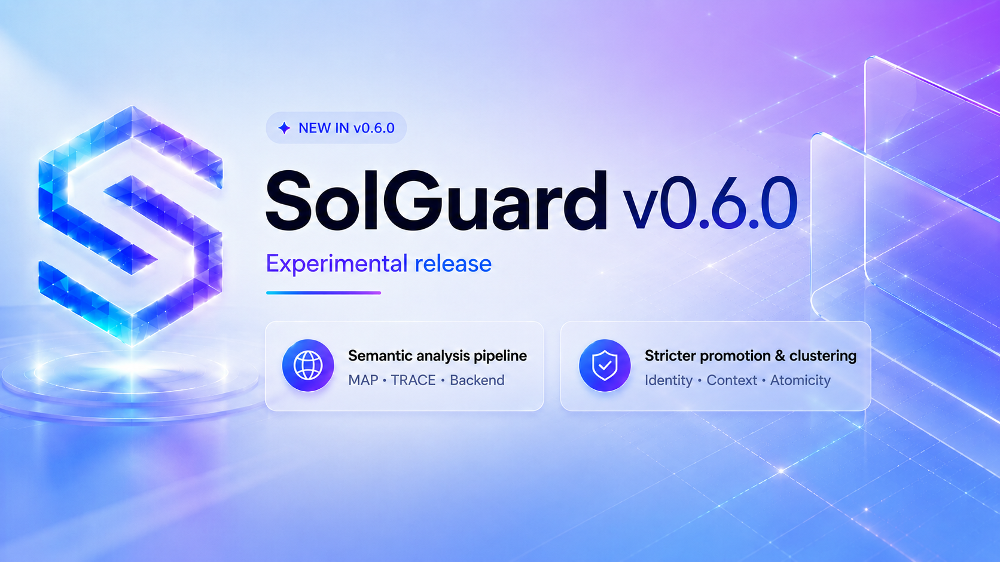

# Solguard v0.6.0 (Experimental)

`v0.6.0` cierra la etapa experimental iniciada en `v0.5.0`, pero no como una iteración cosmética. El cambio real de esta versión es que Solguard deja de apoyarse principalmente en señales superficiales y empieza a construir una base semántica explícita entre `solguard-map`, `solguard-trace` y `solguard-backend`.

En `v0.5.0`, el sistema ya era capaz de producir hallazgos útiles, mantener una salida determinista y enlazar mejor el razonamiento con el código. Pero seguía habiendo una limitación de fondo: muchas detecciones dependían demasiado del nombre de una función, de una coincidencia textual o de una heurística local. Eso funcionaba razonablemente bien en bugs directos, pero degradaba la calidad cuando el problema real estaba repartido entre componentes, caches, llaves incompletas, rutas de mensajería o fronteras de atomicidad.

`v0.6.0` se centra precisamente en esa transición: convertir MAP en una fuente de verdad semántica más rica, hacer que TRACE consuma esa semántica en lugar de reinventarla, y endurecer el backend para que promocione, agrupe y renderice hallazgos con criterios mucho más estrictos.

## Cambio de modelo: de estructura superficial a contexto semántico

La mejora principal de esta versión no es una familia nueva de bugs concreta. Es el cambio de modelo interno.

Antes, la canalización tendía a razonar desde funciones y patrones locales hacia un hallazgo. Ahora la canalización razona desde relaciones semánticas observadas: quién produce un evento, quién lo consume, qué clave identifica realmente una operación, qué contexto se captura y se reutiliza, qué escritura persiste, qué operación puede revertirse y cuál no, qué parte de una ruta está resuelta y qué parte sigue siendo parcial.

Eso obliga a que los tres componentes del sistema trabajen con contratos más explícitos:

- `solguard-map` ya no exporta solo inventario y llamadas; exporta semántica con evidencia, resolución y procedencia.
- `solguard-trace` ya no debe duplicar parsers ni elevar cualquier señal a llamada confirmada; consume el mapa enriquecido y distingue evidencia fuerte, parcial y negativa.
- `solguard-backend` ya no puede mezclar hallazgos legacy y semánticos con reglas distintas; ambos pasan por los mismos gates de promoción, clustering y localización.

## solguard-map: el mapa pasa a ser una base semántica real

El mayor trabajo de esta versión está en `solguard-map`.

### Extracción multi-lenguaje con procedencia explícita

La extracción dejó de ser un bloque monolítico y pasó a separarse entre parsing estructural y resolución semántica. En la práctica, esto permite combinar AST real en Rust, Go y TypeScript/JavaScript con fallback conservador cuando el parser no aplica o el archivo se degrada por límites de recursos.

Esto es importante por dos motivos. El primero es cobertura: el sistema ve mejor handlers, workers, accesos a estado, llamadas entre funciones y superficies de integración. El segundo es trazabilidad: cada señal queda marcada con su `parser_mode`, su confianza, su evidencia y su grado de resolución. Una arista detectada por AST pero no resuelta ya no se trata igual que una relación confirmada.

También se añadieron límites operativos explícitos para evitar que un monorepo grande degrade la calidad del análisis de forma silenciosa. Los archivos omitidos, degradados o analizados con fallback quedan reflejados en el contexto de construcción en lugar de desaparecer del razonamiento.

### Grafo semántico más rico y más preciso

El mapa ahora modela relaciones que antes no existían o quedaban implícitas. Ya no solo aparecen llamadas locales, sino también relaciones tipadas como:

- llamadas directas y parciales;
- emisiones y consumos de eventos;
- RPC caller y RPC handler;
- publicación y consumo en colas;
- lecturas y escrituras a base de datos;
- lecturas y escrituras de estado;
- producción y consumo de configuración.

Sobre ese grafo atómico, `solguard-map` empezó a construir enlaces cross-component y rutas compuestas. Este cambio es relevante porque muchos bugs profundos no viven en una sola función: aparecen cuando una pieza publica un dato, otra lo interpreta con una identidad incompleta y una tercera lo persiste o lo consume en un contexto distinto.

### Contexto semántico, identidades y atomicidad

Otro salto importante ha sido la normalización de contexto semántico. El mapa ya no trata por igual cualquier valor que circule por el programa. Ahora distingue dimensiones de contexto como `epoch`, `version`, `domain`, `session`, `fork`, `route`, `validator_set` o `checkpoint`, separándolas de campos de identidad como `nonce`, `payload_hash`, `sender`, `recipient`, `amount`, `emitter` o `chain_id`.

Esa separación evita uno de los fallos clásicos de versiones anteriores: tomar cualquier hash, cualquier clave o cualquier acceso a storage como si fuera una identidad operativa relevante para replay protection, deduplicación o cacheado.

En la misma línea, `solguard-map` ahora construye `identity_schemas`, `semantic_contexts`, `context_couplings` y `atomicity_boundaries` con evidencia y resolución. No basta con que aparezca un nombre parecido a una key; debe haber uso real en una operación que construya, consuma o verifique una identidad, una replay key, una cache key o una clave de lookup.

### Correcciones de precisión: menos contaminación de identity y atomicity

Una parte importante del trabajo de esta release no ha sido “añadir más detecciones”, sino recortar inferencias incorrectas sin romper detecciones válidas.

En identidad, se endureció la regla para que `identity.dedupe_missing_context` no se aplique a funciones o símbolos que en realidad no participan en construcción o consumo operativo de una identidad. Esto corrige falsos positivos donde una variable, un hash auxiliar o una ruta de almacenamiento acababan etiquetados como esquema de deduplicación sin existir una relación causal real con replay, lookup, insert o verification.

En atomicidad, se corrigieron varios errores de modelado que inflaban ruido, especialmente en Solidity/Vyper y también en rutas fuera de EVM. El sistema distingue mejor entre:

- lecturas y escrituras reales;
- estado persistente y variables locales;
- storage, memoria temporal y acumuladores intermedios;
- efectos revertibles de EVM y operaciones irreversibles fuera de una frontera de rollback.

Con esto, una lectura ya no se degrada a escritura semántica, una variable local ya no se trata como storage persistente, y la semántica de rollback transaccional de EVM deja de ignorarse al evaluar atomicidad.

## solguard-trace: TRACE deja de duplicar y empieza a ensamblar

`solguard-trace` se ha reorientado para consumir el mapa enriquecido en vez de competir con él.

### Consumo semántico en lugar de parsers paralelos

TRACE no añade parsers AST propios. Esa decisión es deliberada. Si MAP es la fuente de verdad, TRACE debe operar sobre el contrato exportado por MAP y no sobre una segunda interpretación de los mismos archivos.

Esto mejora dos cosas. La primera es consistencia: una misma arista, un mismo contexto o una misma identidad no se reconstruyen dos veces con criterios diferentes. La segunda es auditabilidad: cuando TRACE levanta una hipótesis, se puede seguir la cadena de evidencia hasta el mapa original.

### Rutas ensambladas y evidencia parcial controlada

TRACE ahora consume `graph_edges`, `cross_component_links`, `cross_component_paths`, `trust_boundaries`, `build_context`, `semantic_contexts`, `identity_schemas` y `atomicity_boundaries`. Con eso puede montar rutas más profundas y, al mismo tiempo, ser más estricto con lo que considera una llamada o una dependencia confirmada.

La regla de fondo es simple: lo resuelto se usa como evidencia fuerte; lo parcial o no resuelto se conserva como evidencia, pregunta de revisión o hueco de validación, pero no se promociona como hecho confirmado.

Ese cambio reduce errores en trazas largas. En lugar de “cerrar” una ruta solo porque varias piezas parecen encajar por nombre o por forma, TRACE conserva la incertidumbre estructural y la traslada al hallazgo final.

### Findings semánticos con cadena causal

Los findings de TRACE ya no se basan en una sola frase o una sola superficie. Ahora pueden incorporar:

- causa raíz;
- superficie de disparo;
- superficie de impacto;
- superficies de soporte;
- cadena causal de evidencia;
- evidencia contradictoria;
- evidencia ausente;
- confianza separada por resolución, evidencia y causa raíz.

Esto cambia la utilidad práctica del resultado. El hallazgo ya no es solo “qué parece estar mal”, sino “dónde nace la hipótesis, cómo progresa y qué piezas faltan para cerrarla con más fuerza”.

### Mejor separación entre dedupe, cache e indexación

Otro ajuste importante ha sido separar mejor tres dominios que antes podían contaminarse entre sí:

- deduplicación/replay protection;
- cache/context drift;
- indexación o vistas derivadas.

Esa separación ha sido especialmente relevante en rutas donde una cache o una vista indexada se confundía con una identidad de mensaje. El resultado de `v0.6.0` es que una señal solo se clasifica como problema de `dedupe_identity` si existe uso real en un mecanismo operativo de deduplicación, verificación o replay protection. Si el problema real es de contexto de cache o de namespace incompleto, la clasificación debe caer en esa familia y no arrastrar una identidad semántica que no existe.

## solguard-backend: promoción, clustering y localización más estrictos

La tercera parte del salto de `v0.6.0` está en el backend.

### Unificación de candidatos legacy y semánticos

Antes, los hallazgos heredados y los semánticos podían seguir recorridos de promoción demasiado distintos. Eso abría la puerta a inconsistencias: el mismo problema podía aparecer duplicado, o una señal semántica débil podía terminar renderizada con más fuerza que un seed legacy mejor localizado.

En esta versión, ambos tipos pasan por la misma lógica de clustering, merged evidence y promotion gates. Esto era necesario para evitar que el sistema consolidara como “verdad” comportamientos todavía inmaduros.

### Clustering canónico previo a la promoción final

También se corrigió el orden de la canalización. El clustering ya no es un paso tardío de presentación, sino una fase previa a la promoción final.

El backend construye candidatos brutos, los agrupa por una clave canónica más robusta y luego vuelve a evaluar el hallazgo resultante con evidencia combinada. Esa clave evita tanto el sub-clustering como el sobre-clustering:

- no fusiona automáticamente vulnerabilidades diferentes solo porque compartan flujo o superficie;
- no mantiene separadas señales distintas que en realidad son vistas parciales del mismo bug.

Esto resuelve un problema práctico importante: en un sistema con semántica nueva, es fácil generar múltiples señales legítimas sobre el mismo defecto real. El trabajo del backend ya no es mostrarlas todas por separado, sino consolidarlas sin perder trazabilidad.

### Promoción más dura y estados coherentes

Se endurecieron los gates de promoción para que el estado del hallazgo refleje realmente la fuerza de la evidencia.

En particular:

- una fuente heurística por sí sola no puede acabar como `supported`;
- una relación `partial` o `unresolved` no puede sostener alta confianza de causa raíz;
- un hallazgo con pasos causales no resueltos no debe promocionarse como confirmado;
- `review_required` debe renderizarse como revisión requerida, no como si ya estuviera soportado.

Esto parece un detalle de presentación, pero en realidad es una corrección lógica. El renderer forma parte del contrato del sistema: si el texto final sugiere más certeza de la que existe, el error ya no es cosmético.

### Mejor localización de root, trigger e impact

La localización también se ha corregido. Una parte del trabajo ha consistido en evitar que funciones auxiliares, escenarios de test o utilidades matemáticas queden como superficie canónica de un hallazgo cuando el defecto real nace y se consume en otro punto.

La consecuencia es un output más útil: menos ruido en la superficie raíz, menos funciones “secundarias” ocupando el finding principal y una separación más clara entre causa, disparo e impacto.

### Profiling separado de artefactos deterministas

Por último, el backend añade profiling operativo sin contaminar la reproducibilidad del resultado. Las duraciones, conteos y cache hits se registran aparte y no entran en fingerprints, findings canónicos ni comparaciones deterministas.

Esto permite observar coste y comportamiento del pipeline sin romper uno de los requisitos centrales de Solguard: que el artefacto analítico sea estable entre ejecuciones equivalentes.

## Qué mejora realmente respecto a v0.5.0

La diferencia práctica frente a `v0.5.0` se puede resumir así:

`v0.5.0` ya tenía una base útil para detectar y explicar bugs, pero todavía mezclaba con demasiada facilidad señal superficial, semántica parcial y causalidad real. `v0.6.0` reduce precisamente esa mezcla.

Ahora Solguard:

- modela mejor relaciones entre componentes y no solo entre funciones aisladas;
- distingue mejor identidad, contexto, cache, configuración y estado persistente;
- trata la incertidumbre como parte explícita del resultado, en vez de ocultarla;
- agrupa mejor señales del mismo bug y separa mejor bugs distintos;
- localiza con más precisión la causa raíz, el trigger y el impacto;
- endurece la promoción para que el texto final no sobrerrepresente la evidencia;
- reduce falsos positivos de atomicidad e identidad sin recortar artificialmente cobertura válida.

No es un salto “de marketing”. Es un cambio de fiabilidad interna.

## Qué no afirma esta release

`v0.6.0` sigue siendo experimental y conviene ser preciso con sus límites.

Esta versión no introduce ejecución simbólica, SMT ni data-flow interprocedural completo. Tampoco implementa todavía `solguard-invariant` ni `solguard-validate`. El sistema puede construir mejores hipótesis y mejores cadenas causales, pero no pretende convertir automáticamente toda señal compleja en bug explotable confirmado.

La mejora real está en otra parte: en que la hipótesis sale más limpia, mejor localizada, mejor justificada y con menos contaminación semántica.

## Cierre

`v0.6.0` marca el momento en que Solguard deja de ser principalmente una colección de detectores estructurales y empieza a operar como una canalización semántica explícita: MAP extrae y normaliza, TRACE ensambla y evalúa, y el backend decide qué puede promocionarse y cómo debe presentarse.

Frente a `v0.5.0`, el progreso no está en “más findings” por sí mismo, sino en una mejora más difícil y más importante: que el sistema falle menos por clasificación equivocada, por localización pobre, por duplicado semántico o por promoción excesiva de evidencia débil.

Ese es el cierre correcto para la etapa experimental inicial y la base necesaria para seguir hacia `invariant`, `validate` y versiones posteriores sin arrastrar deuda semántica estructural.
