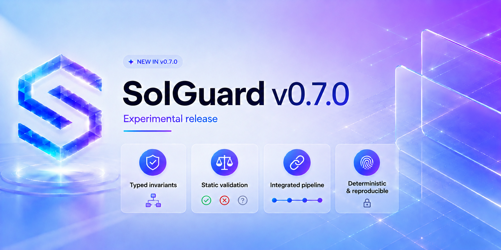

# Solguard v0.7.0 (Experimental)

`v0.7.0` completa la separación conceptual de las herramientas deterministas de Solguard. Hasta esta versión, el sistema podía mapear un repositorio, reconstruir flujos, detectar señales semánticas y promover candidatos, pero todavía no existía una representación independiente de la propiedad que debía mantenerse ni un motor separado para evaluar si la evidencia disponible sostenía realmente su ruptura.



La división actual queda así:

```text
MAP -> Qué existe
DIFF -> Qué cambió
TRACE -> Cómo funciona
INVARIANT -> Qué propiedad debe mantenerse
VALIDATE -> Si la evidencia disponible sostiene o refuta la ruptura
```

La versión introduce `solguard-invariant` y `solguard-validate` como herramientas independientes en Rust y las integra dentro de `solguard-backend`.

El objetivo no es presentar análisis estático como explotación confirmada. La mejora está en convertir propiedades, candidatos, evidencia y decisiones en contratos diferenciados, reproducibles e inspeccionables.

## Cambio de modelo: de hipótesis semánticas a propiedades evaluables

En `v0.6.0`, Solguard mejoró la representación semántica del repositorio. MAP empezó a exportar identidades operativas, contextos, relaciones entre componentes, fronteras de atomicidad y cadenas con procedencia explícita. TRACE pasó a consumir esa semántica para reconstruir causa raíz, trigger e impacto sin duplicar parsers ni elevar relaciones parciales como hechos confirmados.

Sin embargo, todavía faltaba una separación importante.

Una descripción como:

```text
La cache puede reutilizar un validator set obsoleto
```

mezcla varias cosas diferentes:

* la propiedad normativa que debería mantenerse;
* la observación del código;
* la condición que podría romper esa propiedad;
* la cadena causal hacia un impacto;
* y el resultado final de la evaluación.

`v0.7.0` separa esas responsabilidades.

INVARIANT representa qué condición debería cumplirse. Los candidatos canónicos describen una posible ruptura observada. VALIDATE compara ambas partes utilizando evidencia tipada y decide si la ruptura queda soportada, refutada o sigue siendo inconclusa.

## `solguard-invariant`: propiedades tipadas y deterministas

`solguard-invariant` genera un contrato independiente, `invariants.json`, basado en el esquema `invariant.v0.7`.

Cada invariante contiene como mínimo:

* un identificador determinista;
* una familia;
* una regla semántica versionada;
* una declaración legible;
* un predicado tipado;
* sujetos y objetos;
* parámetros;
* scope;
* condiciones de mantenimiento;
* condiciones de ruptura;
* evidencia;
* resolución;
* fingerprints semánticos;
* y soporte histórico cuando existe.

Una invariante deja de ser una frase libre y pasa a representar una propiedad evaluable.

Por ejemplo, una propiedad de identidad puede expresar que una clave de deduplicación debe incluir `domain`, `route`, `nonce` y `payload_hash`. Una propiedad de frescura contextual puede requerir que el validator set usado durante una verificación corresponda al compromiso exacto incluido en el checkpoint. Una propiedad de accounting puede exigir que los cambios de balance utilicen el delta realmente recibido y no únicamente la cantidad solicitada.

## Catálogo inicial de invariantes

El catálogo de `v0.7.0` se construye sobre la semántica estructurada exportada por `audit_map.v0.9` y `trace.v0.9`.

La versión materializa propiedades relacionadas con:

* identidad y deduplicación;
* cache keys y namespace contextual;
* frescura de contexto;
* consistencia entre cache y persistencia;
* atomicidad y rollback;
* orden de efectos;
* accounting y deltas económicos;
* consistencia entre componentes;
* unicidad de slots y generaciones;
* y flujos de settlement.

El catálogo no se genera a partir de coincidencias arbitrarias en nombres, títulos o texto histórico. Un símbolo no se convierte en identidad operativa únicamente porque contenga palabras como `key`, `hash`, `cache` o `nonce`.

Debe existir evidencia estructurada de construcción, consumo, persistencia, comparación o verificación.

## Break conditions explícitas

Cada propiedad incluye condiciones concretas bajo las que podría considerarse rota.

Una break condition no puede ser una etiqueta genérica. Debe indicar:

* qué predicado se contradice;
* qué sujeto está afectado;
* qué operador se evalúa;
* qué valores faltan o divergen;
* en qué fase ocurre;
* y qué evidencia sostiene la observación.

Durante el desarrollo de esta versión se eliminaron las break conditions vacías y las condiciones con conjuntos de valores sin significado.

El resultado final del benchmark contiene:

```text
Break conditions inválidas: 0
Bindings sin evidencia: 0
```

Esto evita que VALIDATE reciba una supuesta ruptura sin una base evaluable.

## Conocimiento histórico tipado

La base de conocimiento sigue teniendo una función de apoyo, pero su integración se ha endurecido.

Un finding histórico en texto libre no puede originar por sí solo una invariante nueva. El conocimiento histórico solo participa cuando puede resumirse o normalizarse mediante:

* familia;
* predicado;
* scope;
* versión de regla;
* y evidencia compatible.

En ejecuciones anteriores, gran parte de los registros históricos era descartada individualmente porque no cumplía este contrato. `v0.7.0` sustituye ese comportamiento por resúmenes tipados agregados y reduce `skipped_sources` desde aproximadamente `1600` entradas hasta `8` resúmenes explicativos.

La evidencia histórica puede reforzar una propiedad ya observada, pero no sustituye la evidencia del repositorio analizado.

## `solguard-validate`: validación estática conservadora

`solguard-validate` consume:

```text
invariants.json
canonical_candidates.json
audit_map.json
trace.v0.9
```

y produce un único contrato autoritativo:

```text
validation_results.json
```

Cada candidato recibe uno de tres resultados:

```text
supported
refuted
inconclusive
```

### `supported`

Un candidato solo queda como `supported` cuando:

* existe una invariante tipada aplicable;
* existe una break condition compatible;
* la evidencia no es exclusivamente heurística;
* root cause, trigger e impact pertenecen al mismo flujo;
* y todas las aristas críticas de la cadena causal están resueltas.

Una relación parcial puede conservarse como contexto secundario, pero no cerrar por sí sola una decisión positiva.

`Supported` significa soporte estático para la ruptura observada. No significa exploitabilidad confirmada ni impacto material validado.

### `refuted`

`Refuted` requiere evidencia positiva de una protección.

Un guard, una invalidación, un rollback o una comprobación solo pueden refutar un candidato cuando:

* operan sobre el mismo flujo;
* cubren el mismo estado;
* cubren la misma dimensión contextual;
* contradicen el mismo predicado;
* y ocurren antes del impacto.

La ausencia de una ruta o la falta de evidencia no se interpreta como prueba de seguridad.

### `inconclusive`

Un resultado queda como `inconclusive` cuando:

* la cadena causal es parcial;
* falta una arista crítica;
* la evidencia disponible no permite demostrar el predicado;
* una protección existe pero su orden temporal no está resuelto;
* o la relación observada sigue dependiendo de evidencia heurística.

La herramienta no devuelve `validated`.

Los campos de explotabilidad e impacto permanecen como `not_assessed` hasta que un auditor revise manualmente el comportamiento, el alcance y las consecuencias reales.

## Binding entre candidatos e invariantes

Una parte central de `v0.7.0` es el linker que relaciona candidatos canónicos con invariantes tipadas.

El binding ya no se basa en texto libre ni en similitud superficial. La selección utiliza información como:

* familia compatible;
* regla semántica;
* tipo de predicado;
* símbolo;
* componente;
* estado;
* flujo;
* dimensión contextual;
* fingerprints;
* y referencias de evidencia.

Cada candidato contiene:

```text
primary_invariant_id
related_invariant_ids
```

La primary invariant se selecciona de forma determinista. Una invariante de `identity_completeness` no puede utilizarse para cerrar un problema de accounting, atomicidad u ordering únicamente porque ambos candidatos compartan palabras o dimensiones similares.

Durante la estabilización de esta versión se eliminaron:

* bindings entre familias incompatibles;
* bindings por texto libre;
* primary invariants no deterministas;
* autoaristas causales;
* y enlaces sin evidencia.

El resultado final es:

```text
Bindings válidos: 24/24
Unbound: 0
Primary invariants no deterministas: 0
Bindings sin evidencia: 0
```

## Cadenas causales y rutas independientes

VALIDATE no evalúa una lista plana de relaciones como si todas pertenecieran a la misma ruta.

Las aristas se agrupan por cadena causal y se evalúan respetando su dirección:

```text
root cause
    -> trigger
    -> transición de estado
    -> consumo
    -> impacto
```

Una ruta parcial no invalida automáticamente otra ruta completa. De la misma manera, varias aristas resueltas no pueden mezclarse artificialmente para fabricar una cadena que nunca existió como flujo real.

Este cambio elimina autoaristas como:

```text
Verify -> Verify
```

cuando no representan una transición semántica real y evita invertir superficies de resolución, verificación e impacto.

## Integración en `solguard-backend`

El backend materializa los resultados del clustering y del promotion gate en:

```text
canonical_candidates.json
```

Este contrato sustituye el uso de Markdown como interfaz entre promoción y validación.

Después ejecuta INVARIANT y VALIDATE:

```text
MAP
  -> TRACE
  -> conocimiento histórico tipado
  -> INVARIANT
  -> canonical candidates
  -> VALIDATE
  -> informe unificado
```

Los tres posibles resultados se conservan dentro del mismo conjunto. Los candidatos `refuted` no se eliminan, porque representan evidencia negativa útil y pueden detectar regresiones en ejecuciones futuras.

`findings.md` refleja el contenido completo de `validation_results.json`, pero el JSON continúa siendo la fuente autoritativa.

## Estado previo y estado de validación

En versiones intermedias existía un campo denominado `source_status`. Ese nombre podía confundirse con el resultado final de VALIDATE, ya que un candidato podía aparecer como `source_status: supported` y terminar correctamente como `inconclusive`.

`v0.7.0` sustituye ese campo por:

```text
pre_validation_status
```

La distinción queda así:

* `pre_validation_status` describe cómo llegó el candidato al gate;
* `result` describe la evaluación autoritativa de VALIDATE.

Esto evita que una promoción previa se interprete como confirmación final.

## Casos incorporados durante la estabilización

El cierre de esta versión requirió ampliar el modelo más allá de identidades y contextos simples.

### Ring-buffer y unicidad de slots

El caso de ring-buffer en DeFi se representa mediante una propiedad de `state_slot_uniqueness`.

La invariante considera:

* capacidad del buffer;
* cálculo del slot;
* generación o identidad de la solicitud;
* estado pendiente;
* reutilización del slot;
* y flujo real de settlement.

La ruptura no se infiere únicamente porque exista una operación módulo. Debe demostrarse que el slot puede reutilizarse mientras una solicitud anterior sigue pendiente y que esa reutilización alcanza el consumidor de settlement.

### Cache de indexer con contexto incompleto

En DTL-v2 se materializa una `cache_key` sobre `ts.StateIndexer.ingestCheckpoint`.

La propiedad enlaza:

* `fork`;
* `session`;
* `checkpoint`;
* construcción de la clave;
* persistencia;
* consulta posterior;
* `canonicalBranch`;
* y el consumidor final.

Esto evita utilizar placeholders compuestos y permite que el candidato se vincule al símbolo real que construye o consume la identidad de cache.

### Frescura del validator set

En DTL-v3 se incorpora una propiedad de `context_freshness` sobre `LightClient.resolve_set`.

La cadena evaluada conecta:

```text
checkpoint commitment
  -> resolve_set
  -> validator set seleccionado
  -> verify_quorum
```

El objetivo es comprobar si el set utilizado durante la verificación corresponde al compromiso exacto del checkpoint y no a una cache, epoch o fallback incompatible.

### Eliminación de un falso positivo histórico

Durante el cierre se eliminó un falso positivo de ring-buffer en DeFi-v2.

La cobertura final se mantuvo en `24/24`, por lo que el benchmark no se cerró relajando el linker ni aceptando cualquier señal como binding válido.

Esta corrección es importante porque indica una mejora simultánea de cobertura y precisión: el sistema conserva todos los bugs documentados mientras elimina una asociación histórica incorrecta.

## Reproducibilidad y contratos deterministas

Los identificadores de invariantes y candidatos no dependen de:

* timestamps;
* paths absolutos;
* orden de evidencia;
* duración de ejecución;
* profiling;
* confianza no estructural;
* o posición accidental dentro de una colección.

Los contratos principales de esta versión son:

```text
invariant.v0.7
canonical_candidates.v0.7
validation.v0.7
```

El profiling continúa separado de los artefactos deterministas.

Los ocho laboratorios fueron reprocesados y los `16/16` artefactos comparados permanecieron sin cambios entre ejecuciones equivalentes.

## Resultados medidos

La validación final de `v0.7.0` se ejecutó sobre los ocho laboratorios actuales de Solguard.

```text
Labs completados:                  8/8
Findings conservados:              24/24
Cobertura:                         100%
Bindings válidos:                  24/24
Candidatos unbound:                0
Invariantes materializadas:        241
Supported:                         2
Inconclusive:                      22
Refuted:                           0
Break conditions inválidas:        0
Bindings sin evidencia:            0
Bindings por texto libre:          0
Primary invariants ambiguas:       0
Pruebas superadas:                 118
Artefactos deterministas:          16/16
```

| Métrica                    | Resultado |
| -------------------------- | --------: |
| Labs completados           |       8/8 |
| Findings del benchmark     |        24 |
| Findings conservados       |        24 |
| Cobertura                  |      100% |
| Bindings válidos           |     24/24 |
| Candidatos sin binding     |         0 |
| Invariantes materializadas |       241 |
| `supported`                |         2 |
| `inconclusive`             |        22 |
| `refuted`                  |         0 |
| Pruebas superadas          |       118 |
| Artefactos deterministas   |     16/16 |

## Cómo interpretar los resultados de VALIDATE

La distribución `2 supported`, `22 inconclusive` y `0 refuted` no significa que la nueva capa solo haya funcionado sobre dos candidatos.

Los `24` candidatos están enlazados con una propiedad tipada y contienen evidencia suficiente para justificar el binding. La diferencia es que únicamente dos presentan una cadena causal completamente resuelta bajo las reglas conservadoras de VALIDATE.

Los otros veintidós conservan exactamente qué falta:

* arista causal ausente;
* resolución parcial;
* scope no demostrado completamente;
* orden temporal de una protección no resuelto;
* o evidencia insuficiente para cerrar la ruptura.

Aumentar artificialmente el número de `supported` reduciendo estos requisitos sería una regresión.

El objetivo de VALIDATE no es maximizar confirmaciones, sino impedir que una hipótesis técnicamente razonable se presente con más certeza de la que permite la evidencia.

## Qué mejora realmente respecto a `v0.6.0`

`v0.6.0` convirtió MAP, TRACE y backend en una canalización semántica más coherente. La versión mejoró la localización de superficies, la separación entre identidad, cache y contexto, el clustering canónico y los gates de promoción.

`v0.7.0` construye encima de esa base y añade la capa normativa que faltaba.

Ahora Solguard:

* separa una sospecha de la propiedad que supuestamente rompe;
* representa invariantes mediante predicados tipados;
* enlaza cada candidato con una primary invariant determinista;
* conserva evidencia a favor, contradictoria y ausente;
* evalúa cadenas causales completas;
* distingue soporte estático, refutación e incertidumbre;
* utiliza conocimiento histórico sin permitir que el texto libre origine propiedades;
* conserva resultados negativos para prevenir regresiones;
* y genera artefactos reproducibles que pueden inspeccionarse de forma independiente.

La mejora no consiste simplemente en detectar más findings. Consiste en hacer explícita la diferencia entre:

```text
señal
hipótesis
propiedad
ruptura
evidencia
decisión
```

## Qué no afirma esta release

`v0.7.0` sigue siendo experimental.

La versión ha sido validada sobre laboratorios controlados de Solguard, no sobre una muestra suficiente de protocolos reales de producción.

Tampoco incorpora todavía:

* ejecución automática de exploits;
* PoCs completas;
* symbolic execution;
* SMT;
* data-flow interprocedural completo;
* confirmación automática de explotabilidad;
* cálculo definitivo de impacto;
* ni sustitución de la revisión humana.

Un resultado `supported` continúa siendo una decisión de soporte estático. El auditor debe revisar el código, confirmar que el comportamiento está dentro del scope, construir una reproducción cuando sea necesario y evaluar el impacto real.

## Cierre

`v0.7.0` completa una etapa importante del diseño de Solguard.

En `v0.5.0`, el sistema consiguió ejecutar un flujo completo y recuperar conocimiento de una base local. En `v0.6.0`, MAP y TRACE pasaron de señales superficiales a una semántica estructurada con mejores cadenas causales. En `v0.7.0`, las propiedades y la evaluación dejan de estar implícitas y pasan a existir como herramientas y contratos separados.

La canalización actual puede expresarse así:

```text
MAP: descubre
TRACE: reconstruye
INVARIANT: define
VALIDATE: decide
```

Los resultados del benchmark son completos y reproducibles: `24/24` findings conservados, `24/24` bindings válidos, `0` candidatos sin propiedad, `118` pruebas superadas y `16/16` artefactos deterministas.

Esto no convierte todavía a Solguard en un auditor autónomo de producción. Sí deja cerrado un requisito previo esencial: que cada candidato pueda relacionarse con una propiedad explícita y que la fuerza de la evidencia se evalúe sin depender de lenguaje libre, decisiones del modelo o promociones implícitas.

Esa es la base necesaria para que `v0.8.0` pueda centrarse en el siguiente problema: profundidad de análisis sobre protocolos reales, flujos interprocedurales, invariantes económicas y cadenas de explotación más completas.
