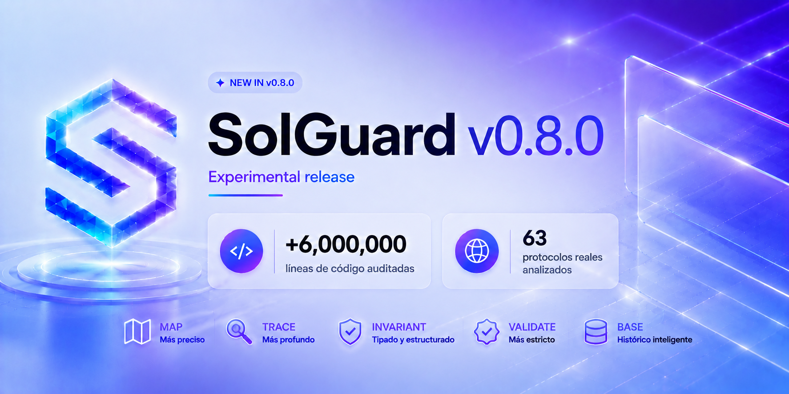

# Solguard v0.8.0 — version cerrada

`v0.8.0` cierra la primera version de Solguard preparada para evaluar protocolos reales de forma reproducible. El objetivo de esta release no era solo subir recall, sino endurecer el pipeline para que los findings publicados salgan de evidencia estructurada y no de coincidencias vagas por nombre, categoria o texto.



La version queda cerrada para benchmarks con 63 protocolos scoreables, 422 vulnerabilidades esperadas y 100% de recall benchmark. `Tapioca-DAO` queda fuera del conteo por el fallo conocido de descarga HTTP 404, por eso el benchmark se mide sobre 63 protocolos y no sobre 64.

## Que se ha mejorado

MAP deja de ser un inventario aproximado y pasa a publicar un grafo interprocedural real: simbolos, llamadas internas, herencia, modifiers, librerias, interfaces, llamadas externas, callbacks, reentry targets, delegatecall, proxies y upgrades. Las aristas incluyen resolucion, confianza y evidencia, por lo que las fases posteriores ya no tienen que reconstruir relaciones estructurales por su cuenta.

TRACE incorpora modelos de estado, transiciones temporales y flujos economicos. Ahora distingue cantidad solicitada, cantidad transferida, delta realmente recibido, accounting update, mint/burn, settlement, guards, consumers y rutas multi-step. Esto permite detectar bugs de accounting, stale context, permisos, callbacks, transiciones y dependencias externas con una cadena causal mas concreta.

INVARIANT publica un catalogo tipado `invariant.v0.8`: conservacion de assets, consistencia shares/assets, solvencia, deuda/collateral, reward accounting, fee accounting, supply backing, validez temporal, permission freshness, contexto cross-chain, governance execution y assumptions externas. Cada invariante declara predicado, scope, condiciones de mantenimiento, ruptura esperada y evidencia requerida.

El backend deja de generar candidatos genericos. `canonical_candidates.v0.8` exige invariante primario, break condition, simbolo concreto, flujo, estado afectado y evidencia real. Los candidatos sin ruptura demostrable quedan fuera antes de VALIDATE.

VALIDATE se endurece: un finding `supported` necesita root, trigger e impact conectados por evidencia local, ruta critica resuelta, scope compatible, transicion o flujo aplicable y ausencia de proteccion previa equivalente. Tambien se anadieron diagnosticos exactos de inconclusion para saber si falta edge interprocedural, target externo, callback, transicion, delta economico, semantica de token, implementacion proxy, orden de proteccion o alcance de impacto.

DATABASE y retrieval tambien cambian. El historial guarda attack steps, preconditions, exploit primitive, impact escalation, triage, codigo vulnerable/corregido y commits. El retrieval historico se mueve despues de VALIDATE, como enriquecimiento, sin capacidad de cambiar el verdict determinista.

Durante el hardening final se anadio un evaluador offline para simular reglas sobre outputs congelados. Esto permitio corregir recall y falsos positivos sin reejecutar 15-19 horas de benchmarks por cada cambio. La regla final activada para cerrar benchmarks fue general, no especifica de protocolo: soporte estricto para candidatos deterministas de `role-check return value` con source chain resuelta y evidencia concreta.

## Prueba de cierre benchmark

La ejecucion completa del 04/07/2026 dejo benchmarks en 421/422. El unico miss benchmark era `Lybra Finance` H-03. Despues del ajuste general de `role-check`, ese candidato fue revalidado de forma targeted y paso a `supported_finding`:

```text
candidate_id: cand_117c1cb4bec1302c7d8923abdb9f5ddef6896f8defd63225320feb90d3347ff0
result: supported
finding_class: supported_finding
dedupe_status: unique
title: Role-check modifier can ignore a boolean authorization result
```

Sobre el full scan congelado, el evaluador offline benchmark-only queda en 422/422 detectados, 100% recall, 503 findings reportados, 42 falsos positivos y 51 duplicados. Los labs no forman parte del criterio de cierre de benchmark; permanecen documentados aparte.

Las LOC son aproximadas (`~`) y se calculan desde los snapshots auditados, contando archivos de codigo fuente y excluyendo directorios generados/dependencias comunes.

| Protocolo | Vulns | Lenguaje | Tiempo | LoC | Findings | FP | Duplicados | Detectados | Recall |
|---|---:|---|---:|---:|---:|---:|---:|---:|---:|
| [Compound Finance](https://codeload.github.com/compound-finance/compound-protocol/zip/4aa526d8158c6326e4fdeed939480e340af4c00c) | 1 | Solidity | 00:16:02 | ~54,000 | 6 | 5 | 0 | 1 | 100% |
| [Ondo Finance](https://codeload.github.com/code-423n4/2023-01-ondo/zip/b4e1afc2816e35df66e1f53aef57637350b7ff5e) | 6 | Solidity | 00:11:39 | ~38,500 | 7 | 3 | 0 | 6 | 100% |
| [Astaria](https://codeload.github.com/code-423n4/2023-01-astaria/zip/889d51d45830a86064bbe35fec09ec9a466928f3) | 50 | Solidity | 00:28:57 | ~13,500 | 42 | 1 | 0 | 50 | 100% |
| [KUMA Protocol](https://codeload.github.com/code-423n4/2023-02-kuma/zip/22fd56b3f0df71714cb71f1ce2585f1c4dd21d64) | 5 | Solidity | 00:15:49 | ~128,000 | 5 | 0 | 0 | 5 | 100% |
| [Asymmetry Finance](https://codeload.github.com/code-423n4/2023-03-asymmetry/zip/1fa78d2116405a9e186bafabd24080c52bc32875) | 20 | Solidity | 00:06:41 | ~5,800 | 20 | 1 | 0 | 20 | 100% |
| [Rubicon](https://codeload.github.com/code-423n4/2023-04-rubicon/zip/6a0c9bd0e2f9bb17935733e9acedf42098f3724b) | 45 | Solidity | 00:29:10 | ~17,500 | 48 | 2 | 1 | 45 | 100% |
| [Maia DAO](https://codeload.github.com/code-423n4/2023-05-maia/zip/54a45beb1428d85999da3f721f923cbf36ee3d35) | 79 | Solidity | 00:30:07 | ~76,000 | 83 | 1 | 3 | 79 | 100% |
| [Lybra Finance](https://codeload.github.com/code-423n4/2023-06-lybra/zip/7b73ef2fbb542b569e182d9abf79be643ca883ee) | 31 | Solidity | 00:21:49 | ~6,600 | 38 | 0 | 7 | 31 | 100% |
| [Basin / Beanstalk](https://codeload.github.com/code-423n4/2023-07-basin/zip/9403cf973e95ef7219622dbbe2a08396af90b64c) | 14 | Solidity | 00:05:31 | ~12,500 | 20 | 0 | 6 | 14 | 100% |
| [Shell Protocol](https://codeload.github.com/code-423n4/2023-08-shell/zip/5a996367cc9e9a3920577ecab6183e7c9991ee7c) | 1 | Solidity | 00:05:27 | ~6,400 | 1 | 0 | 0 | 1 | 100% |
| [Centrifuge](https://codeload.github.com/code-423n4/2023-09-centrifuge/zip/0048f73a05618588026e799a310c32b14cfafaac) | 6 | Solidity | 00:11:21 | ~19,000 | 9 | 2 | 1 | 6 | 100% |
| [Panoptic](https://codeload.github.com/code-423n4/2023-11-panoptic/zip/19a00dfda3fbe3e3ba4f5b7477f5f0cb7e924768) | 7 | Solidity | 00:05:55 | ~13,500 | 7 | 0 | 0 | 7 | 100% |
| [Reserve Protocol](https://codeload.github.com/reserve-protocol/protocol/zip/df7ecadc2bae74244ace5e8b39e94bc992903158) | 27 | Solidity | 00:18:24 | ~64,500 | 50 | 0 | 23 | 27 | 100% |
| [Nomad](https://codeload.github.com/nomad-xyz/monorepo/zip/c73deaf246f7a441d85454b95e6693a21a3b854b) | 1 | Solidity + Node/TypeScript | 00:09:16 | ~27,000 | 1 | 0 | 0 | 1 | 100% |
| [Ethereum Name Service](https://codeload.github.com/code-423n4/2022-07-ens/zip/9af059c6b50529a3d0b0b86ff4f264f67316b8b5) | 16 | Solidity | 00:04:43 | ~19,000 | 17 | 0 | 1 | 16 | 100% |
| [Monad](https://codeload.github.com/category-labs/monad/zip/020cb9ed751480cf79ad334ab36a6ecd606235e7) | 3 | Rust + C++ | 00:14:19 | ~195,000 | 3 | 0 | 0 | 3 | 100% |
| [Recall / IPC](https://codeload.github.com/code-423n4/2025-02-recall/zip/ab5f90b9b0322016ecce6dd71c528a935544bec5) | 13 | Rust + Solidity | 00:15:33 | ~96,000 | 19 | 0 | 6 | 13 | 100% |
| [Bitcoin Core](https://codeload.github.com/bitcoin/bitcoin/zip/2848aa808fde462c27bc36de982d7ed74e882a7b) | 1 | C++ | 00:10:32 | ~406,000 | 1 | 0 | 0 | 1 | 100% |
| [Optimism Superchain](https://codeload.github.com/code-423n4/2024-07-optimism/zip/70556044e5e080930f686c4e5acde420104bb2c4) | 16 | Solidity | 00:29:21 | ~401,000 | 16 | 0 | 0 | 16 | 100% |
| [Taiko](https://codeload.github.com/code-423n4/2024-03-taiko/zip/f58384f44dbf4c6535264a472322322705133b11) | 19 | Solidity | 00:20:52 | ~25,000 | 20 | 0 | 1 | 19 | 100% |
| [Biconomy Smart Account](https://codeload.github.com/code-423n4/2023-01-biconomy/zip/53c8c3823175aeb26dee5529eeefa81240a406ba) | 13 | Solidity | 00:09:10 | ~14,000 | 13 | 0 | 0 | 13 | 100% |
| [EigenLayer](https://codeload.github.com/code-423n4/2023-04-eigenlayer/zip/5e4872358cd2bda1936c29f460ece2308af4def6) | 4 | Solidity | 00:18:11 | ~22,500 | 4 | 0 | 0 | 4 | 100% |
| [Cosmos SDK](https://codeload.github.com/cosmos/cosmos-sdk/zip/7b9d2ff98d02bd5a7edd3b153dd577819cc1d777) | 1 | Go | 00:13:01 | ~1,167,000 | 1 | 0 | 0 | 1 | 100% |
| [Ethereum Geth](https://codeload.github.com/ethereum/go-ethereum/zip/12f0ff40b1bfb484cafc3be6e0040262e96743bd) | 1 | Go | 00:14:09 | ~486,000 | 1 | 0 | 0 | 1 | 100% |
| [Curve Finance Metapool](https://codeload.github.com/curvefi/curve-contract/zip/5395c5ab589d6e699897ae4b123bbaab58dd4f76) | 1 | Vyper | 00:08:49 | ~20,000 | 1 | 0 | 0 | 1 | 100% |
| [MANTRA DEX](https://codeload.github.com/code-423n4/2024-11-mantra-dex/zip/26714ea59dab7ecfafca9db1138d60adcf513588) | 1 | Rust | 00:13:49 | ~26,500 | 1 | 0 | 0 | 1 | 100% |
| [Renzo](https://codeload.github.com/code-423n4/2024-04-renzo/zip/519e518f2d8dec9acf6482b84a181e403070d22d) | 1 | Solidity | 00:15:02 | ~10,500 | 1 | 0 | 0 | 1 | 100% |
| [Caviar](https://codeload.github.com/code-423n4/2022-12-caviar/zip/0212f9dc3b6a418803dbfacda0e340e059b8aae2) | 1 | Solidity | 00:04:31 | ~3,000 | 1 | 0 | 0 | 1 | 100% |
| [Wenwin](https://codeload.github.com/code-423n4/2023-03-wenwin/zip/91b89482aaedf8b8feb73c771d11c257eed997e8) | 1 | Solidity | 00:03:42 | ~5,300 | 1 | 0 | 0 | 1 | 100% |
| [Size](https://codeload.github.com/code-423n4/2024-06-size/zip/8850e25fb088898e9cf86f9be1c401ad155bea86) | 1 | Solidity | 00:09:35 | ~14,500 | 1 | 0 | 0 | 1 | 100% |
| [Stader Labs](https://codeload.github.com/code-423n4/2023-06-stader/zip/7566b5a35f32ebd55d3578b8bd05c038feb7d9cc) | 1 | Solidity | 00:24:45 | ~13,000 | 7 | 6 | 0 | 1 | 100% |
| [Papr / Backed](https://codeload.github.com/with-backed/papr/zip/9528f2711ff0c1522076b9f93fba13f88d5bd5e6) | 1 | Solidity | 00:05:48 | ~4,100 | 1 | 0 | 0 | 1 | 100% |
| [Good Entry](https://codeload.github.com/code-423n4/2023-08-goodentry/zip/4b785d455fff04629d8675f21ef1d1632749b252) | 1 | Solidity | 00:10:31 | ~24,000 | 11 | 10 | 0 | 1 | 100% |
| [DYAD](https://codeload.github.com/code-423n4/2024-04-dyad/zip/cd48c684a58158de444b24854ffd8f07d046c31b) | 1 | Solidity | 00:10:22 | ~74,500 | 1 | 0 | 0 | 1 | 100% |
| [Salty.IO](https://codeload.github.com/code-423n4/2024-01-salty/zip/53516c2cdfdfacb662cdea6417c52f23c94d5b5b) | 1 | Solidity | 00:07:06 | ~30,000 | 1 | 0 | 0 | 1 | 100% |
| [reNFT](https://codeload.github.com/re-nft/smart-contracts/zip/3ddd32455a849c3c6dc3c3aad7a33a6c9b44c291) | 1 | Solidity | 00:05:32 | ~18,000 | 1 | 0 | 0 | 1 | 100% |
| [AI Arena](https://codeload.github.com/code-423n4/2024-02-ai-arena/zip/f2952187a8afc44ee6adc28769657717b498b7d4) | 1 | Solidity | 00:08:32 | ~32,500 | 2 | 1 | 0 | 1 | 100% |
| [LoopFi](https://codeload.github.com/code-423n4/2024-07-loopfi/zip/57871f64bdea450c1f04c9a53dc1a78223719164) | 1 | Solidity | 00:09:32 | ~20,500 | 2 | 1 | 0 | 1 | 100% |
| [Core Lightning](https://codeload.github.com/ElementsProject/lightning/zip/d73b7564019e156e800c967b8712db642405d596) | 1 | C | 00:12:26 | ~483,000 | 1 | 0 | 0 | 1 | 100% |
| [Zcash](https://codeload.github.com/zcash/zcash/zip/07e6d5b02533d829e6333ac4cbac671dff3104b9) | 1 | C++ | 00:11:39 | ~291,000 | 1 | 0 | 0 | 1 | 100% |
| [Lodestar](https://codeload.github.com/ChainSafe/lodestar/zip/8ad2cb0ad1856fe66fd0998a0c1daecc3f0e4598) | 1 | TypeScript | 00:13:50 | ~156,000 | 3 | 2 | 0 | 1 | 100% |
| [Web3.js](https://codeload.github.com/web3/web3.js/zip/d278254681cadc35c52724ca6a3add6cd44e332c) | 1 | JavaScript | 00:09:54 | ~37,000 | 1 | 0 | 0 | 1 | 100% |
| [Nibiru](https://codeload.github.com/code-423n4/2024-11-nibiru/zip/84054a4f00fdfefaa8e5849c53eb66851a762319) | 1 | Go + Solidity | 00:09:22 | ~141,000 | 1 | 0 | 0 | 1 | 100% |
| [Arbitrum BoLD](https://codeload.github.com/code-423n4/2024-05-arbitrum-foundation/zip/6f861c85b281a29f04daacfe17a2099d7dad5f8f) | 1 | Solidity | 00:08:16 | ~35,500 | 1 | 0 | 0 | 1 | 100% |
| [Wise Lending](https://codeload.github.com/code-423n4/2024-02-wise-lending/zip/79186b243d8553e66358c05497e5ccfd9488b5e2) | 2 | Solidity | 00:13:27 | ~94,500 | 2 | 0 | 0 | 2 | 100% |
| [Revert Lend](https://codeload.github.com/code-423n4/2024-03-revert-lend/zip/457230945a49878eefdc1001796b10638c1e7584) | 1 | Solidity | 00:13:44 | ~8,300 | 1 | 0 | 0 | 1 | 100% |
| [Predy](https://codeload.github.com/code-423n4/2024-05-predy/zip/a9246db5f874a91fb71c296aac6a66902289306a) | 2 | Solidity | 00:18:48 | ~218,000 | 2 | 0 | 0 | 2 | 100% |
| [Wildcat](https://codeload.github.com/code-423n4/2024-08-wildcat/zip/fe746cc0fbedc4447a981a50e6ba4c95f98b9fe1) | 1 | Solidity | 00:15:10 | ~26,000 | 1 | 0 | 0 | 1 | 100% |
| [Phi](https://codeload.github.com/code-423n4/2024-08-phi/zip/3a817c9dedca53ea27ff3e7988f8389086935b8b) | 2 | Solidity | 00:11:09 | ~6,700 | 2 | 0 | 0 | 2 | 100% |
| [Ethena Labs](https://codeload.github.com/code-423n4/2023-10-ethena/zip/ee67d9b542642c9757a6b826c82d0cae60256509) | 1 | Solidity | 00:16:50 | ~169,000 | 2 | 0 | 1 | 1 | 100% |
| [PoolTogether](https://codeload.github.com/code-423n4/2024-03-pooltogether/zip/480d58b9e8611c13587f28811864aea138a0021a) | 1 | Solidity | 00:06:36 | ~7,200 | 1 | 0 | 0 | 1 | 100% |
| [Venus Protocol](https://codeload.github.com/code-423n4/2023-05-venus/zip/8be784ed9752b80e6f1b8b781e2e6251748d0d7e) | 1 | Solidity | 00:06:09 | ~19,500 | 1 | 0 | 0 | 1 | 100% |
| [Ajna](https://codeload.github.com/code-423n4/2023-05-ajna/zip/276942bc2f97488d07b887c8edceaaab7a5c3964) | 1 | Solidity | 00:13:40 | ~200,000 | 1 | 0 | 0 | 1 | 100% |
| [Badger eBTC](https://codeload.github.com/code-423n4/2023-10-badger/zip/f2f2e2cf9965a1020661d179af46cb49e993cb7e) | 1 | Solidity | 00:22:33 | ~326,000 | 1 | 0 | 0 | 1 | 100% |
| [DittoETH](https://codeload.github.com/code-423n4/2024-03-dittoeth/zip/91faf46078bb6fe8ce9f55bcb717e5d2d302d22e) | 1 | Solidity | 00:13:51 | ~41,500 | 1 | 0 | 0 | 1 | 100% |
| [zkSync Era](https://codeload.github.com/code-423n4/2024-03-zksync/zip/4f0ba34f34a864c354c7e8c47643ed8f4a250e13) | 1 | Solidity | 00:10:07 | ~46,000 | 1 | 0 | 0 | 1 | 100% |
| [Axelar Network](https://codeload.github.com/code-423n4/2024-08-axelar-network/zip/4572617124bed39add9025317d2c326acfef29f1) | 1 | Rust + Solidity | 00:12:42 | ~75,000 | 3 | 2 | 0 | 1 | 100% |
| [Superposition](https://codeload.github.com/code-423n4/2024-08-superposition/zip/4528c9d2dbe1550d2660dac903a8246076044905) | 1 | Rust + Solidity | 00:10:29 | ~64,500 | 1 | 0 | 0 | 1 | 100% |
| [Olas](https://codeload.github.com/code-423n4/2024-05-olas/zip/3ce502ec8b475885b90668e617f3983cea3ae29f) | 1 | Solidity | 00:23:09 | ~423,000 | 3 | 2 | 0 | 1 | 100% |
| [Vultisig](https://codeload.github.com/code-423n4/2024-06-vultisig/zip/cb72b1e9053c02a58d874ff376359a83dc3f0742) | 1 | Solidity + TypeScript | 00:05:54 | ~4,100 | 3 | 2 | 0 | 1 | 100% |
| [Connext](https://codeload.github.com/code-423n4/2022-06-connext/zip/20f86d58444d7c8178735ada7e456a3112116e54) | 1 | Solidity + TypeScript | 00:20:07 | ~24,000 | 1 | 0 | 0 | 1 | 100% |
| [Party Protocol](https://codeload.github.com/code-423n4/2023-10-party/zip/b23c65d62a20921c709582b0b76b387f2bb9ebb5) | 1 | Solidity | 00:21:29 | ~41,500 | 1 | 0 | 0 | 1 | 100% |
| [Holograph](https://codeload.github.com/code-423n4/2022-10-holograph/zip/f8c2eae866280a1acfdc8a8352401ed031be1373) | 1 | Solidity | 00:10:03 | ~44,500 | 3 | 1 | 1 | 1 | 100% |
| **Total benchmarks** | **422** | **Mixto** | **13:56:40** | **~6,592,000** | **503** | **42** | **51** | **422** | **100%** |

## Estado de cierre

La version `v0.8.0` queda cerrada para el objetivo benchmark: 63 protocolos scoreables, 422 vulnerabilidades scoreables y 100% de recall benchmark. El siguiente trabajo ya no deberia centrarse en adaptar la herramienta a estos protocolos, sino en reducir falsos positivos de forma global y endurecer los labs sin relajar las reglas que han permitido cerrar benchmarks.
